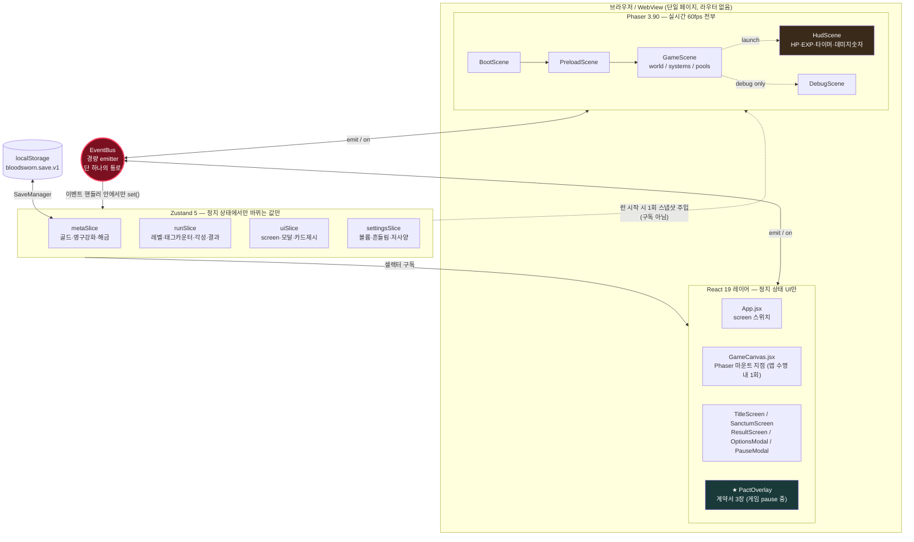

# 06. 기술 설계 문서 (TDD)

> **문서 지위: 결정(DECISION).** 정본(`01-CONCEPT-AND-STORY.md`, `03-GDD-CORE.md`, `04-PACT-SYSTEM.md`)의
> 하위 문서다. 정본과 충돌하면 정본이 이긴다. 그 외 모든 구현 판단은 이 문서가 최종이다.
> 이 문서는 "이렇게 하면 좋다"가 아니라 **"이렇게 한다"** 를 적는다. 논의는 끝났다.
>
> 최종 수정: 2026-08-10 / 1인 개발 / 개발 기간 7일

---

## 0. 전제와 스캐폴드 현황 (실측)

### 0.1 확정 스택

| 항목 | 값 |
|---|---|
| 런타임 | React 19.2 + Vite 7.3 |
| 게임 엔진 | Phaser 3.90 (`Phaser.AUTO` → WebGL 우선) |
| 상태 | Zustand 5.0 |
| 네이티브 | **Capacitor 7 (Android + iOS 동시 배포).** iOS 최소 배포 타겟 14.0 / Xcode 16 이상 / Node 20 이상 / CocoaPods 필요 |
| 맵 | Tiled (JSON export) |
| 논리 해상도 | **640 × 360 가로 고정** |
| 서버 | **없음.** 저장은 로컬 전용 — `localStorage`(동기 핫 캐시) + `@capacitor/preferences`(write-through 영속층). **iOS 때문에 결정을 뒤집었다 → §12.0** |
| 언어 | JavaScript (JSX). **TypeScript 도입하지 않는다** — 7일에 타입 정비 비용을 쓸 수 없다. 대신 JSDoc |

### 0.2 기존 스캐폴드에서 실제로 확인한 문제 (전부 이번 주에 해결)

이 절의 내용은 추측이 아니라 파일을 직접 열어 확인한 결과다.

| # | 파일 | 실측된 문제 | 조치 |
|---|---|---|---|
| B1 | `FE/src/game/GameManager.js:7` | `import { AudienceRoomScene } from "./scenes/AudienceRoomScene.js";` — **`src/game/scenes/` 디렉토리 자체가 존재하지 않는다.** Vite dev/build 모두 즉시 실패. **현재 빌드 불가 상태** | Day 1 최우선. §3.4의 새 `GameManager`로 전면 교체 |
| B2 | `FE/src/game/config.js` | `width: 375, height: 667`(세로) + `Phaser.Scale.RESIZE` + 이전 프로젝트 잔재 `AUDIENCE_LAYOUT` export | §1.3의 새 config로 **파일 전체 교체** |
| B3 | `FE/src/router/index.jsx` + `FE/src/App.jsx` | 라우터가 `App`을 레이아웃 element로 쓰는데 `App.jsx`에 **`<Outlet />`이 없다.** 자식 라우트(`MainPage`)가 영원히 렌더되지 않는다 | 라우터 자체를 제거(§0.3) |
| B4 | `FE/src/pages/MainPage/MainPage.jsx` | 본문이 `return;` (undefined 반환) + 사용하지 않는 `styles` import → React 19에서 렌더 에러 + ESLint 에러. `MainPage.module.css`는 **0바이트** | 디렉토리째 삭제 |
| B5 | `FE/package.json` | `firebase ^12.9`, `axios ^1.13`, `@tanstack/react-query ^5.90`, `react-hook-form ^7.71`, `react-router-dom ^7.13` — **서버 없는 오프라인 단일화면 게임에 전부 불필요.** firebase 하나만으로도 번들이 수백 KB 늘어난다 | 5개 전부 제거(§14.2) |
| B6 | `FE/src/main.jsx` | `QueryClientProvider` + `RouterProvider`로 앱을 감싸고 있음 | §3.4 기준으로 재작성 |
| B7 | `FE/android/app/src/main/AndroidManifest.xml` | `<activity>`에 **`android:screenOrientation` 속성이 없다.** 정본 §2.1의 "방향 고정 landscape"가 미충족 | §11.1 |
| B8 | `FE/capacitor.config.json` | `appId: com.superdimension.app`, `appName: SuperDimension` — 이전 프로젝트 값 | `com.bloodsworn.game` / `BLOODSWORN` |
| B9 | `FE/index.html` | `<title>fe</title>`, `lang="en"`, `viewport`에 모바일 게임용 설정(`viewport-fit=cover`, `user-scalable=no`) 없음 | §11.3 |
| B10 | `FE/src/.env` (**0바이트**) + `FE/src/utils/getEnv.js` | 정의된 환경변수가 하나도 없는데 `getEnv()`는 미정의 시 **throw** 한다. 호출하는 순간 앱이 죽는 함수 | 둘 다 삭제(§07 문서 §8) |
| B11 | `FE/.gitignore copy` | 파일명에 공백이 들어간 백업 잔재 | 삭제 |
| B12 | `FE/eslint.config.js` | `languageOptions.globals`가 `globals.browser`만. Node 스크립트(`scripts/*.js`)를 lint하면 `process`, `__dirname` 미정의 에러 | §07 문서 §4에서 override 블록 추가 |

### 0.3 라우터를 제거하는 결정

**결정: `react-router-dom`을 제거하고 Zustand의 `uiSlice.screen` 단일 문자열로 화면을 전환한다.**

근거 세 가지.
1. 이 게임의 화면은 `title / sanctum / loading / playing / result` 5개뿐이고 **전부 모달성 전환**이다. URL이 의미를 갖는 화면이 하나도 없다.
2. Capacitor WebView는 `file://` 로 로드되므로 `createHashRouter`를 써야 하고, 뒤로가기 버튼 처리도 라우터와 Capacitor `App` 플러그인 양쪽을 조율해야 한다. 순수 낭비다.
3. 라우터를 쓰면 Phaser 캔버스가 라우트 전환 때 언마운트되어 `game.destroy()`가 예기치 않게 돌 위험이 있다. 캔버스는 **앱 수명 내내 한 번만 마운트**되어야 한다(§3.4).

---

## 1. 아키텍처 개요

### 1.1 다이어그램



### 1.2 데이터 흐름의 절대 규칙 4개

1. **React와 Phaser는 서로를 직접 참조하지 않는다.** 유일한 통로는 `EventBus`다. React 컴포넌트 안에서 `scene.player.hp`를 읽는 코드는 리뷰 없이 삭제한다.
2. **Phaser는 Zustand를 구독(subscribe)하지 않는다.** 읽기는 런 시작 시점의 1회 스냅샷(`getSnapshotForRun()`)뿐이다. Phaser가 스토어를 구독하면 프레임 안에서 리렌더가 유발되고 원인 추적이 불가능해진다.
3. **Zustand의 `set()`은 EventBus 핸들러 또는 React 이벤트 핸들러 안에서만 호출한다.** Phaser의 `update()` 루프 안에서 `set()`을 부르는 것은 **금지**다(§3.3).
4. **모든 게임 시간(delta)은 Phaser가 소유한다.** React에는 `setInterval` 기반 게임 타이머가 존재하지 않는다.

### 1.3 `game/config.js` 최종안 (기존 파일 전체 교체)

```js
/**
 * BLOODSWORN 게임 전역 설정
 * 논리 해상도 640x360 가로 고정. 정본 03-GDD-CORE §2.1 준수.
 */
import Phaser from "phaser";

/** 논리 해상도 — 이 값을 코드 여기저기 하드코딩하지 말고 항상 여기서 import 한다. */
export const LOGICAL_WIDTH = 640;
export const LOGICAL_HEIGHT = 360;

/** 월드(스테이지1 봉인묘) 크기. 정본 03-GDD-CORE §8.1 */
export const WORLD_WIDTH = 1600;
export const WORLD_HEIGHT = 1200;

/** 타일 크기 */
export const TILE_SIZE = 16;

/** 런 길이(초). 정본 01 §2 */
export const RUN_DURATION = 360;

export const GAME_CONFIG = {
    type: Phaser.AUTO,
    width: LOGICAL_WIDTH,
    height: LOGICAL_HEIGHT,
    backgroundColor: "#0b0710",
    pixelArt: true,
    roundPixels: true,
    antialias: false,
    powerPreference: "high-performance",
    // 모바일 WebView에서 60fps 상한을 명시. forceSetTimeOut은 쓰지 않는다(rAF가 더 안정적).
    fps: { target: 60, min: 30, forceSetTimeOut: false },
    scale: {
        mode: Phaser.Scale.FIT,
        autoCenter: Phaser.Scale.CENTER_BOTH,
        width: LOGICAL_WIDTH,
        height: LOGICAL_HEIGHT,
    },
    render: {
        // 픽셀아트 텍스처가 씻겨나가지 않도록 프리멀티플라이 비활성
        premultipliedAlpha: false,
        // 스크린샷/공유 기능 없음 → 백버퍼 보존 불필요
        preserveDrawingBuffer: false,
    },
    physics: {
        default: "arcade",
        arcade: {
            gravity: { x: 0, y: 0 },
            debug: false,
            // 플레이어 vs 벽 타일맵 충돌에만 쓴다(§5.2). 적/투사체는 공간해시로 직접 판정.
            fps: 60,
        },
    },
    audio: { disableWebAudio: false },
    // scene 배열은 GameManager가 주입한다.
};
```

`AUDIENCE_LAYOUT`은 삭제한다. 이 프로젝트에 알현실은 없다.

---

## 2. 역할 분담 원칙

정본 `03-GDD-CORE.md` §10의 **"실시간 전투 = Phaser, 정지 UI = React"** 를 기술적 판정 기준으로 환산한다.

### 2.1 판정 규칙 (이 표가 최종 심판이다)

| 질문 | 예 | 아니오 |
|---|---|---|
| **이 값이 1초에 2번 이상 바뀌는가?** | → Phaser가 그린다. Zustand 금지 | 다음 질문으로 |
| **게임이 정지(`scene.pause`)된 상태에서만 보이는가?** | → React가 그린다 | 다음 질문으로 |
| **월드 좌표계 위에 있는가?(카메라를 따라 움직이는가)** | → Phaser | → React 또는 HudScene |
| **텍스트가 길고 레이아웃이 복잡한가?(카드/설명/옵션)** | → React | → HudScene(BitmapText) |

### 2.2 소유권 표

| 대상 | 소유 | 이유 |
|---|---|---|
| 플레이어/적/투사체/오브/장판 스프라이트 | **Phaser GameScene** | 월드 좌표, 매 프레임 |
| HP바, EXP바, 타이머, 처치수, 인간성 하트 | **Phaser HudScene** | **60fps로 변한다. React로 그리면 죽는다(§3.3)** |
| 데미지 숫자, 힐 숫자, 크리티컬 표시 | **Phaser HudScene** (BitmapText 풀) | 초당 수십 개 생성 |
| 가상 조이스틱, 대시 버튼, 쿨다운 링 | **Phaser HudScene** | 터치 입력을 Phaser가 직접 받아야 지연이 없다 |
| 각성 발동 연출(플래시/충격파/오라) | **Phaser GameScene** | 히트스톱·카메라 흔들림·파티클 = 엔진 기능 |
| 각성 이름 대형 타이포 배너 | **React** (`AwakeningBanner`) | 0.2초 히트스톱 = 정지 상태. 한글 폰트 조판이 DOM이 압도적으로 쉽다 |
| **PACT 카드 3장** | **React** (`PactOverlay`) | 정본 §10 명시. 게임 완전 정지 상태 |
| 타이틀 / 성소 / 결과 / 옵션 / 일시정지 | **React** | 정지 상태, 복잡한 레이아웃 |
| 로딩 진행률 바 | **React** (`LoadingScreen`) | `asset:progress` 이벤트를 초당 ~10회 받음. 저빈도이므로 허용 |
| 골드, 영구강화 단계, 해금 | **Zustand `metaSlice`** | 런 종료 시에만 변함 |
| 레벨, 태그 카운터, 각성 목록, 인간성 | **Zustand `runSlice`** | 레벨업(정지) 시에만 변함 |
| **현재 HP, 현재 EXP, 남은 시간, 처치수, 좌표** | **Phaser 내부 변수 (Zustand 금지)** | §3.3 |

### 2.3 React가 절대 하지 않는 것

- `requestAnimationFrame` 기반 애니메이션 루프 (CSS `@keyframes`만 사용)
- 게임 로직 계산 (스탯 계산, 충돌, 스폰)
- Phaser 객체에 대한 직접 접근
- 매 프레임 갱신되는 어떤 값의 표시

---

## 3. ★ React ↔ Phaser 브릿지 규약

**이 문서에서 가장 중요한 절이다.** 여기서 규약이 무너지면 7일 안에 회복할 수 없다.

### 3.1 `EventBus` 구현 (`src/game/EventBus.js`)

Phaser의 `Phaser.Events.EventEmitter`를 쓰지 않는다. React 쪽에서 Phaser를 import하게 만들면
번들 분리(§14.1)가 깨지기 때문이다. 40줄짜리 자체 emitter를 쓴다.

```js
/**
 * EventBus — React 셸과 Phaser 게임 사이의 유일한 통로.
 * 의존성 0. React도 Phaser도 이 파일만 import 한다.
 * 규칙: 이벤트 이름은 반드시 EVENTS 상수를 통해서만 쓴다. 문자열 리터럴 직접 사용 금지.
 */
class EventBusImpl {
    constructor() {
        /** @type {Map<string, Set<Function>>} */
        this.handlers = new Map();
        this.debug = false;
    }

    /**
     * @param {string} event
     * @param {Function} fn
     * @returns {() => void} 구독 해제 함수 (useEffect cleanup에 그대로 반환한다)
     */
    on(event, fn) {
        let set = this.handlers.get(event);
        if (!set) {
            set = new Set();
            this.handlers.set(event, set);
        }
        set.add(fn);
        return () => set.delete(fn);
    }

    /** 1회성 구독 */
    once(event, fn) {
        const off = this.on(event, (payload) => {
            off();
            fn(payload);
        });
        return off;
    }

    off(event, fn) {
        this.handlers.get(event)?.delete(fn);
    }

    /**
     * @param {string} event
     * @param {any} [payload]
     */
    emit(event, payload) {
        if (this.debug) console.log("[EB]", event, payload);
        const set = this.handlers.get(event);
        if (!set) return;
        // 핸들러 안에서 off()를 부를 수 있으므로 복사 후 순회
        for (const fn of [...set]) {
            try {
                fn(payload);
            } catch (e) {
                console.error(`[EventBus] handler error on "${event}"`, e);
            }
        }
    }

    /** 게임 재시작 시 Phaser 쪽 구독만 정리하기 위해 사용. React 구독은 useEffect가 정리한다. */
    clear(event) {
        if (event) this.handlers.delete(event);
        else this.handlers.clear();
    }
}

export const EventBus = new EventBusImpl();
```

이벤트 이름 상수는 `src/game/constants.js`에 모은다.

```js
/** 이벤트 이름 상수. 오타 하나로 반나절을 날리지 않기 위한 장치. */
export const EVENTS = {
    // ── Phaser → React (P→R) ──
    BOOT_READY: "boot:ready",
    ASSET_PROGRESS: "asset:progress",
    RUN_STARTED: "run:started",
    RUN_PHASE_CHANGED: "run:phase-changed",
    RUN_LEVELUP: "run:levelup",
    PACT_APPLIED: "pact:applied",
    AWAKENING_TRIGGERED: "awakening:triggered",
    HUMANITY_ZERO: "humanity:zero",
    ELITE_SPAWNED: "elite:spawned",
    CHEST_OPENED: "chest:opened",
    BOSS_SPAWNED: "boss:spawned",
    BOSS_HP: "boss:hp",
    RUN_PAUSED: "run:paused",
    RUN_RESUMED: "run:resumed",
    RUN_ENDED: "run:ended",
    PERF_SAMPLE: "perf:sample",
    QUALITY_CHANGED: "quality:changed",
    FATAL_ERROR: "error:fatal",

    // ── React → Phaser (R→P) ──
    CMD_START_RUN: "cmd:start-run",
    CMD_PACT_CHOOSE: "cmd:pact-choose",
    CMD_PACT_REROLL: "cmd:pact-reroll",
    CMD_PACT_SKIP: "cmd:pact-skip",
    CMD_AWAKENING_ACK: "cmd:awakening-ack",
    CMD_PAUSE: "cmd:pause",
    CMD_RESUME: "cmd:resume",
    CMD_ABANDON: "cmd:abandon",
    CMD_SETTINGS: "cmd:settings",
    CMD_DEBUG: "cmd:debug",
};
```

### 3.2 전체 이벤트 목록 (규약 — 이 표에 없는 이벤트는 만들지 않는다)

**P→R (Phaser가 emit, React가 수신)**

| # | 이벤트 | 페이로드 | 발생 시점 | React 반응 |
|---|---|---|---|---|
| 1 | `boot:ready` | `{}` | `BootScene.create()` 끝 | 로딩 화면 표시 시작 |
| 2 | `asset:progress` | `{ progress: 0..1, file: string }` | `PreloadScene`의 `load.on("progress")` | 로딩바 갱신 (초당 ~10회, 허용) |
| 3 | `run:started` | `{ seed: number, characterId: string, startedAt: number }` | `GameScene.create()` 끝 | `screen="playing"`, 로딩 해제 |
| 4 | `run:phase-changed` | `{ phase: 1..4, timeSec, label: "01:00 축시", bgmTier }` | 90초 경계 통과 | 화면 상단 시각 표시 페이드 인/아웃 |
| 5 | `run:levelup` | `{ level, cards: Card[3], rerollLeft, canSkip, nocturneLine, tagCounts }` | 레벨업 → `scene.pause()` 직후 | **`PactOverlay` 오픈** |
| 6 | `pact:applied` | `{ cardId, blessing, toll, humanity, tagCounts, willAwaken }` | 카드 적용 완료 | `runSlice` 갱신, 오버레이 닫기 |
| 7 | `awakening:triggered` | `{ tag, awakeningId, name, quote, index: 1\|2 }` | 태그 3중첩 도달, 히트스톱 시작 시 | `AwakeningBanner` 표시 |
| 8 | `humanity:zero` | `{ atTimeSec }` | 인간성 0 도달 | 「완전 흡혈귀화」 배너 |
| 9 | `elite:spawned` | `{ id, name, hp, x, y, timeSec, field? }` | 엘리트 스폰 · **필드보스 등장**(30 §3.6) | 등장 배너. 구독자 0이던 죽은 이벤트를 30 이 살렸다 |
| 10 | `chest:opened` | `{ x, y, sourceId, kind: "blessing"\|"rune"\|"items", label, blessing }` | 보물상자 획득 | 획득 토스트 (30 §3.7 로 페이로드 확장) |
| 11 | `boss:spawned` | `{ bossId, maxHp }` | 6:00 보스 등장 | BGM 전환 트리거, 보스 이름 배너 |
| 12 | `boss:hp` | `{ hp, maxHp, phase }` | **200ms 스로틀** (60fps 아님) | 보스 HP바(React) 갱신 |
| 13 | `run:paused` | `{ reason: "user"\|"levelup"\|"blur" }` | `scene.pause()` 시 | 일시정지 모달 |
| 14 | `run:resumed` | `{}` | `scene.resume()` 시 | 모달 닫기 |
| 15 | `run:ended` | `{ result: "death"\|"clear"\|"abandon", stats: RunStats, ending: "A"\|"B"\|"C"\|null }` | HP 0 / 보스 처치 / 포기 | `ResultScreen`, `metaSlice` 골드 가산, 세이브 |
| 16 | `perf:sample` | `{ fps, entities, ms: { enemyAI, collision, weapons, render, total } }` | **디버그 모드에서만, 500ms마다** | 디버그 오버레이 |
| 17 | `quality:changed` | `{ tier: "high"\|"low", reason }` | 적응형 품질 강등/복귀(§5.7) | 옵션 화면에 표시 |
| 18 | `error:fatal` | `{ message, stack }` | 씬 생성 실패 등 | 에러 화면 + 타이틀 복귀 버튼 |
| 19 | `rune:changed` | `{ weapons: [{ weaponId, name, level, t1, t2, t3 }] }` | 룬을 새겼을 때 / 무기 획득·레벨업 시 | 일시정지 화면의 룬 조망 갱신 (31 §6.2) |
| 30 | `encounter:spawned` | `{ id, name, kind, x, y }` | 디렉터가 조우를 배치한 순간 (30 §4.3) | 등장 배너 1.8초 |
| 31 | `encounter:resolved` | `{ id, kind, choice, label }` | 좌판을 밟아 조우가 해소됨 | 결과 한 줄 배너 |
| 32 | `encounter:expired` | `{ id, kind }` | 체류 시간 종료 / 조우 소멸 | 배너·표시 정리 |
| 33 | `seer:preview` | `{ cards: Card[3], atLevel }` | 「눈먼 예언자」 미리보기 (30 §3.3) | 상단 미리보기 줄. 그 레벨업까지 남는다 |

> ★ 30~33 은 전부 **저빈도**다(런당 5회 안팎). 조우의 좌표·남은 시간 같은 60fps 값은
> 이 표에 없다 — 방향 화살표는 Phaser 가 setScrollFactor(0) 으로 직접 그린다(§3.3).

**R→P (React가 emit, Phaser가 수신)**

| # | 이벤트 | 페이로드 | 발생 시점 | Phaser 반응 |
|---|---|---|---|---|
| 20 | `cmd:start-run` | `{ characterId, meta: MetaSnapshot, settings: Settings, seed? }` | 타이틀/성소에서 "런 시작" | `scene.start("GameScene", payload)` |
| 21 | `cmd:pact-choose` | `{ index: 0\|1\|2 }` | 카드 탭 | `PactSystem.apply()` → `pact:applied` → `scene.resume()` |
| 22 | `cmd:pact-reroll` | `{}` | 리롤 버튼 | 카드 3장 재생성 → `run:levelup` 재emit |
| 23 | `cmd:pact-skip` | `{}` | 스킵 버튼 | HP 25% 회복 + 골드 +30 → `scene.resume()` |
| 24 | `cmd:awakening-ack` | `{}` | 각성 배너 애니메이션 종료 | 히트스톱 해제, 충격파 발동 |
| 25 | `cmd:pause` | `{ reason }` | 일시정지 버튼 / 앱 백그라운드 | `scene.pause()` + `sound.pauseAll()` |
| 26 | `cmd:resume` | `{}` | 계속하기 | `scene.resume()` + `sound.resumeAll()` |
| 27 | `cmd:abandon` | `{}` | 포기 확인 | 현재까지 골드 정산 → `run:ended` |
| 28 | `cmd:settings` | `{ bgmVolume, sfxVolume, screenShake, damageNumbers, lowSpec, joystickMode }` | 옵션 변경 즉시 | 볼륨 반영, 흔들림 플래그, 품질 티어 강제 |
| 29 | `cmd:debug` | `{ action: "levelup"\|"godmode"\|"timescale"\|"killall"\|"gold", value? }` | 치트키/디버그 패널 | §13 |

> **총 33개.** 이 표에 없는 통신이 필요해지면 그것은 대개 §2의 소유권 배분이 잘못되었다는 신호다.
> 이벤트를 추가하기 전에 "이 값을 정말 React가 알아야 하나"를 먼저 묻는다.

### 3.3 ★ 금지 규칙 — 60fps 값을 Zustand에 넣지 않는다

**왜 이것이 프로젝트를 죽이는가.** Zustand의 `set()`은 구독 중인 컴포넌트의 리렌더를 유발한다.
HP를 스토어에 넣으면 초당 60회 `set()` → 초당 60회 React 렌더 → 초당 60회 VDOM diff + 커밋.
데스크톱에서는 견딜 수 있지만, 적 150체가 도는 **모바일 WebView에서는 메인 스레드가 즉사한다.**
게다가 Phaser의 `update()`와 React 렌더가 같은 스레드를 다투므로 프레임 스파이크가 불규칙해져
원인 추적도 불가능해진다.

**금지 예시 (절대 이렇게 쓰지 않는다)**

```js
// ❌ 금지 — GameScene.update() 안에서 매 프레임 스토어를 갱신
update(time, delta) {
    this.player.hp -= this.drain * (delta / 1000);
    useStore.getState().setHp(this.player.hp);      // 초당 60회 리렌더
    useStore.getState().setTime(this.remainSec);    // 초당 60회 리렌더
    useStore.getState().setKills(this.killCount);   // 초당 60회 리렌더
}
```

```jsx
// ❌ 금지 — React가 HP바를 그린다
function HpBar() {
    const hp = useStore((s) => s.hp); // 매 프레임 리렌더
    return <div className="hp" style={{ width: `${hp}%` }} />;
}
```

**정답 (이렇게 한다)**

```js
// ✅ GameScene.update() — 순수 지역 변수. 스토어 접근 0회.
update(time, delta) {
    const dt = delta / 1000;
    this.runTime += dt;
    this.player.hp -= this.stats.drain * dt;
    // HudScene에 직접 참조를 넘긴다. 이벤트도 스토어도 거치지 않는다.
    this.hud.sync(this.player, this.runTime, this.killCount);
}
```

```js
// ✅ HudScene — 값이 "바뀐 프레임에만" Phaser 오브젝트를 건드린다.
export class HudScene extends Phaser.Scene {
    constructor() {
        super({ key: "HudScene", active: false });
    }

    create() {
        this.hpFill = this.add.rectangle(8, 8, 120, 6, 0xc21a2b).setOrigin(0, 0);
        this.expFill = this.add.rectangle(8, 18, 120, 3, 0x2fd6c0).setOrigin(0, 0);
        this.timeText = this.add.bitmapText(600, 8, "pixel", "06:00", 8).setOrigin(1, 0);
        this.killText = this.add.bitmapText(600, 20, "pixel", "0", 8).setOrigin(1, 0);
        // 변화 감지용 캐시. 이 값들이 있어야 불필요한 setter 호출을 막는다.
        this._cache = { hpW: -1, expW: -1, sec: -1, kills: -1 };
    }

    /** @param {Player} player @param {number} runTime @param {number} kills */
    sync(player, runTime, kills) {
        const hpW = Math.max(0, Math.round((player.hp / player.maxHp) * 120));
        if (hpW !== this._cache.hpW) {
            this.hpFill.width = hpW;
            this._cache.hpW = hpW;
        }
        const expW = Math.round((player.exp / player.expNeed) * 120);
        if (expW !== this._cache.expW) {
            this.expFill.width = expW;
            this._cache.expW = expW;
        }
        // 텍스트는 초 단위로만 바뀐다 → 초당 1회 setText
        const sec = Math.ceil(RUN_DURATION - runTime);
        if (sec !== this._cache.sec) {
            const m = Math.floor(sec / 60);
            this.timeText.setText(`${m}:${String(sec % 60).padStart(2, "0")}`);
            this._cache.sec = sec;
        }
        if (kills !== this._cache.kills) {
            this.killText.setText(String(kills));
            this._cache.kills = kills;
        }
    }
}
```

**허용/금지 판정표**

| 값 | 갱신 빈도 | 위치 |
|---|---|---|
| `player.hp`, `player.exp`, `x`, `y` | 60Hz | ❌ Zustand / ✅ Phaser 내부 |
| 남은 시간, 처치수, 콤보 | 60Hz~1Hz | ❌ Zustand / ✅ HudScene |
| 적 목록, 투사체 목록 | 60Hz | ❌ Zustand / ✅ 플랫 배열 |
| 데미지 숫자 | 초당 수십 | ❌ Zustand / ✅ BitmapText 풀 |
| 보스 HP | 200ms 스로틀 | ⚠️ 예외적으로 `runSlice` 허용 (초당 5회) |
| 레벨, 태그 카운터, 각성 목록, 인간성 | 런당 ~20회 | ✅ `runSlice` |
| 제시된 카드 3장 | 런당 ~20회 | ✅ `uiSlice` |
| 골드, 영구강화, 해금 | 런당 1회 | ✅ `metaSlice` |
| 볼륨, 옵션 | 사용자 조작 시 | ✅ `settingsSlice` |

### 3.4 스토어 설계 — 슬라이스 4분할

`src/state/store.js` 하나의 `create()`에 4개 슬라이스를 합성한다. 스토어를 여러 개 만들지 않는다
(구독 지점이 늘어나고 저장 로직이 갈라진다).

```js
/**
 * 전역 스토어. 슬라이스 4개를 하나의 store로 합성한다.
 * ★ 여기에 들어오는 값의 유일한 기준: "게임이 정지된 순간에만 바뀌는가?"
 */
import { create } from "zustand";
import { createMetaSlice } from "./metaSlice";
import { createRunSlice } from "./runSlice";
import { createUiSlice } from "./uiSlice";
import { createSettingsSlice } from "./settingsSlice";

export const useStore = create((set, get, api) => ({
    ...createMetaSlice(set, get, api),
    ...createRunSlice(set, get, api),
    ...createUiSlice(set, get, api),
    ...createSettingsSlice(set, get, api),
}));

/** Phaser가 런 시작 시 1회만 읽어가는 스냅샷. Phaser는 이 함수 외로 스토어를 만지지 않는다. */
export function getSnapshotForRun() {
    const s = useStore.getState();
    return {
        meta: {
            upgrades: { ...s.upgrades },
            unlocked: [...s.unlocked],
        },
        settings: { ...s.settings },
    };
}
```

```js
/** runSlice — 한 런 동안의 "정지 시점" 상태. 런 시작 시 resetRun()으로 초기화한다. */
const RUN_INIT = {
    level: 1,
    humanity: 100,
    tagCounts: { FRAIL: 0, SLOW: 0, MYOPIA: 0, GREED: 0, BLIND: 0, HUNGER: 0 },
    awakenings: [], // [{ tag, awakeningId, name, atLevel }]
    ownedBlessings: {}, // { [blessingId]: level }
    rerollLeft: 2,
    bossHp: null, // { hp, maxHp, phase } — 200ms 스로틀로만 갱신
    lastResult: null, // RunStats
};

export const createRunSlice = (set) => ({
    ...RUN_INIT,
    resetRun: (rerollLeft) => set({ ...RUN_INIT, rerollLeft }),
    applyPactResult: (p) =>
        set({
            level: p.level,
            humanity: p.humanity,
            tagCounts: p.tagCounts,
            ownedBlessings: p.ownedBlessings,
        }),
    pushAwakening: (a) => set((s) => ({ awakenings: [...s.awakenings, a] })),
    consumeReroll: () => set((s) => ({ rerollLeft: Math.max(0, s.rerollLeft - 1) })),
    setBossHp: (bossHp) => set({ bossHp }),
    setResult: (lastResult) => set({ lastResult }),
});
```

`uiSlice`: `screen`("title"|"sanctum"|"loading"|"playing"|"result"), `modal`(null|"options"|"pause"|"codex"),
`pact`({open, cards, nocturneLine, canSkip}), `awakeningBanner`, `loadProgress`.
`settingsSlice`: 정본 §13의 옵션 6종 + `apply()`가 `EVENTS.CMD_SETTINGS`를 emit.
`metaSlice`: `gold`, `upgrades`, `unlocked`, `codex`, `addGold()`, `buyUpgrade()`, `hydrate()`.

### 3.5 셀렉터 + `shallow` 사용법

**규칙: `useStore()`를 인자 없이 호출하는 코드는 금지한다.** 스토어 전체를 구독하게 되어
어떤 값이 바뀌어도 리렌더된다.

```jsx
import { useShallow } from "zustand/react/shallow";
import { useStore } from "@/state/store";

// ✅ 원시값 1개 — 셀렉터만으로 충분. shallow 불필요.
const level = useStore((s) => s.level);

// ✅ 여러 값을 한 번에 — 새 객체를 만들므로 반드시 useShallow로 감싼다.
const { cards, canSkip, rerollLeft } = useStore(
    useShallow((s) => ({
        cards: s.pact.cards,
        canSkip: s.pact.canSkip,
        rerollLeft: s.rerollLeft,
    }))
);

// ❌ 금지 — 매 렌더마다 새 객체 → 참조 비교 실패 → 무한 리렌더 위험
const bad = useStore((s) => ({ cards: s.pact.cards }));

// ❌ 금지 — 전체 구독
const everything = useStore();
```

액션(setter)은 렌더 사이에 참조가 바뀌지 않으므로 개별 셀렉터로 뽑는다.

```jsx
const addGold = useStore((s) => s.addGold); // 안정적 참조. 의존성 배열에 넣어도 안전.
```

### 3.6 React → Phaser 커맨드 훅

```js
/** useGameEvent — EventBus 구독을 useEffect 생명주기에 안전하게 묶는다. */
import { useEffect, useRef } from "react";
import { EventBus } from "@/game/EventBus";

export function useGameEvent(event, handler) {
    const ref = useRef(handler);
    ref.current = handler; // 최신 클로저 유지. 재구독을 유발하지 않는다.
    useEffect(() => {
        return EventBus.on(event, (payload) => ref.current(payload));
    }, [event]);
}
```

```jsx
/** PactOverlay — 카드 3장. 게임이 pause된 상태에서만 마운트된다. */
import { useShallow } from "zustand/react/shallow";
import { EventBus } from "@/game/EventBus";
import { EVENTS } from "@/game/constants";
import { useStore } from "@/state/store";
import PactCard from "./PactCard";

export default function PactOverlay() {
    const { open, cards, line, canSkip } = useStore(
        useShallow((s) => ({
            open: s.pact.open,
            cards: s.pact.cards,
            line: s.pact.nocturneLine,
            canSkip: s.pact.canSkip,
        }))
    );
    const rerollLeft = useStore((s) => s.rerollLeft);

    if (!open) return null;

    return (
        <div className="pact-overlay">
            <p className="nocturne-line">{line}</p>
            <div className="pact-cards">
                {cards.map((card, i) => (
                    <PactCard
                        key={card.uid}
                        card={card}
                        onPick={() => EventBus.emit(EVENTS.CMD_PACT_CHOOSE, { index: i })}
                    />
                ))}
            </div>
            <div className="pact-actions">
                <button
                    disabled={rerollLeft <= 0}
                    onClick={() => EventBus.emit(EVENTS.CMD_PACT_REROLL)}
                >
                    재계약 ({rerollLeft})
                </button>
                {canSkip && (
                    <button onClick={() => EventBus.emit(EVENTS.CMD_PACT_SKIP)}>거절한다</button>
                )}
            </div>
        </div>
    );
}
```

Phaser 쪽 수신은 `GameScene.create()`에서 등록하고 `shutdown`에서 반드시 해제한다.

```js
create(data) {
    this.offHandlers = [
        EventBus.on(EVENTS.CMD_PACT_CHOOSE, (p) => this.pact.choose(p.index)),
        EventBus.on(EVENTS.CMD_PACT_REROLL, () => this.pact.reroll()),
        EventBus.on(EVENTS.CMD_PACT_SKIP, () => this.pact.skip()),
        EventBus.on(EVENTS.CMD_PAUSE, (p) => this.pauseRun(p?.reason ?? "user")),
        EventBus.on(EVENTS.CMD_RESUME, () => this.resumeRun()),
        EventBus.on(EVENTS.CMD_ABANDON, () => this.endRun("abandon")),
        EventBus.on(EVENTS.CMD_SETTINGS, (s) => this.applySettings(s)),
        EventBus.on(EVENTS.CMD_DEBUG, (d) => this.debug.exec(d)),
    ];
    // Phaser가 씬을 재시작할 때 반드시 구독을 정리한다. 안 하면 유령 씬이 커맨드를 먹는다.
    this.events.once(Phaser.Scenes.Events.SHUTDOWN, () => {
        this.offHandlers.forEach((off) => off());
        this.offHandlers = null;
    });
}
```

### 3.7 Phaser 인스턴스 생명주기 — StrictMode / HMR 대응

React 19 개발 모드의 `StrictMode`는 `useEffect`를 **마운트 → 언마운트 → 재마운트**로 두 번 돌린다.
Phaser 게임을 순진하게 생성하면 캔버스가 2개 생기고, WebGL 컨텍스트가 2개 잡히고, 입력이 두 번 먹는다.

**결정: `GameCanvas`는 앱 최상단에 **단 한 번** 마운트하고, `GameManager`가 중복 생성을 자체 방어한다.**

```js
/**
 * GameManager — Phaser 인스턴스의 유일한 소유자.
 * React StrictMode 이중 마운트 / Vite HMR 양쪽을 모두 방어한다.
 */
import Phaser from "phaser";
import { GAME_CONFIG } from "./config";
import { EventBus } from "./EventBus";
import { EVENTS } from "./constants";
import BootScene from "./scenes/BootScene";
import PreloadScene from "./scenes/PreloadScene";
import GameScene from "./scenes/GameScene";
import HudScene from "./scenes/HudScene";
import DebugScene from "./scenes/DebugScene";

class GameManagerImpl {
    constructor() {
        /** @type {Phaser.Game|null} */
        this.game = null;
        /** StrictMode 이중 호출 방어 카운터 */
        this.mountCount = 0;
    }

    /**
     * @param {HTMLElement} container
     * @returns {Phaser.Game}
     */
    boot(container) {
        this.mountCount += 1;
        // 이미 살아 있으면 새로 만들지 않고 기존 인스턴스를 그대로 돌려준다.
        if (this.game) return this.game;

        this.game = new Phaser.Game({
            ...GAME_CONFIG,
            parent: container,
            scene: [BootScene, PreloadScene, GameScene, HudScene, DebugScene],
        });
        return this.game;
    }

    /**
     * cleanup에서 호출. StrictMode의 즉시 언마운트에서는 파괴하지 않는다.
     * 실제 파괴는 페이지 이탈(pagehide) 또는 HMR dispose에서만 일어난다.
     */
    release() {
        this.mountCount -= 1;
    }

    destroy() {
        if (!this.game) return;
        // removeCanvas=true 로 캔버스 DOM까지 제거해야 HMR에서 캔버스가 쌓이지 않는다.
        this.game.destroy(true, false);
        this.game = null;
        this.mountCount = 0;
        EventBus.clear();
    }
}

export const gameManager = new GameManagerImpl();

// Vite HMR: 모듈이 교체될 때 기존 게임을 확실히 파괴한다. 이걸 빼면 개발 중 캔버스가 무한 증식한다.
if (import.meta.hot) {
    import.meta.hot.dispose(() => gameManager.destroy());
}
```

```jsx
/**
 * GameCanvas — 앱 수명 내내 단 한 번 마운트되는 Phaser 컨테이너.
 * 화면 전환(title/sanctum/result)에도 절대 언마운트하지 않는다. CSS로 숨기기만 한다.
 */
import { useEffect, useRef } from "react";
import { gameManager } from "@/game/GameManager";

export default function GameCanvas({ hidden }) {
    const ref = useRef(null);

    useEffect(() => {
        const el = ref.current;
        gameManager.boot(el);
        const onPageHide = () => gameManager.destroy();
        window.addEventListener("pagehide", onPageHide);
        return () => {
            window.removeEventListener("pagehide", onPageHide);
            gameManager.release(); // StrictMode 이중 언마운트에서 destroy 하지 않는다
        };
    }, []);

    return (
        <div
            id="game-root"
            ref={ref}
            // display:none 은 WebGL 컨텍스트 손실을 유발할 수 있으므로 쓰지 않는다.
            style={{ visibility: hidden ? "hidden" : "visible" }}
        />
    );
}
```

**결정 요약**
- 게임 인스턴스는 앱당 1개, 영구. 씬 전환만 한다.
- `game.destroy(true, false)` — 두 번째 인자 `noReturn=false`. `true`로 주면 Phaser 전역이 정리되어 HMR 재생성이 깨진다.
- 화면 전환은 언마운트가 아니라 `visibility`로 처리. `display:none`은 일부 안드로이드 WebView에서 컨텍스트 로스를 유발한다.
- 런 재시작은 `scene.start("GameScene", payload)` — 게임 재생성이 아니다.

---

## 4. 게임 루프 & 시스템 설계

### 4.1 결정: ECS를 도입하지 않는다

**결정: "시스템 함수 + 플랫 배열(Structure of Arrays 아님, 그냥 객체 배열)" 방식을 쓴다.**

근거.
1. **엔티티 종류가 6개뿐이다.** 적, 투사체, EXP오브, 장판, 데미지숫자, 픽업. ECS의 조합 폭발 이득이 나올 규모가 아니다.
2. **ECS 라이브러리(bitECS 등) 학습·디버깅에 최소 하루가 든다.** 7일 중 1/7이다. 그 하루로 각성 연출을 만드는 편이 게임에 이롭다.
3. **Phaser의 렌더링은 이미 객체 지향이다.** ECS로 데이터를 관리해도 결국 `Sprite`에 좌표를 복사해 넣어야 한다. 이중 관리가 된다.
4. 성능 문제는 ECS가 아니라 **충돌 판정과 드로우콜**에서 온다(§5). 그건 ECS 없이도 해결된다.

대신 다음 규율을 지킨다.
- 엔티티는 **평범한 클래스**(`Enemy`, `Projectile`)이되, 로직은 클래스 메서드가 아니라 **시스템 함수**에 둔다.
- 시스템은 `GameScene`의 필드로 인스턴스화되며 `update(dt)` 하나만 노출한다.
- 활성 엔티티는 `scene.enemies` / `scene.projectiles` 같은 **플랫 배열**로 유지한다. 순회 비용이 가장 싸다.
- 배열에서 제거할 때는 `splice`(O(n)) 대신 **swap-pop**을 쓴다.

```js
/** 배열에서 i번째를 O(1)로 제거한다. 순서가 무의미한 엔티티 배열에 사용. */
export function swapPop(arr, i) {
    const last = arr.length - 1;
    if (i !== last) arr[i] = arr[last];
    arr.pop();
}
```

### 4.2 매 프레임 실행 순서 (고정)

```js
/** GameScene.update — 이 순서를 바꾸지 않는다. 순서가 밸런스와 체감을 결정한다. */
update(time, delta) {
    if (this.paused) return;
    // dt 클램프: 앱 복귀 직후 delta가 2000ms로 튀면 적이 화면을 관통한다.
    const dt = Math.min(delta, 50) / 1000 * this.timeScale;

    this.prof.begin();
    this.sysInput.update(dt);      // 1. 조이스틱/키보드 → 입력 벡터 확정
    this.sysPlayer.update(dt);     // 2. 이동, 대시, 무적, HUNGER 드레인
    this.sysPhase.update(dt);      // 3. 시간 진행, 페이즈 전환, 보스 소환
    this.sysSpawn.update(dt);      // 4. 링 스폰, 상한 도달 시 텔레포트 재활용
    this.sysEnemyAI.update(dt);    // 5. 적 이동(★ 4그룹 틱 분산, §5.6)
    this.sysWeapon.update(dt);     // 6. 무기 쿨다운 → 투사체/참격/장판 생성
    this.grid.rebuild();           // 7. ★ 공간해시 재구축 (적 위치 확정 후 1회)
    this.sysCollision.update(dt);  // 8. 투사체↔적, 적↔플레이어, 장판↔적
    this.sysPickup.update(dt);     // 9. EXP오브 자석/흡수, 아이템
    this.sysDamage.update(dt);     // 10. 데미지 큐 처리, 사망 판정, 흡혈, 각성 트리거
    this.sysCleanup.update(dt);    // 11. 수명 만료/화면 밖 → 풀 반환
    this.sysQuality.update(dt);    // 12. fps 감시 → 품질 티어 조정
    this.prof.end();

    this.hud.sync(this.player, this.runTime, this.kills); // 13. HUD 직접 갱신
}
```

**순서의 근거**
- 공간해시 재구축(7)은 **모든 이동이 끝난 뒤, 충돌 전에** 정확히 1회. 이동 중간에 갱신하면 그리드가 오염된다.
- 데미지 처리(10)를 충돌(8)에서 즉시 하지 않고 **큐에 쌓았다가 일괄 처리**한다. 이유: 한 프레임에 같은 적이 여러 소스에서 맞을 때 사망 처리가 중복되어 EXP가 2배 드롭되는 버그를 원천 차단한다.
- 각성 트리거는 데미지 처리 끝에서 검사한다. 프레임 중간에 `scene.pause()`가 걸리면 시스템 절반이 안 돌아 상태가 깨진다.

### 4.3 데미지 큐

```js
/** 데미지는 즉시 적용하지 않고 큐에 쌓는다. 프레임당 1회 일괄 처리. */
export class DamageSystem {
    constructor(scene) {
        this.scene = scene;
        /** @type {{target:Enemy, amount:number, crit:boolean, source:string}[]} */
        this.queue = [];
    }

    push(target, amount, crit, source) {
        if (target.dead) return; // 이미 이 프레임에 죽은 대상은 무시
        this.queue.push({ target, amount, crit, source });
    }

    update() {
        const q = this.queue;
        for (let i = 0; i < q.length; i++) {
            const d = q[i];
            const e = d.target;
            if (e.dead || !e.active) continue;
            e.hp -= d.amount;
            this.scene.hud.popDamage(e.x, e.y - 8, d.amount, d.crit);
            if (e.hp <= 0) {
                e.dead = true; // 같은 프레임 중복 사망 차단
                this.scene.onEnemyKilled(e);
            } else {
                e.flash(); // 0.06초 흰색 틴트
            }
        }
        q.length = 0; // 배열 재할당 대신 길이 0. GC 압력 감소.
    }
}
```

---

## 5. ★ 성능 설계 — 적 150 + 투사체 200 @ 모바일 60fps

**이 게임의 생사가 걸린 절이다.** 정본 §2.2가 동시 적 150체, §5.2가 EXP오브 200개를 요구한다.
아무 대책 없이 Phaser Arcade의 그룹 overlap을 쓰면 중급 안드로이드 기기에서 **20fps로 떨어진다.**

### 5.1 오브젝트 풀링

**규칙: 런 중에 `new`가 실행되는 코드는 존재하지 않는다.** 모든 엔티티는 `PreloadScene`/`GameScene.create()`
에서 미리 만들어 두고 재활용한다. GC 스파이크가 60fps를 깨는 1순위 원인이다.

**풀 사이즈 (확정)**

| 풀 | 크기 | 근거 |
|---|---|---|
| 적(Enemy) | 200 | 상한 150 + 보스전 소환 여유 |
| 투사체(Projectile) | 250 | 상한 200 + 보스 탄막 |
| EXP 오브 | 250 | 정본 §5.2의 200 상한 + 여유 |
| 데미지 숫자(BitmapText) | 40 | §5.5. 40개 넘으면 어차피 안 읽힌다 |
| 장판(AreaZone) | 24 | 성수 낙하 3 × 지속 겹침 |
| 참격/이펙트 스프라이트 | 30 | |
| 피격 파티클 | Phaser ParticleEmitter 1개, `maxParticles` 200 | |

Phaser `Group`의 `getFirstDead(false)`를 활용한다. 직접 배열 풀을 만들면 Phaser의 렌더 리스트 관리와
이중화되므로 쓰지 않는다.

```js
/**
 * EnemyPool — Phaser Group 기반 고정 크기 풀.
 * runChildUpdate=false: 우리는 시스템 함수에서 직접 순회한다. Phaser에게 맡기지 않는다.
 */
export class EnemyPool {
    /** @param {Phaser.Scene} scene @param {number} size */
    constructor(scene, size = 200) {
        this.scene = scene;
        this.group = scene.add.group({
            classType: Enemy,
            maxSize: size,
            runChildUpdate: false,
        });
        // ★ 전부 미리 생성한다. 런 중 생성 비용 0.
        for (let i = 0; i < size; i++) {
            const e = new Enemy(scene, 0, 0);
            e.setActive(false).setVisible(false);
            this.group.add(e, true);
        }
        /** 활성 엔티티 플랫 배열. 순회는 항상 이쪽으로 한다(Group 순회보다 빠르다). */
        this.active = [];
    }

    /**
     * @param {string} enemyId @param {number} x @param {number} y @param {object} scaling
     * @returns {Enemy|null} 풀이 비면 null (호출측이 텔레포트 재활용으로 폴백)
     */
    spawn(enemyId, x, y, scaling) {
        /** @type {Enemy} */
        const e = this.group.getFirstDead(false);
        if (!e) return null;
        e.reset(enemyId, x, y, scaling);
        e.setActive(true).setVisible(true);
        e.poolIndex = this.active.length;
        this.active.push(e);
        return e;
    }

    /** @param {number} i active 배열 인덱스 */
    releaseAt(i) {
        const e = this.active[i];
        e.setActive(false).setVisible(false);
        e.body && (e.body.enable = false);
        swapPop(this.active, i);
        if (i < this.active.length) this.active[i].poolIndex = i;
    }

    releaseAll() {
        for (let i = this.active.length - 1; i >= 0; i--) this.releaseAt(i);
    }
}
```

```js
/** Enemy — 생성자는 런 시작 전에만 돈다. reset()이 실질적 "생성"이다. */
export class Enemy extends Phaser.GameObjects.Sprite {
    constructor(scene, x, y) {
        super(scene, x, y, "atlas_enemies");
        this.hp = 0;
        this.maxHp = 0;
        this.speed = 0;
        this.damage = 0;
        this.expValue = 1;
        this.dead = false;
        this.aiGroup = 0; // 0..3 — 틱 분산용(§5.6)
        this.poolIndex = -1;
        this.cellKey = -1; // 공간해시 셀 캐시
    }

    /** 풀에서 꺼낼 때 호출. 여기서 new 를 하지 않는다. */
    reset(enemyId, x, y, scaling) {
        const def = ENEMY_DEFS[enemyId];
        this.enemyId = enemyId;
        this.setPosition(x, y);
        this.setTexture("atlas_enemies", def.frame);
        this.maxHp = def.hp * scaling.hpMult;
        this.hp = this.maxHp;
        this.speed = def.speed;
        this.damage = def.damage * scaling.atkMult;
        this.expValue = def.exp;
        this.radius = def.radius;
        this.r2 = def.radius * def.radius; // 제곱반경 캐시(§5.4)
        this.dead = false;
        this.setAlpha(1).setTint(0xffffff).setDepth(10);
        this.play(def.anim, true);
        this.aiGroup = (this.aiGroup + 1) & 3;
    }
}
```

### 5.2 ★ 충돌 판정 — 공간 해시 그리드를 직접 구현한다

**문제.** Arcade Physics로 `physics.add.overlap(projectiles, enemies, cb)` 를 걸면
투사체 200 × 적 150 = **30,000회/프레임**의 AABB 검사 + 콜백 오버헤드가 발생한다.
Arcade의 QuadTree는 Phaser 3에서 기본 비활성이며(`overlapBias` 기반 브로드페이즈만 존재),
동적 객체가 수백 개일 때 재구축 비용이 이득을 상쇄한다. 중급 기기에서 8~12ms를 먹는다. 예산(4ms) 초과다.

**결정: 셀 64px의 공간 해시 그리드를 직접 구현하고, Arcade Physics는 아래 두 조합에만 쓴다.**

| 조합 | 방식 | 이유 |
|---|---|---|
| 플레이어 ↔ 벽 타일레이어 | **Arcade** (`physics.add.collider`) | 타일맵 충돌은 Phaser가 최적화되어 있고 대상이 1개뿐이다 |
| 적 ↔ 벽 타일레이어 | **쓰지 않는다** | 적은 벽을 통과한다(스폰 링이 화면 밖이라 체감 안 됨). 150체 타일 충돌은 예산 밖 |
| 투사체 ↔ 적 | **공간해시** | 최대 부하 지점 |
| 적 ↔ 플레이어 | **공간해시**(플레이어 주변 9셀만) | 매우 저렴 |
| 장판 ↔ 적 | **공간해시**(장판 반경이 덮는 셀만) | |
| EXP오브 ↔ 플레이어 | **공간해시 없이 제곱거리 직접**(오브는 자석 반경 안에서만 활성) | |
| 적 ↔ 적 (분리/밀어내기) | **하지 않는다** | O(n²). 정본에 요구 없음. 적은 겹쳐도 된다 |

```js
/**
 * SpatialHash — 셀 64px 고정 그리드. 매 프레임 rebuild() 1회.
 * 월드 1600x1200 → 25 x 19 = 475 셀. 셀 배열을 미리 할당하고 재사용한다(할당 0).
 */
export class SpatialHash {
    /** @param {number} worldW @param {number} worldH @param {number} cell */
    constructor(worldW, worldH, cell = 64) {
        this.cell = cell;
        this.cols = Math.ceil(worldW / cell);
        this.rows = Math.ceil(worldH / cell);
        this.count = this.cols * this.rows;
        /** @type {Enemy[][]} 셀당 배열. 재할당하지 않고 length=0 으로 비운다. */
        this.cells = new Array(this.count);
        for (let i = 0; i < this.count; i++) this.cells[i] = [];
    }

    /** @param {number} x @param {number} y @returns {number} 셀 인덱스 (범위 밖이면 -1) */
    indexOf(x, y) {
        const cx = (x / this.cell) | 0; // Math.floor 대신 비트 OR (양수 전제)
        const cy = (y / this.cell) | 0;
        if (cx < 0 || cy < 0 || cx >= this.cols || cy >= this.rows) return -1;
        return cy * this.cols + cx;
    }

    /** @param {Enemy[]} entities 활성 적 플랫 배열 */
    rebuild(entities) {
        const cells = this.cells;
        for (let i = 0; i < this.count; i++) cells[i].length = 0;
        for (let i = 0; i < entities.length; i++) {
            const e = entities[i];
            const idx = this.indexOf(e.x, e.y);
            e.cellKey = idx;
            if (idx >= 0) cells[idx].push(e);
        }
    }

    /**
     * (x, y) 반경 r 이 걸치는 모든 셀을 순회하며 콜백을 호출한다.
     * 배열을 새로 만들어 반환하지 않는다 — 프레임당 수백 번 호출되므로 할당이 곧 GC다.
     * @param {number} x @param {number} y @param {number} r
     * @param {(e: Enemy) => void} fn
     */
    forEachNear(x, y, r, fn) {
        const c = this.cell;
        let x0 = ((x - r) / c) | 0;
        let x1 = ((x + r) / c) | 0;
        let y0 = ((y - r) / c) | 0;
        let y1 = ((y + r) / c) | 0;
        if (x0 < 0) x0 = 0;
        if (y0 < 0) y0 = 0;
        if (x1 >= this.cols) x1 = this.cols - 1;
        if (y1 >= this.rows) y1 = this.rows - 1;
        for (let cy = y0; cy <= y1; cy++) {
            const base = cy * this.cols;
            for (let cx = x0; cx <= x1; cx++) {
                const bucket = this.cells[base + cx];
                for (let k = 0; k < bucket.length; k++) fn(bucket[k]);
            }
        }
    }

    /**
     * 최근접 적 1체. 반경을 점진 확장하지 않고 maxR 한 번에 훑는다(셀 수가 적어 충분히 싸다).
     * @returns {Enemy|null}
     */
    findNearest(x, y, maxR) {
        let best = null;
        let bestD2 = maxR * maxR;
        this.forEachNear(x, y, maxR, (e) => {
            if (e.dead) return;
            const dx = e.x - x;
            const dy = e.y - y;
            const d2 = dx * dx + dy * dy; // ★ sqrt 없음
            if (d2 < bestD2) {
                bestD2 = d2;
                best = e;
            }
        });
        return best;
    }
}
```

```js
/** CollisionSystem — 투사체 기준 순회. 투사체 200 × 인접셀 평균 6체 ≈ 1,200회. 30,000회에서 25배 감소. */
export class CollisionSystem {
    constructor(scene) {
        this.scene = scene;
    }

    update() {
        const s = this.scene;
        const grid = s.grid;
        const dmg = s.sysDamage;
        const projs = s.projectiles.active;

        // ── 투사체 ↔ 적 ──
        for (let i = projs.length - 1; i >= 0; i--) {
            const p = projs[i];
            const pr = p.radius;
            let consumed = false;
            grid.forEachNear(p.x, p.y, pr + 16, (e) => {
                if (consumed || e.dead || p.hitSet.has(e.poolIndex)) return;
                const dx = e.x - p.x;
                const dy = e.y - p.y;
                const rr = pr + e.radius;
                if (dx * dx + dy * dy > rr * rr) return; // ★ 제곱거리 비교
                const crit = Math.random() < s.stats.critRate;
                const amount = p.damage * (crit ? s.stats.critMult : 1);
                dmg.push(e, amount, crit, p.weaponId);
                p.hitSet.add(e.poolIndex);
                if (--p.pierce < 0) consumed = true;
            });
            if (consumed) s.projectiles.releaseAt(i);
        }

        // ── 적 ↔ 플레이어 (플레이어 주변 셀만) ──
        const pl = s.player;
        if (!pl.invulnUntil || s.runTime > pl.invulnUntil) {
            const pr2 = (pl.radius + 10) * (pl.radius + 10);
            grid.forEachNear(pl.x, pl.y, pl.radius + 20, (e) => {
                if (e.dead || pl.hitCooldown > 0) return;
                const dx = e.x - pl.x;
                const dy = e.y - pl.y;
                if (dx * dx + dy * dy > pr2) return;
                s.sysPlayer.takeDamage(e.damage);
            });
        }
    }
}
```

**셀 크기를 64px로 정한 근거.** 적 반경 8px, 투사체 반경 4~8px, 무기 최대 사거리 ~120px.
셀이 너무 작으면(16px) 넓은 판정이 걸치는 셀 수가 폭발하고, 너무 크면(128px) 셀당 엔티티가 많아져
브루트포스로 회귀한다. 적 150체 / 475셀 = 셀당 평균 0.3체, 밀집 시에도 셀당 6~10체.
투사체 판정(반경 12px)은 평균 **2×2=4셀**만 본다.

### 5.3 EXP 오브 — 병합 최적화

정본 §5.2가 요구하는 "200개 초과 시 병합"을 구현한다.

```js
/** 오브가 상한을 넘으면 가장 오래된 것부터 병합한다. 값은 보존되므로 밸런스 영향 없음. */
mergeIfOverflow() {
    const orbs = this.orbs.active;
    const OVER = 200;
    if (orbs.length <= OVER) return;
    // 오래된 것 = 배열 앞쪽(스폰 순). 20개를 1개로 접는다.
    let acc = 0;
    for (let i = 19; i >= 1; i--) {
        acc += orbs[i].value;
        this.orbs.releaseAt(i);
    }
    orbs[0].value += acc;
    orbs[0].setTexture("atlas_fx", "orb/purple"); // 보라 티어로 승격
}
```

### 5.4 거리 계산 — `Math.sqrt` 금지

**규칙: 런 루프 안에서 `Math.sqrt`, `Phaser.Math.Distance.Between`, `Math.hypot`를 호출하지 않는다.**
전부 제곱거리 비교로 대체한다. 실측상 sqrt 자체보다 `Distance.Between`의 함수 호출 + 인자 언패킹 비용이 크다.

```js
// ❌ 금지
if (Phaser.Math.Distance.Between(a.x, a.y, b.x, b.y) < r) { ... }

// ✅ 정답
const dx = b.x - a.x, dy = b.y - a.y;
if (dx * dx + dy * dy < r * r) { ... }
```

**정규화가 꼭 필요한 곳(적 이동 방향)에서만 sqrt를 1회 쓴다.** 하지만 그것마저 틱 분산(§5.6)으로
프레임당 150회 → 38회로 줄인다.

```js
/** 적 이동 — 방향 벡터는 AI 틱에서만 갱신하고, 나머지 프레임은 캐시된 방향으로 직진한다. */
moveTowardPlayer(e, px, py, dt) {
    const dx = px - e.x, dy = py - e.y;
    const d2 = dx * dx + dy * dy;
    if (d2 > 1) {
        const inv = 1 / Math.sqrt(d2); // AI 틱에서만 실행
        e.vx = dx * inv * e.speed;
        e.vy = dy * inv * e.speed;
        e.flipX = dx < 0;
    }
}
```

각도가 필요한 곳(투사체 발사 방향)은 `Math.atan2` 1회로 끝내고 `setRotation`에 넣는다.
`Phaser.Math.Angle.Between`은 같은 일을 하지만 호출 계층이 하나 더 있으므로 쓰지 않는다.

### 5.5 드로우콜 최소화

WebGL 드로우콜은 **텍스처가 바뀔 때마다** 발생한다. 적 8종 + 투사체 + 오브 + 이펙트가 각각 다른
PNG면 프레임당 배치가 10회 이상 쪼개진다.

**결정 사항 5개.**

1. **텍스처를 4장으로 통합한다.** 이보다 더 쪼개지 않는다.

| 텍스처 키 | 내용 | 최대 크기 |
|---|---|---|
| `atlas_actors` | 플레이어 4방향 전체 + 적 8종 + 엘리트 2 + 보스 | 2048×2048 |
| `atlas_fx` | 투사체, 참격, 장판, EXP오브, 파티클, 픽업 | 1024×1024 |
| `tiles_crypt` | 타일셋(`mainlevbuild.png` 1024×640) + 촛불/횃불/스파이크 | 1024×1024 |
| `atlas_ui` | HUD, 조이스틱, 아이콘(Raven Fantasy 발췌), 비트맵폰트 | 1024×1024 |

   → **정상 프레임의 드로우콜: 배경 타일 1 + actors 1 + fx 1 + ui 1 = 4~6회.**

2. **`roundPixels: true`** (§1.3). 서브픽셀 좌표에서 픽셀아트가 떨리는 것을 막는다. 부작용 없음.

3. **모든 인게임 텍스트는 `BitmapText`.** `Phaser.GameObjects.Text`는 갱신할 때마다
   캔버스에 다시 그리고 **GPU 텍스처를 새로 업로드**한다. 데미지 숫자에 쓰면 즉사한다.
   `atlas_ui`에 8px 픽셀 폰트를 굽고 `load.bitmapFont`로 로드한다.
   (한글이 필요한 곳 = 각성 배너, 카드 = 전부 **React DOM**이 담당한다. 비트맵폰트는 숫자+영문+기호만 구우면 된다.)

4. **데미지 숫자 상한 40개.** 풀이 꽉 차면 **가장 오래된 것을 재활용**한다(무시하지 않는다 — 최신 피격이 안 보이면 체감이 나쁘다).

```js
/** popDamage — 풀 고갈 시 최고령 재활용. 저사양 티어에서는 크리티컬만 표시. */
popDamage(x, y, amount, crit) {
    if (!this.showDamage) return;
    if (this.quality === "low" && !crit) return;
    let t = this.dmgPool.getFirstDead(false);
    if (!t) {
        t = this.dmgOldest();     // 링버퍼 헤드
        this.tweens.killTweensOf(t);
    }
    t.setActive(true).setVisible(true).setPosition(x, y);
    t.setText(amount < 10 ? amount.toFixed(1) : String(amount | 0));
    t.setTint(crit ? 0xffd166 : 0xffffff).setScale(crit ? 1.35 : 1);
    this.tweens.add({
        targets: t, y: y - 14, alpha: { from: 1, to: 0 }, duration: 480,
        onComplete: () => t.setActive(false).setVisible(false),
    });
}
```

5. **`setDepth`를 매 프레임 호출하지 않는다.** 깊이 정렬이 매 프레임 일어나면 렌더 리스트가
   재정렬된다. Y-sorting은 **하지 않는다** — 탑다운 픽셀아트에서 적이 겹쳐 보이는 것은 허용 가능한 타협이다.
   깊이는 스폰 시 고정: 바닥 0 / 장판 5 / 적 10 / 오브 12 / 플레이어 15 / 투사체 20 / 이펙트 30 / HUD(별도 씬) 100.

### 5.6 틱 분산 (time-slicing)

적 AI를 매 프레임 150회 전부 돌리면 3ms를 초과한다. **4그룹으로 나눠 프레임당 1/4만 갱신한다.**
갱신되지 않는 프레임에는 **캐시된 속도 벡터로 직진**하므로 시각적으로 전혀 티가 나지 않는다
(15fps로 방향 재조준 = 66ms 지연. 적 속도 40px/s에서 오차 2.6px. 16×16 적에게 무의미).

```js
/** EnemyAISystem — 프레임당 활성 적의 1/4만 재조준, 나머지는 캐시 벡터로 이동. */
export class EnemyAISystem {
    constructor(scene) {
        this.scene = scene;
        this.tick = 0;
    }

    update(dt) {
        const s = this.scene;
        const list = s.enemies.active;
        const px = s.player.x;
        const py = s.player.y;
        const slice = this.tick & 3; // 0,1,2,3 순환
        this.tick++;

        for (let i = 0; i < list.length; i++) {
            const e = list[i];
            if (e.dead) continue;

            // ── 재조준(무거움): 이 프레임에 배정된 그룹만 ──
            if (e.aiGroup === slice) {
                const beh = ENEMY_BEHAVIOR[e.enemyId];
                beh(e, px, py, s); // chase / zigzag / kite / charge
            }

            // ── 이동(가벼움): 전원 매 프레임 ──
            e.x += e.vx * dt;
            e.y += e.vy * dt;
        }
    }
}
```

같은 원리를 적용하는 다른 시스템.

| 대상 | 주기 |
|---|---|
| 적 AI 재조준 | 4프레임에 1회 (그룹 분산) |
| 디스폰 거리 체크(900px 초과) | 15프레임에 1회, 전수 검사 |
| EXP오브 자석 판정 | 3프레임에 1회 (오브 속도는 매 프레임 적용) |
| 오브 병합 검사 | 60프레임에 1회 |
| 적응형 품질 판정 | 60프레임에 1회 |
| 보스 HP 이벤트 emit | 200ms |
| `perf:sample` emit | 500ms |

### 5.7 성능 예산 표

**프레임 예산 = 16.6ms.** 실제 목표는 **13ms** 로 잡는다. 3.6ms는 브라우저 합성/GC/OS 스케줄링 몫이다.

| # | 시스템 | 예산 (ms) | 산정 근거 | 초과 시 조치 |
|---|---|---:|---|---|
| 1 | input | 0.2 | 포인터 2개 처리 | — |
| 2 | player | 0.3 | 단일 엔티티 | — |
| 3 | phase | 0.1 | 타이머 비교 | — |
| 4 | spawn | 0.3 | 프레임당 최대 3체 | 스폰 배치화 |
| 5 | **enemyAI** | **2.5** | 150체 중 38체 재조준 + 150체 이동 | 그룹을 4→8로 확대 |
| 6 | weapons | 1.2 | 무기 5종 쿨다운 + 최근접 탐색 | 최근접 탐색 주기 2프레임 |
| 7 | grid.rebuild | 0.4 | 475셀 클리어 + 150 삽입 | 셀 128px로 확대 |
| 8 | **collision** | **3.5** | 투사체 200 × 평균 6 + 플레이어 9셀 | 투사체 상한 200→140 |
| 9 | pickup | 0.5 | 오브 200, 3프레임 분산 | 자석 반경 축소 |
| 10 | damage | 0.4 | 큐 평균 30건 | — |
| 11 | cleanup | 0.3 | 15프레임 분산 | — |
| 12 | hud.sync | 0.3 | 변화 감지 캐시로 대부분 no-op | — |
| 13 | **render (Phaser flush)** | **4.0** | 드로우콜 4~6, 스프라이트 ~400 | 파티클 제거, 데미지숫자 off |
|  | **소계** | **14.0** | | |
|  | 여유 (GC, 합성, OS) | 2.6 | | |
|  | **합계** | **16.6** | | |

**측정 방법.** `ProfilerSystem`이 `performance.now()`로 각 시스템을 감싼다.
지수이동평균(EMA)으로 스무딩해야 값이 읽힌다.

```js
/**
 * ProfilerSystem — 디버그 모드에서만 활성. 릴리즈에서는 begin/end가 빈 함수로 대체된다.
 */
export class ProfilerSystem {
    constructor(enabled) {
        this.enabled = enabled;
        this.marks = {};
        this.ema = {};
        this.alpha = 0.1;
        this._t = 0;
        if (!enabled) {
            this.mark = () => {};
            this.begin = () => {};
            this.end = () => {};
        }
    }

    begin() {
        this._frameStart = performance.now();
        this._t = this._frameStart;
    }

    /** 직전 mark 이후 경과 시간을 name에 누적한다. update() 안에서 시스템마다 1줄씩. */
    mark(name) {
        const now = performance.now();
        const dt = now - this._t;
        this._t = now;
        this.ema[name] = this.ema[name] === undefined
            ? dt
            : this.ema[name] * (1 - this.alpha) + dt * this.alpha;
    }

    end() {
        this.mark("_total");
    }

    snapshot(scene) {
        return {
            fps: Math.round(scene.game.loop.actualFps),
            entities: scene.enemies.active.length + scene.projectiles.active.length,
            ms: { ...this.ema },
        };
    }
}
```

사용은 `update()` 안에서 각 시스템 호출 뒤에 `this.prof.mark("enemyAI")` 를 붙인다.
릴리즈 빌드에서는 `enabled=false`이므로 빈 함수 호출 13회 = 무시 가능한 비용이다.

### 5.8 저사양 폴백 — 적응형 품질

**규칙: fps가 45 미만으로 3초(180프레임) 연속 지속되면 자동으로 티어를 `low`로 강등한다.**
한 번 강등되면 **그 런 동안 복귀하지 않는다** (오르내리며 깜빡이는 것이 저프레임보다 나쁘다).
다음 런 시작 시 `high`로 복귀 시도하되, 강등이 2런 연속 발생하면 `settingsSlice.lowSpec`을 영구 ON으로 저장한다.

```js
/**
 * QualitySystem — fps 감시 후 1회성 강등. 정본 03-GDD-CORE §13 "저사양 모드"의 자동판.
 */
const LOW_FPS = 45;
const HOLD_FRAMES = 180; // 3초 @60fps

export class QualitySystem {
    constructor(scene) {
        this.scene = scene;
        this.badFrames = 0;
        this.tier = scene.settings.lowSpec ? "low" : "high";
        if (this.tier === "low") this.applyLow("settings");
    }

    update() {
        if (this.tier === "low") return;
        const fps = this.scene.game.loop.actualFps;
        this.badFrames = fps < LOW_FPS ? this.badFrames + 1 : 0;
        if (this.badFrames >= HOLD_FRAMES) this.applyLow("auto");
    }

    applyLow(reason) {
        const s = this.scene;
        this.tier = "low";
        this.badFrames = 0;

        // 1. 데미지 숫자: 크리티컬만
        s.hud.quality = "low";
        // 2. 파티클: 방출량 절반, 최대 개수 절반
        s.fx.hitEmitter.setQuantity(1);
        s.fx.hitEmitter.setFrequency(60);
        s.fx.bloodEmitter.stop();
        // 3. 적 상한 150 → 110, 투사체 200 → 140
        s.caps.enemies = 110;
        s.caps.projectiles = 140;
        // 4. AI 틱 분산 4 → 6그룹
        s.sysEnemyAI.groups = 6;
        // 5. 카메라 흔들림 비활성
        s.screenShake = false;
        // 6. 장식 애니메이션(촛불/횃불) 정지 — 타일 애니메이션은 의외로 비싸다
        s.map.stopAnimatedTiles();

        EventBus.emit(EVENTS.QUALITY_CHANGED, { tier: "low", reason });
    }
}
```

**강등해도 절대 건드리지 않는 것:** 적의 실제 이동 속도, 데미지 수치, 스폰 곡선.
품질 강등이 난이도를 바꾸면 안 된다. 오직 시각 요소와 **동시 개체 상한**만 조정한다.

---

## 6. StatSystem

정본 `03-GDD-CORE.md` §4.2의 계산 순서를 구현한다.

```
최종값 = (기본값 + Σ가산) × Π곱연산 × (각성 보정)
```

**설계: 모디파이어를 배열에 append-only로 쌓고, dirty flag가 설 때만 전체 재계산한다.**
증분 계산(모디파이어 추가 시 현재값에 바로 곱하기)은 **절대 하지 않는다.** 각성이 페널티를
"완전 제거"할 때(SLOW×3 → 둔족 제거) 되돌릴 방법이 없어지기 때문이다.

```js
/**
 * StatSystem — 플레이어 최종 스탯 계산.
 * ★ 순서 고정: base + Σadd → × Πmul → 각성 보정 → floor/clamp
 * 재계산은 레벨업/각성 시점(= 게임 정지 시점)에만 일어난다. 프레임 비용 0.
 */
import { BASE_STATS, TOLL_FLOORS } from "@/game/constants";

export class StatSystem {
    constructor(metaUpgrades) {
        /** @type {{stat:string, op:"add"|"mul", value:number, src:string, tag?:string}[]} */
        this.mods = [];
        /** 각성이 등록하는 후처리 함수들. 순서 보장을 위해 배열로 유지. */
        this.awakenMods = [];
        /** @type {Record<string, number>} 계산 결과 캐시 */
        this.final = { ...BASE_STATS };
        this.dirty = true;
        this.applyMetaUpgrades(metaUpgrades);
    }

    /** 성소 영구강화는 일반 모디파이어와 동일하게 취급한다(특별 취급 금지). */
    applyMetaUpgrades(up) {
        if (up.toughness) this.add("maxHp", "add", up.toughness * 10, "meta:toughness");
        if (up.sharpness) this.add("damageMult", "mul", 1 + up.sharpness * 0.04, "meta:sharpness");
        if (up.swiftness) this.add("moveSpeed", "mul", 1 + up.swiftness * 0.03, "meta:swiftness");
        if (up.greed) this.add("goldMult", "mul", 1 + up.greed * 0.1, "meta:greed");
    }

    /**
     * @param {string} stat @param {"add"|"mul"} op @param {number} value
     * @param {string} src 디버깅용 출처 문자열 ("bls_dmg", "toll:FRAIL#2", "meta:sharpness")
     * @param {string} [tag] 대가 태그. 각성이 이 태그의 모디파이어를 제거할 때 쓴다.
     */
    add(stat, op, value, src, tag) {
        this.mods.push({ stat, op, value, src, tag });
        this.dirty = true;
    }

    /** 각성 「중력의 군주」/「접촉의 광기」/「탐욕의 왕관」이 페널티를 제거할 때 호출. */
    removeByTag(tag) {
        this.mods = this.mods.filter((m) => m.tag !== tag);
        this.dirty = true;
    }

    /** 각성 보정 등록. fn(final) 이 최종 객체를 직접 수정한다. */
    addAwakening(id, fn) {
        this.awakenMods.push({ id, fn });
        this.dirty = true;
    }

    /** @returns {Record<string, number>} */
    get() {
        if (this.dirty) this.recalc();
        return this.final;
    }

    recalc() {
        // ── 1단계: 가산 ──
        const out = { ...BASE_STATS };
        const mods = this.mods;
        for (let i = 0; i < mods.length; i++) {
            const m = mods[i];
            if (m.op === "add") out[m.stat] += m.value;
        }

        // ── 2단계: 곱연산 ──
        for (let i = 0; i < mods.length; i++) {
            const m = mods[i];
            if (m.op === "mul") out[m.stat] *= m.value;
        }

        // ── 3단계: 각성 보정 (등록 순서대로) ──
        for (let i = 0; i < this.awakenMods.length; i++) {
            this.awakenMods[i].fn(out);
        }

        // ── 4단계: 하한/상한 (정본 04-PACT-SYSTEM §4) ──
        // ★ floor는 반드시 마지막이다. 중간에 걸면 이후 곱연산이 하한을 다시 뚫는다.
        out.maxHp = Math.max(TOLL_FLOORS.maxHp, out.maxHp); // 25
        out.moveSpeed = Math.max(TOLL_FLOORS.moveSpeed, out.moveSpeed); // 32
        out.rangeMult = Math.max(TOLL_FLOORS.rangeMult, out.rangeMult); // 0.35
        out.expMult = Math.max(TOLL_FLOORS.expMult, out.expMult); // 0.40
        out.visionRadius = Math.max(TOLL_FLOORS.visionRadius, out.visionRadius); // 90
        out.drain = Math.min(TOLL_FLOORS.drainMax, out.drain); // 4.0
        out.critRate = Math.min(1, out.critRate);

        this.final = out;
        this.dirty = false;
    }

    /** 디버그 패널용. 어떤 모디파이어가 스탯을 어떻게 만들었는지 추적한다. */
    explain(stat) {
        return this.mods.filter((m) => m.stat === stat).map((m) => `${m.op} ${m.value} ← ${m.src}`);
    }
}
```

**핵심 판단 4가지.**
1. `mods` 배열은 최대 ~60개(런당 20레벨 × 축복1+대가1 + 메타 6). 재계산 비용은 마이크로초 단위다. 최적화 대상이 아니다.
2. **HP 비율 보존.** `maxHp`가 변할 때 현재 HP는 비율을 유지한다. `hp = hpRatio * newMaxHp`. FRAIL이 붙었는데 현재 HP가 그대로면 즉사한다.
3. **각성이 페널티를 "유지"하는지 "제거"하는지가 각성마다 다르다**(정본 §5.3). 데이터에 `removesToll: true/false` 로 명시하고 `removeByTag`를 조건부 호출한다.
4. `HUNGER` 각성처럼 **비스탯 효과**(처치 폭발, 최근 처치수 기반 가속)는 StatSystem이 아니라 `AwakeningSystem`의 훅으로 처리한다. StatSystem은 숫자만 다룬다.

---

## 7. PactSystem

정본 `04-PACT-SYSTEM.md` §6의 알고리즘을 그대로 코드 구조로 옮긴다.

```js
/**
 * PactSystem — 계약서 생성 / 적용 / 각성 트리거.
 * 데이터는 전부 data/*.json 에서 온다. 이 파일에 수치를 하드코딩하지 않는다(정본 §10).
 */
import BLESSINGS from "@/data/blessings.json";
import TOLLS from "@/data/tolls.json";
import AWAKENINGS from "@/data/awakenings.json";
import NOCTURNE_LINES from "@/data/nocturneLines.json";
import { EventBus } from "@/game/EventBus";
import { EVENTS } from "@/game/constants";

const RARITY_MULT = { common: 1.0, rare: 1.8, epic: 1.4 }; // 정본 §4. Epic은 수치↓ 2중첩
const TOLL_STACKS = { common: 1, rare: 1, epic: 2 };
const HUMANITY_COST = { common: 3, rare: 6, epic: 12 };
const AWAKEN_MAX = 2; // 런당 각성 상한 (정본 §5.4)

export class PactSystem {
    /** @param {GameScene} scene */
    constructor(scene) {
        this.scene = scene;
        this.rng = scene.rng; // 시드 고정 RNG (§13 리플레이/디버그용)
        /** ★ 태그 카운터 — 각성의 유일한 판정 근거 */
        this.tagCounts = { FRAIL: 0, SLOW: 0, MYOPIA: 0, GREED: 0, BLIND: 0, HUNGER: 0 };
        this.awakened = []; // [{tag, awakeningId}]
        this.owned = {}; // { [blessingId]: level }
        this.humanity = 100;
        this.rerollLeft = 2 + (scene.meta.upgrades.recontract ?? 0);
        /** 성소 「각성 촉진」: 3 → 최대 2.6 */
        this.awakenThreshold = 3 - (scene.meta.upgrades.awakenBoost ?? 0) * 0.2;
        this.pending = null; // 현재 제시 중인 카드 3장
    }

    // ─────────────────────────────────────────────────────────
    // 1. 카드 생성
    // ─────────────────────────────────────────────────────────

    /** @param {number} level @returns {Card[]} 길이 3 */
    generate(level) {
        const cards = [];
        const usedBlessings = new Set();
        const usedTags = [];

        for (let i = 0; i < 3; i++) {
            // ── 1) 등급 롤 (정본 §3.1) ──
            // S3 안전장치: 3장 중 최소 1장은 Common 보장 → 마지막 장까지 common이 없으면 강제
            let rarity;
            if (i === 2 && !cards.some((c) => c.rarity === "common")) {
                rarity = "common";
            } else {
                rarity = this.rollRarity(level);
            }

            // ── 2) 축복 후보 필터 ──
            const blessing = this.pickBlessing(rarity, usedBlessings);
            usedBlessings.add(blessing.id);

            // ── 3) 대가 롤 (S4: Lv1~3은 대가 없음) ──
            const toll = level <= 3 ? null : this.pickToll(rarity, usedTags);
            if (toll) usedTags.push(toll.tag);

            // ── 5) 각성 임박 판정 ──
            const willAwaken = toll ? this.wouldAwaken(toll.tag, TOLL_STACKS[rarity]) : false;

            cards.push({
                uid: `${level}-${i}-${this.rng.next()}`,
                rarity,
                blessing,
                toll,
                stacks: toll ? TOLL_STACKS[rarity] : 0,
                humanityCost: toll ? HUMANITY_COST[rarity] : 0,
                willAwaken,
            });
        }

        // ── 4) 중복 방지: 대가 태그가 3장 모두 같으면 마지막 장을 다시 굴린다 ──
        if (usedTags.length === 3 && usedTags[0] === usedTags[1] && usedTags[1] === usedTags[2]) {
            const alt = this.pickToll(cards[2].rarity, [usedTags[0], usedTags[0]]);
            if (alt) {
                cards[2].toll = alt;
                cards[2].willAwaken = this.wouldAwaken(alt.tag, cards[2].stacks);
            }
        }

        this.pending = cards;
        return cards;
    }

    rollRarity(level) {
        // 정본 §3.1: rareW = 30 + lv*1.2, epicW = 10 + lv*0.8
        return this.rng.weighted({
            common: 60,
            rare: 30 + level * 1.2,
            epic: 10 + level * 0.8,
        });
    }

    /** 무기 슬롯/MAX 필터 + 폴백 (정본 §6-2) */
    pickBlessing(rarity, used) {
        const weaponCount = Object.keys(this.owned).filter((id) => BLESSINGS[id].kind === "weapon")
            .length;
        const pool = Object.values(BLESSINGS).filter((b) => {
            if (used.has(b.id)) return false;
            if (!b.rarities.includes(rarity)) return false;
            const lv = this.owned[b.id] ?? 0;
            if (lv >= b.maxLevel) return false; // MAX 제외
            if (b.kind === "weapon" && lv === 0 && weaponCount >= 5) return false; // 슬롯 만석
            if (b.requires && !this.owned[b.requires]) return false; // 각인은 본체 보유 시만
            return true;
        });
        // 후보 0개 → 폴백 축복 "피의 결정"
        return pool.length ? this.rng.pick(pool) : BLESSINGS.bls_fallback;
    }

    /**
     * 대가 롤 — 가중치 조정 규칙 3가지 (정본 §6-3)
     * @param {string} rarity @param {string[]} usedTags
     */
    pickToll(rarity, usedTags) {
        const atCap = this.awakened.length >= AWAKEN_MAX;
        const stacks = TOLL_STACKS[rarity];
        const weights = {};

        for (const toll of Object.values(TOLLS)) {
            const tag = toll.tag;
            let w = toll.weight;

            // ① 이미 각성한 태그는 가중치 0 (S2)
            if (this.awakened.some((a) => a.tag === tag)) {
                weights[tag] = 0;
                continue;
            }
            // ② 각성 상한 도달 시, 3중첩 직전(2중첩) 태그는 ×0.2
            if (atCap && this.tagCounts[tag] + stacks >= this.awakenThreshold) w *= 0.2;
            // ③ 하한(floor)에 도달한 태그는 ×0.3 (무의미한 대가 방지)
            if (this.isTagAtFloor(tag)) w *= 0.3;
            // 같은 롤에서 이미 뽑힌 태그는 ×0.35 (4) 중복 방지 보조
            if (usedTags.includes(tag)) w *= 0.35;

            weights[tag] = w;
        }

        const tag = this.rng.weighted(weights);
        return tag ? { ...TOLLS[tag], rarityMult: RARITY_MULT[rarity] } : null;
    }

    /** ★ 하한 적용 지점 판정 — StatSystem의 최종값이 floor에 붙었는지 본다. */
    isTagAtFloor(tag) {
        const f = this.scene.stats.get();
        switch (tag) {
            case "FRAIL": return f.maxHp <= 25.001;
            case "SLOW": return f.moveSpeed <= 32.001;
            case "MYOPIA": return f.rangeMult <= 0.3501;
            case "GREED": return f.expMult <= 0.4001;
            case "BLIND": return f.visionRadius <= 90.001;
            case "HUNGER": return f.drain >= 3.999;
            default: return false;
        }
    }

    wouldAwaken(tag, stacks) {
        if (this.awakened.length >= AWAKEN_MAX) return false;
        if (this.awakened.some((a) => a.tag === tag)) return false;
        return this.tagCounts[tag] + stacks >= this.awakenThreshold;
    }

    // ─────────────────────────────────────────────────────────
    // 2. 카드 적용
    // ─────────────────────────────────────────────────────────

    /** @param {number} index 0..2 */
    choose(index) {
        const card = this.pending?.[index];
        if (!card) return;
        const scene = this.scene;

        // ── 축복 적용 ──
        this.owned[card.blessing.id] = (this.owned[card.blessing.id] ?? 0) + 1;
        this.applyBlessing(card.blessing, this.owned[card.blessing.id]);

        // ── 대가 적용 ──
        if (card.toll) {
            const t = card.toll;
            for (let s = 0; s < card.stacks; s++) {
                const n = this.tagCounts[t.tag] + 1;
                this.tagCounts[t.tag] = n;
                // 곱연산 누적 (정본 §4). op는 데이터가 지정한다.
                const value = t.op === "mul" ? 1 - t.magnitude * t.rarityMult
                                             : t.magnitude * t.rarityMult;
                scene.stats.add(t.stat, t.op, value, `toll:${t.tag}#${n}`, t.tag);
            }
            this.humanity = Math.max(0, this.humanity - card.humanityCost);
        }

        scene.stats.dirty = true;
        scene.player.syncMaxHp(scene.stats.get().maxHp); // HP 비율 보존

        EventBus.emit(EVENTS.PACT_APPLIED, {
            cardId: card.uid,
            level: scene.level,
            humanity: this.humanity,
            tagCounts: { ...this.tagCounts },
            ownedBlessings: { ...this.owned },
        });

        this.pending = null;
        this.checkAwakening(card.toll?.tag);
    }

    /** 스킵 — HP 25% 회복 + 골드 +30, 인간성 감소 없음 (정본 §6.2) */
    skip() {
        const p = this.scene.player;
        p.hp = Math.min(p.maxHp, p.hp + p.maxHp * 0.25);
        this.scene.gold += 30;
        this.pending = null;
        this.scene.resumeRun();
    }

    reroll() {
        if (this.rerollLeft <= 0) return;
        this.rerollLeft--;
        this.present(this.scene.level); // run:levelup 재emit
    }

    // ─────────────────────────────────────────────────────────
    // 3. ★ 각성 트리거
    // ─────────────────────────────────────────────────────────

    /** @param {string|undefined} tag 방금 부여된 태그 */
    checkAwakening(tag) {
        if (!tag) return this.scene.resumeRun();

        // 각성 상한 초과 → 인간성 -20 (정본 §5.4)
        if (this.awakened.length >= AWAKEN_MAX) {
            if (this.tagCounts[tag] >= this.awakenThreshold) {
                this.humanity = Math.max(0, this.humanity - 20);
            }
            return this.afterPact();
        }
        if (this.tagCounts[tag] < this.awakenThreshold) return this.afterPact();
        if (this.awakened.some((a) => a.tag === tag)) return this.afterPact();

        // ── 발동 ──
        const def = AWAKENINGS[tag];
        this.awakened.push({ tag, awakeningId: def.id });

        if (def.removesToll) this.scene.stats.removeByTag(tag); // SLOW/MYOPIA/GREED
        this.scene.stats.addAwakening(def.id, AWAKEN_EFFECTS[def.id]);
        this.scene.sysAwaken.attach(def.id); // 비스탯 효과 훅 (처치폭발, 오라 등)

        // S6: 각성 시 HP 30% 회복
        const p = this.scene.player;
        p.syncMaxHp(this.scene.stats.get().maxHp);
        p.hp = Math.min(p.maxHp, p.hp + p.maxHp * 0.3);

        this.scene.playAwakeningCinematic(def); // 히트스톱 → 플래시 → 충격파
        EventBus.emit(EVENTS.AWAKENING_TRIGGERED, {
            tag,
            awakeningId: def.id,
            name: def.name,
            quote: def.quote,
            index: this.awakened.length,
        });
        // resume은 React의 cmd:awakening-ack 를 받고 나서 한다.
    }

    afterPact() {
        if (this.humanity <= 0 && !this.ascended) {
            this.ascended = true;
            this.scene.sysAwaken.attach("ascension"); // 완전 흡혈귀화
            EventBus.emit(EVENTS.HUMANITY_ZERO, { atTimeSec: this.scene.runTime });
        }
        this.scene.resumeRun();
    }
}
```

**호출 흐름 (레벨업 1회)**

```
GameScene.onLevelUp(level)
  → scene.pause()  +  sound.pauseAll()
  → pact.present(level)  →  cards = pact.generate(level)
  → EventBus.emit("run:levelup", { cards, ... })
  → [React] PactOverlay 마운트, 녹턴 대사 1줄 출력
  → [사용자 탭] EventBus.emit("cmd:pact-choose", { index })
  → pact.choose(index)  →  stats.add(...)  →  emit("pact:applied")
  → pact.checkAwakening(tag)
      ├ 미발동 → afterPact() → scene.resume()
      └ 발동  → 히트스톱 + emit("awakening:triggered")
                 → [React] 배너 애니메이션 → emit("cmd:awakening-ack")
                 → 충격파 + 넉백 + 2초 스턴 → scene.resume()
```

---

## 8. 에셋 파이프라인

### 8.1 실측한 원본 현황 (`asset/`)

| 폴더 | 파일 수 | 용량 | 형태 |
|---|---:|---:|---|
| `icons/Free - Raven Fantasy Icons` | 6,581 | 24 MB | **`Full Spritesheet/16x16.png` (256×2192) 이미 통합본 존재** + 개별 파일 6,500장 |
| `effect/Free` (Part 16~36) | 273 | **66 MB** | Part당 13장, 각 512~896 × **576** 스프라이트시트 |
| `monsters/Basic Asset Pack (0~9)` | 481 | 2.7 MB | 몬스터별 단일 시트. 예: `VampireBat.png` = **64×16 (16×16 4프레임)** |
| `bosses` | 162 | 1.3 MB | `Bringer-Of-Death/SpriteSheet/*.png` 통합본 존재 |
| `character/FREE_Adventurer` | 18 | 121 KB | 방향별 시트. `idle_down.png` = **768×80 (96×80 8프레임)** |
| `tilemap` | 26 | 1.4 MB | `mainlevbuild.png` **1024×640** (16px 타일 64×40=2,560칸) + 촛불/횃불 개별 |
| `projectile` | 9 | 365 KB | `All_Fire_Bullet_Pixel_16x16_*.png` 8장 |
| `npcs`, `item` | 274 | 5.2 MB | 이번 주 미사용 |
| `bgm` | 21 | **28 MB** | mp3 |
| **합계** | **7,846** | **128 MB** | |

### 8.2 ★ 결정: 이번 주에 아틀라스를 굽지 않는다

**핵심 발견: 필요한 에셋의 거의 전부가 이미 균일 격자 스프라이트시트다.**
`VampireBat.png`는 16×16 4프레임, 캐릭터는 96×80 8프레임, 아이콘은 16×16 격자, 타일셋은 16×16 격자다.
이 상태에서 `this.load.spritesheet(key, url, { frameWidth, frameHeight })` 한 줄이면 그대로 쓸 수 있다.
아틀라스를 굽는 이유는 **(a) 프레임 크기가 제각각일 때 (b) 드로우콜을 줄일 때** 두 가지인데,
(a)는 해당 없고 (b)는 아래 조건으로 충족된다.

**아틀라스 생략 조건 (전부 만족 → 생략 확정)**

| 조건 | 판정 |
|---|---|
| 개별 시트가 균일 격자인가 | ✅ 몬스터/캐릭터/보스/아이콘/타일 전부 균일 |
| 인게임 동시 사용 텍스처 수가 8장 이하인가 | ✅ 적 8종 시트 + 캐릭터 4시트 + 이펙트 6 + 타일 1 + 아이콘 1 ≈ 20장 → **문제. §8.3으로 해결** |
| 총 텍스처 메모리가 64MB 이하인가 | ✅ 선별 후 원본 합계 5MB 미만 |
| 로드 시간이 3초 이하인가 | ✅ 로컬 파일(`file://`) 로드, 네트워크 없음 |

세 번째 조건 "동시 텍스처 20장"이 걸린다. 여기에 대한 답이 §8.3이다.

> **결론: TexturePacker도, free-tex-packer-core도, spritesmith도 이번 주에 도입하지 않는다.**
> 대신 **Node 스크립트로 "복사 + 선별 + 수직 결합"만 하는 40줄짜리 `build:atlas`** 를 만든다.
> 진짜 패킹 알고리즘(MaxRects)은 필요 없다. 우리 소스가 이미 격자이기 때문이다.

### 8.3 `npm run build:atlas` — 선별·복사·결합 스크립트

**원본 `asset/`은 절대 수정하지 않는다.** 산출물만 `FE/public/assets/` 에 만든다.

```
PJT20260810/
├─ asset/                       ← 원본 7,846개. 읽기 전용. git 제외(§07 문서 §6)
├─ tools/
│  ├─ asset-manifest.json       ← ★ "무엇을 어디서 가져올지" 선언. 손으로 관리하는 유일한 파일
│  └─ build-assets.mjs          ← 실행 스크립트 (sharp 1개만 의존)
└─ FE/
   └─ public/assets/            ← ★ 산출물. git 포함(약 5MB). Vite가 그대로 서빙
      ├─ actors/                (player_idle.png, enemy_bat.png, boss_executioner.png ...)
      ├─ fx/                    (slash.png, fire_bullet.png, holy_rain.png ...)
      ├─ tiles/                 (crypt_tiles.png, candle.png, torch.png)
      ├─ ui/                    (icons16.png, hud.png, pixel_font.png/.xml)
      ├─ map/                   (crypt.json ← Tiled export)
      └─ audio/                 (bgm_*.ogg, sfx_*.ogg)
```

```json
// tools/asset-manifest.json (발췌)
{
    "outDir": "../FE/public/assets",
    "srcRoot": "../asset",
    "entries": [
        {
            "out": "actors/player.png",
            "op": "vstack",
            "frameWidth": 96,
            "frameHeight": 80,
            "src": [
                "character/FREE_Adventurer 2D Pixel Art/Sprites/IDLE/idle_down.png",
                "character/FREE_Adventurer 2D Pixel Art/Sprites/IDLE/idle_left.png",
                "character/FREE_Adventurer 2D Pixel Art/Sprites/IDLE/idle_right.png",
                "character/FREE_Adventurer 2D Pixel Art/Sprites/IDLE/idle_up.png",
                "character/FREE_Adventurer 2D Pixel Art/Sprites/RUN/run_down.png",
                "character/FREE_Adventurer 2D Pixel Art/Sprites/RUN/run_left.png",
                "character/FREE_Adventurer 2D Pixel Art/Sprites/RUN/run_right.png",
                "character/FREE_Adventurer 2D Pixel Art/Sprites/RUN/run_up.png"
            ]
        },
        {
            "out": "actors/enemies.png",
            "op": "vstack",
            "frameWidth": 16,
            "frameHeight": 16,
            "note": "행 = 적 종류. E1~E8 순서 고정. 이 순서가 코드의 row 인덱스다.",
            "src": [
                "monsters/basic asset pack (8)/basic asset pack/Basic Undead Animations/Vampire Bat/VampireBat.png",
                "monsters/basic asset pack (8)/basic asset pack/Basic Undead Animations/Mutilated Stumbler/MutilatedStumbler.png",
                "monsters/basic asset pack (8)/basic asset pack/Basic Undead Animations/Skittering Hand/SkitteringHand.png"
            ]
        },
        {
            "out": "fx/slash.png",
            "op": "copy-resize",
            "scale": 0.5,
            "note": "원본 512x576 → 256x288. 640x360 화면에 576px 이펙트는 과대. 반드시 축소한다.",
            "src": ["effect/Free/Part 16/766.png"]
        },
        { "out": "ui/icons16.png", "op": "copy",
          "src": ["icons/Free - Raven Fantasy Icons/Full Spritesheet/16x16.png"] },
        { "out": "tiles/crypt_tiles.png", "op": "copy", "src": ["tilemap/mainlevbuild.png"] }
    ]
}
```

```js
/**
 * tools/build-assets.mjs
 * asset/ 원본을 읽어 FE/public/assets/ 로 선별·변환한다. 원본은 수정하지 않는다.
 * 의존성: sharp 1개. (npm i -D sharp)
 * 실행: npm run build:atlas
 */
import { readFile, mkdir, copyFile } from "node:fs/promises";
import { dirname, join, resolve } from "node:path";
import sharp from "sharp";

const HERE = dirname(new URL(import.meta.url).pathname);
const manifest = JSON.parse(await readFile(join(HERE, "asset-manifest.json"), "utf8"));
const SRC = resolve(HERE, manifest.srcRoot);
const OUT = resolve(HERE, manifest.outDir);

/** 여러 시트를 세로로 이어 붙인다. 각 원본의 폭이 다르면 최대 폭에 좌측 정렬한다. */
async function vstack(paths, outPath) {
    const metas = await Promise.all(paths.map(async (p) => {
        const buf = await readFile(join(SRC, p));
        const m = await sharp(buf).metadata();
        return { buf, w: m.width, h: m.height };
    }));
    const width = Math.max(...metas.map((m) => m.w));
    const height = metas.reduce((a, m) => a + m.h, 0);
    let top = 0;
    const composite = metas.map((m) => {
        const c = { input: m.buf, left: 0, top };
        top += m.h;
        return c;
    });
    await sharp({
        create: { width, height, channels: 4, background: { r: 0, g: 0, b: 0, alpha: 0 } },
    })
        .composite(composite)
        .png({ compressionLevel: 9, palette: true }) // ★ palette:true 로 픽셀아트 PNG를 크게 줄인다
        .toFile(outPath);
    console.log(`[vstack] ${outPath} ${width}x${height} (${paths.length} rows)`);
}

for (const entry of manifest.entries) {
    const outPath = join(OUT, entry.out);
    await mkdir(dirname(outPath), { recursive: true });

    if (entry.op === "copy") {
        await copyFile(join(SRC, entry.src[0]), outPath);
    } else if (entry.op === "copy-resize") {
        const img = sharp(join(SRC, entry.src[0]));
        const m = await img.metadata();
        await img
            .resize(Math.round(m.width * entry.scale), Math.round(m.height * entry.scale), {
                kernel: "nearest", // ★ 픽셀아트는 반드시 nearest. lanczos를 쓰면 도트가 뭉개진다
            })
            .png({ compressionLevel: 9, palette: true })
            .toFile(outPath);
    } else if (entry.op === "vstack") {
        await vstack(entry.src, outPath);
    }
    console.log(`  → ${entry.out}`);
}
console.log("done.");
```

**이 방식의 이득**
- 적 8종이 `enemies.png` 1장(16×128)이 된다 → **드로우콜 1회**. §5.5의 통합 목표를 진짜 패커 없이 달성.
- 프레임 인덱스가 `row * framesPerRow + col`로 결정론적이다. JSON 아틀라스 파싱도 필요 없다.
- 실행 시간 2초 미만. Day 1에 만들고 에셋 추가 시 manifest에 3줄 추가하면 끝난다.
- 스크립트가 실패해도 게임은 `public/assets/`의 기존 산출물로 계속 돈다(빌드 의존성 아님).

### 8.4 PreloadScene 로드 코드

```js
/** PreloadScene — 전 에셋 로드 + 애니메이션 등록. 로드 대상은 20개 미만이어야 한다. */
export default class PreloadScene extends Phaser.Scene {
    constructor() {
        super("PreloadScene");
    }

    preload() {
        this.load.on("progress", (p) =>
            EventBus.emit(EVENTS.ASSET_PROGRESS, { progress: p, file: "" })
        );

        const A = "assets/"; // base:"./" 이므로 상대경로. 절대경로(/assets)는 Capacitor에서 깨진다.

        this.load.spritesheet("player", `${A}actors/player.png`, {
            frameWidth: 96,
            frameHeight: 80,
        });
        this.load.spritesheet("enemies", `${A}actors/enemies.png`, {
            frameWidth: 16,
            frameHeight: 16,
        });
        this.load.spritesheet("boss", `${A}actors/boss_executioner.png`, {
            frameWidth: 100,
            frameHeight: 100,
        });
        this.load.spritesheet("fx_slash", `${A}fx/slash.png`, { frameWidth: 32, frameHeight: 36 });
        this.load.spritesheet("fx_bullet", `${A}fx/fire_bullet.png`, {
            frameWidth: 16,
            frameHeight: 16,
        });
        this.load.spritesheet("icons16", `${A}ui/icons16.png`, { frameWidth: 16, frameHeight: 16 });
        this.load.image("tiles_crypt", `${A}tiles/crypt_tiles.png`);
        this.load.tilemapTiledJSON("map_crypt", `${A}map/crypt.json`);
        this.load.bitmapFont("pixel", `${A}ui/pixel_font.png`, `${A}ui/pixel_font.xml`);

        // 오디오: mp3/ogg 이중 등록. Android WebView는 둘 다 되지만 ogg가 가볍다.
        this.load.audio("bgm_ambient", [`${A}audio/bgm_ambient.ogg`]);
        this.load.audio("sfx_hit", [`${A}audio/sfx_hit.ogg`]);
    }

    create() {
        registerAnims(this); // §07 문서 §3의 키 규칙에 따라 전 애니메이션 등록
        this.scene.start("GameScene");
    }
}
```

### 8.5 오디오 변환 (필수)

원본 BGM 28MB(mp3)를 그대로 넣으면 APK가 30MB 늘어난다. **ffmpeg로 ogg 64kbps mono 변환한다.**

```bash
# tools/convert-audio.sh — 1회 실행. 결과만 커밋한다.
ffmpeg -i "asset/bgm/ncprime-cinematic-background-291979.mp3" \
  -ac 1 -ar 32000 -c:a libvorbis -q:a 1 \
  "FE/public/assets/audio/bgm_phase1.ogg"
```

목표: BGM 5트랙 × 약 700KB = **3.5MB**, SFX 20종 × 8KB = **0.2MB**.

---

## 9. Tiled 통합

### 9.1 Tiled 프로젝트 설정 (정확히 이대로)

| 항목 | 값 |
|---|---|
| 맵 크기 | **100 × 75 타일** (= 1600 × 1200 px, 정본 §8.1) |
| 타일 크기 | **16 × 16** |
| Orientation | Orthogonal |
| Tile layer format | **CSV** (Base64+zlib를 쓰면 Phaser가 pako 없이 못 읽는다) |
| Tile render order | Right Down |
| 타일셋 | `crypt_tiles.png` (1024×640, margin 0, spacing 0) |
| **타일셋 임베드** | **반드시 "Embed in map" 체크.** 외부 `.tsx` 참조는 Phaser가 따라가지 못한다 |
| Export | File → Export As → **JSON (`.tmj` 아님, `.json`)** → `FE/public/assets/map/crypt.json` |

> Tiled 1.9 이상은 기본 확장자가 `.tmj`다. **`.json`으로 강제 저장한다.** Vite dev 서버가
> `.tmj`를 `application/octet-stream`으로 서빙해 Phaser의 JSON 파서가 실패한다.

### 9.2 레이어 구성 (이름 고정 — 코드가 이 문자열로 찾는다)

| 레이어 이름 | 타입 | 용도 | 충돌 |
|---|---|---|---|
| `ground` | Tile Layer | 바닥 | 없음 |
| `walls` | Tile Layer | 벽/기둥 | **있음** (타일 속성 `collides: true`) |
| `deco` | Tile Layer | 장식(촛불받침, 관, 잔해) | 없음 |
| `objects` | **Object Layer** | 스폰포인트, 플레이어 시작점, 성촉 위치 | — |

**충돌 설정 방법.** Tiled의 Tileset 편집기에서 벽 타일들을 선택 → Custom Properties에
`collides` (bool) `true` 추가. 타일마다 히트박스를 그리지 않는다(시간 낭비, AABB로 충분).

**오브젝트 레이어 규약.** 각 오브젝트에 `type`(Tiled 1.9+에서는 `class`) 문자열을 넣는다.

| `type` | 의미 | 추가 프로퍼티 |
|---|---|---|
| `playerStart` | 플레이어 시작 좌표 | — |
| `spawnRing` | 스폰 링 중심 보정용(사용 안 하면 생략) | — |
| `candle` | 촛불 애니메이션 배치 | `variant`: "A"\|"B" |
| `torch` | 횃불 | — |
| `spike` | 함정 (COULD) | `damage`: number |

### 9.3 Phaser 로드 코드

```js
/** GameScene.createMap — Tiled JSON을 월드로 전개한다. */
createMap() {
    const map = this.make.tilemap({ key: "map_crypt" });

    // 인자 1: Tiled 안에서의 "타일셋 이름". 인자 2: Phaser 텍스처 키.
    // ★ 이 두 문자열이 다르면 조용히 빈 화면이 나온다. 가장 흔한 함정.
    const tileset = map.addTilesetImage("crypt_tiles", "tiles_crypt");

    const ground = map.createLayer("ground", tileset, 0, 0).setDepth(0);
    const walls = map.createLayer("walls", tileset, 0, 0).setDepth(1);
    map.createLayer("deco", tileset, 0, 0).setDepth(2);

    // 타일 속성 collides:true 인 타일만 충돌로 지정
    walls.setCollisionByProperty({ collides: true });

    // 월드/카메라 경계
    this.physics.world.setBounds(0, 0, map.widthInPixels, map.heightInPixels);
    this.cameras.main.setBounds(0, 0, map.widthInPixels, map.heightInPixels);
    this.cameras.main.setRoundPixels(true);

    // ── 오브젝트 레이어에서 스폰포인트 읽기 ──
    const objs = map.getObjectLayer("objects")?.objects ?? [];
    for (const o of objs) {
        // Tiled의 오브젝트 좌표는 좌하단 기준(타일 오브젝트) 또는 좌상단(도형)이다.
        // 도형(point)을 쓰면 좌상단이므로 그대로 쓴다. 반드시 Point 오브젝트로 배치할 것.
        const type = o.type || o.class;
        if (type === "playerStart") {
            this.playerStart = { x: o.x, y: o.y };
        } else if (type === "candle") {
            const variant = o.properties?.find((p) => p.name === "variant")?.value ?? "A";
            this.add.sprite(o.x, o.y, "fx_candle").play(`deco/candle${variant}/burn`).setDepth(3);
        } else if (type === "torch") {
            this.add.sprite(o.x, o.y, "fx_torch").play("deco/torch/burn").setDepth(3);
        }
    }

    // 플레이어만 Arcade 콜라이더를 붙인다(§5.2). 적은 벽을 통과한다.
    this.physics.add.collider(this.player, walls);
    this.wallsLayer = walls;
    return map;
}
```

### 9.4 성능 주의 2가지

1. **`createLayer`는 컬링이 자동이다.** 100×75 = 7,500 타일이지만 카메라 밖은 렌더되지 않는다. 걱정하지 않아도 된다.
2. **애니메이션 타일(Tiled의 Tile Animation)을 쓰지 않는다.** Phaser의 타일 애니메이션은 `phaser3-animated-tiles`
   플러그인이 필요하고, 순수 Phaser로는 매 프레임 타일 인덱스를 바꿔야 해서 레이어 전체가 dirty해진다.
   촛불/횃불은 **오브젝트 레이어의 Point에 일반 Sprite를 배치**해서 애니메이션한다(§9.3 코드 참조).
   개수를 20개 이하로 제한하고, 저사양 티어에서는 `anims.pause()` 한다.

---

## 10. 오디오

### 10.1 ★ 모바일 WebView 자동재생 정책

Android WebView와 iOS Safari는 **사용자 제스처 없이 AudioContext를 시작할 수 없다.**
Phaser는 `sound.locked = true` 상태로 시작하고, 첫 입력에서 자동 unlock을 시도하지만
**Capacitor WebView에서는 이 자동 해제가 실패하는 경우가 있다.** 명시적으로 처리한다.

```js
/**
 * AudioSystem — 잠금 해제, 크로스페이드, SFX 중복 억제.
 * ★ 타이틀 화면의 "런 시작" 버튼이 첫 사용자 제스처다. 여기서 반드시 unlock 한다.
 */
export class AudioSystem {
    constructor(scene) {
        this.scene = scene;
        this.sound = scene.sound;
        this.current = null; // 현재 BGM
        /** @type {Map<string, number>} SFX별 마지막 재생 시각(ms) */
        this.lastPlayed = new Map();
        this.bgmVolume = scene.settings.bgmVolume ?? 0.6;
        this.sfxVolume = scene.settings.sfxVolume ?? 0.8;
    }

    /** 첫 사용자 제스처 시점에 정확히 1회 호출. */
    unlock() {
        if (!this.sound.locked) return Promise.resolve();
        return new Promise((resolve) => {
            this.sound.once(Phaser.Sound.Events.UNLOCKED, resolve);
            // WebAudio 컨텍스트를 직접 깨운다. Phaser의 자동 unlock이 실패하는 케이스 방어.
            const ctx = this.sound.context;
            if (ctx && ctx.state === "suspended") ctx.resume().then(resolve);
        });
    }

    /**
     * BGM 크로스페이드 — 페이즈 전환용(정본 01 §4.5).
     * @param {string} key @param {number} ms
     */
    crossfade(key, ms = 1500) {
        if (this.current?.key === key) return;
        const next = this.sound.add(key, { loop: true, volume: 0 });
        next.play();
        this.scene.tweens.add({ targets: next, volume: this.bgmVolume, duration: ms });
        const prev = this.current;
        if (prev) {
            this.scene.tweens.add({
                targets: prev,
                volume: 0,
                duration: ms,
                onComplete: () => prev.destroy(), // ★ stop만 하면 인스턴스가 누적된다
            });
        }
        this.current = next;
    }

    /**
     * SFX 재생 — 같은 키를 8ms 안에 다시 재생하지 않는다.
     * 적 20체를 한 프레임에 죽이면 히트음 20개가 겹쳐 클리핑이 발생한다. 이 억제가 필수다.
     * @param {string} key @param {number} [detune] 반음 단위 랜덤 피치(-100~100)
     */
    sfx(key, detune = 0) {
        const now = performance.now();
        const last = this.lastPlayed.get(key) ?? -Infinity;
        if (now - last < 8) return;
        this.lastPlayed.set(key, now);
        this.sound.play(key, {
            volume: this.sfxVolume,
            detune: detune ? Phaser.Math.Between(-detune, detune) : 0,
        });
    }

    setVolumes(bgm, sfx) {
        this.bgmVolume = bgm;
        this.sfxVolume = sfx;
        if (this.current) this.current.setVolume(bgm);
    }
}
```

### 10.2 트랙 구성 (정본 01 §4.5)

| 페이즈 | 시각 | BGM 키 | 전환 |
|---|---|---|---|
| 0:00–1:30 | 23:00 | `bgm_ambient` | 즉시 |
| 1:30–3:00 | 01:00 | `bgm_perc1` | 크로스페이드 1.5s |
| 3:00–4:30 | 03:00 | `bgm_perc2` | 크로스페이드 1.5s |
| 4:30–6:00 | 05:00 | `bgm_rush` | 크로스페이드 1.0s |
| 6:00– | 여명 | `bgm_boss` | **컷 (페이드 없음)** — 정화 연출과 동시 |

**SFX 상한 규칙 표**

| SFX | 억제 간격 | 피치 랜덤 |
|---|---|---|
| `sfx_hit` (적 피격) | 8ms | ±120 |
| `sfx_kill` | 30ms | ±150 |
| `sfx_exp` (오브 획득) | 40ms | ±200 |
| `sfx_levelup` | 없음 | 없음 |
| `sfx_awaken` (각성 스팅) | 없음 | 없음 |
| `sfx_player_hurt` | 200ms | ±60 |

`sound.pauseOnBlur = true`(Phaser 기본값)를 유지하되, Capacitor의 `appStateChange`(§11.5)에서도
명시적으로 `pauseAll()`을 호출한다. WebView는 `blur` 이벤트를 안정적으로 주지 않는다.

### 10.3 ★ iOS 무음 스위치 — Android에 없는 실패 모드

**iOS에는 Android에 존재하지 않는 "소리가 안 나는 정상 동작"이 하나 있다.**
이것을 모르면 존재하지도 않는 오디오 버그를 몇 시간씩 쫓게 되므로 여기 못 박아 둔다.

| 항목 | Android | iOS |
|---|---|---|
| 기본 오디오 세션 | 개념 없음 (미디어 스트림에 직결) | **`AVAudioSession` 카테고리 `Ambient`** |
| 하드웨어 무음 스위치 | 게임 사운드에 영향 없음 | **`Ambient`는 무음 스위치를 존중한다 → 스위치가 켜져 있으면 소리가 나지 않는다** |
| 무음에서도 소리를 내려면 | 해당 없음 | 카테고리를 **`Playback`** 으로 변경 → **네이티브(`AppDelegate`) 코드 수정 필요** |
| 첫 제스처 unlock(§10.1) | 필요 | **똑같이 필요.** iOS에서도 `sound.unlock()`은 그대로 유지한다 |

**결정: 7일 스코프에서 기본 동작(무음 스위치 존중)을 그대로 유지한다. `AppDelegate`를 건드리지 않는다.**

근거 3가지.
1. **게임에서는 존중이 오히려 올바른 동작이다.** 사용자가 무음으로 해 둔 기기에서 갑자기 BGM이 터지는 쪽이 사고다.
2. 카테고리를 바꾸려면 Capacitor가 생성한 네이티브 소스를 수정해야 한다. **Mac이 없어 로컬에서 검증할 수 없고**, 확인 경로가 CI 왕복뿐이다. 비용이 이득보다 크다.
3. ⚠ 애초에 확실하게 먹는다는 보장도 없다. **WKWebView가 `AVAudioSession` 카테고리 설정을 무시한다는 WebKit 버그 보고가 존재**하며, 동작이 iOS 버전에 따라 다를 수 있다. 검증 불가능한 수정에 시간을 쓰지 않는다.

> **대신 QA에 반드시 항목을 남긴다.** → `13-QA-TEST-PLAN.md`: "iOS에서 소리가 안 나면 **무음 스위치부터 확인**한다."
> 이 한 줄이 없으면 오디오 코드를 처음부터 다시 읽게 된다.

**폴백(나중에 정말 필요해지면):** `Playback` 카테고리로의 전환은 Day 7 이후 별도 일정에서 다룬다.
이번 주에는 하지 않는다(§15).

---

## 11. Capacitor 통합

> **이 절의 범위가 이번 개편에서 넓어졌다.** Capacitor는 이제 Android 전용 래퍼가 아니라
> **Android + iOS 두 네이티브 셸**을 같은 `dist/`로 감싼다. 아래 하위 절은 원칙적으로 **양 플랫폼을 나란히** 적는다.
> 배포 파이프라인(서명·CI·스토어)은 이 문서가 아니라 `14-BUILD-AND-DEPLOY.md`가 다룬다. 여기서는 **앱이 어떻게 동작하는가**만 정의한다.

### 11.1 가로 방향 고정 (Android + iOS)

**Android — `AndroidManifest.xml`**

기존 `<activity>`에 **`android:screenOrientation="landscape"` 를 추가한다.** 현재 없다(§0.2 B7).
`configChanges`에 이미 `orientation|screenSize`가 있으므로 회전 시 액티비티가 재생성되지는 않는다.

```xml
<activity
    android:configChanges="orientation|keyboardHidden|keyboard|screenSize|locale|smallestScreenSize|screenLayout|uiMode|navigation"
    android:name=".MainActivity"
    android:label="@string/title_activity_main"
    android:theme="@style/AppTheme.NoActionBarLaunch"
    android:launchMode="singleTask"
    android:screenOrientation="landscape"
    android:exported="true">
```

**iOS — `ios/App/App/Info.plist`**

iOS에는 `screenOrientation` 같은 단일 속성이 없다. **허용 방향 배열에서 세로를 아예 빼는** 방식이다.
배열에 세로가 하나라도 남아 있으면 iOS는 회전을 허용한다.

```xml
<!-- ios/App/App/Info.plist -->
<key>UISupportedInterfaceOrientations</key>
<array>
    <string>UIInterfaceOrientationLandscapeLeft</string>
    <string>UIInterfaceOrientationLandscapeRight</string>
</array>
<!-- iPad 계열까지 대상에 들어갈 경우 같은 값을 ~ipad 키에도 넣는다 -->
<key>UISupportedInterfaceOrientations~ipad</key>
<array>
    <string>UIInterfaceOrientationLandscapeLeft</string>
    <string>UIInterfaceOrientationLandscapeRight</string>
</array>

<!-- 상태바를 숨겨 몰입 모드로. Android의 StatusBar.hide()에 대응한다 -->
<key>UIStatusBarHidden</key><true/>
<key>UIViewControllerBasedStatusBarAppearance</key><false/>

<!-- iPad Split View/Slide Over를 막아 가로 전체화면을 보장한다 -->
<key>UIRequiresFullScreen</key><true/>
```

| 목적 | Android | iOS |
|---|---|---|
| 가로 고정 | `android:screenOrientation="landscape"` | `UISupportedInterfaceOrientations`에서 세로 제거 |
| 상태바 숨김 | `StatusBar.hide()` (§11.4) | `UIStatusBarHidden=true` + `StatusBar.hide()` 양쪽 |
| 회전 시 재생성 방지 | `configChanges`에 `orientation\|screenSize` | 해당 개념 없음 (회전 자체가 불가) |
| 전체화면 강제 | 기본 | `UIRequiresFullScreen=true` |

> ⚠ **`Info.plist`는 `cap sync`가 덮어쓰지 않는다.** `ios/`는 Android와 마찬가지로 **커밋 대상**이며(→ `07` §6.4),
> 여기 넣은 수정이 사라지면 방향 고정이 조용히 풀린다. Day 7 체크리스트(§14.5)에서 반드시 재확인한다.

`capacitor.config.json`도 함께 갱신한다. **`ios` 블록을 신설한다.**

```json
{
    "appId": "com.bloodsworn.game",
    "appName": "BLOODSWORN",
    "webDir": "dist",
    "android": {
        "backgroundColor": "#0b0710",
        "allowMixedContent": false,
        "webContentsDebuggingEnabled": false
    },
    "ios": {
        "backgroundColor": "#0b0710",
        "contentInset": "never",
        "scrollEnabled": false,
        "webContentsDebuggingEnabled": false
    },
    "plugins": {
        "SplashScreen": {
            "launchAutoHide": false,
            "backgroundColor": "#0b0710",
            "androidScaleType": "CENTER_CROP"
        },
        "StatusBar": { "overlaysWebView": true, "style": "DARK" }
    }
}
```

| `ios` 키 | 왜 넣는가 |
|---|---|
| `backgroundColor` | 첫 프레임 전 흰 배경 번쩍임 제거. Android 블록과 같은 값 |
| `contentInset: "never"` | WKWebView가 세이프에어리어만큼 콘텐츠를 자동으로 밀어내지 못하게 한다. **인셋은 CSS `env()`로 우리가 직접 다룬다**(§11.3) |
| `scrollEnabled: false` | ★ 러버밴드(고무줄) 스크롤 제거. 이게 남아 있으면 화면 전체가 손가락을 따라 튕겨서 **"상자 안의 웹페이지"로 보인다** |
| `webContentsDebuggingEnabled: false` | 릴리스에서 원격 인스펙터 차단. Android와 동일 강도 |

> ⚠ **`server.url`을 릴리스 설정에 남기지 않는다.** 원격 URL을 로드하는 빌드는 App Store 심사에서
> 4.2.2 "web clipping" 패턴으로 취급된다. 이 게임은 **완전 오프라인**이며 그것이 가장 강한 방어다.
> 개발 편의로 잠깐 넣었다면 커밋 전에 반드시 지운다.

> ⚠ 확인 필요(2026-08-10 기준 미확인): 위 `ios` 블록의 키 이름·기본값은 실제 구축 시
> 사용하는 Capacitor 7 버전의 설정 레퍼런스로 1회 대조한다. 값의 **의도**는 위 표가 최종이다.

### 11.2 필요한 플러그인 (4개)

```
@capacitor/app          — 뒤로가기 버튼(Android), appStateChange(양 플랫폼)
@capacitor/status-bar   — 상태바 숨김
@capacitor/splash-screen— 스플래시 수동 해제
@capacitor/preferences  — ★ 세이브 영속층. iOS UserDefaults / Android SharedPreferences (§12.0)
```

**★ 이 목록은 이번 개편에서 3개 → 4개로 늘었다.** 원래 이 절은
"`@capacitor/preferences`는 도입하지 않는다. localStorage로 충분하다"고 못 박고 있었고,
`16-RISKS-AND-SCOPE-CUTS.md` R16이 **"Capacitor 플러그인을 최소로만 쓴다"를 리스크 소거 근거로 인용**하고 있었다.
**iOS에서 그 판단이 세이브 데이터 소실로 이어지므로 결정을 뒤집었다.** 근거 전문은 §12.0에 있다.

정직하게 적어 둔다 — **"플러그인을 아예 늘리지 않는다"는 근거는 더 이상 성립하지 않는다.**
대신 이렇게 말할 수 있다.

| 원래 근거 | 개편 후 상태 |
|---|---|
| 플러그인 3개 = 네이티브 브릿지 표면 최소 | **4개.** 늘어난 1개는 **Capacitor 공식 코어 플러그인**이며 서드파티가 아니다 |
| 플러그인마다 iOS/Android 양쪽 동작 차이가 리스크 | Preferences는 **양 플랫폼 모두 OS 표준 키-값 저장소**에 직결. 커스텀 네이티브 코드 0줄 |
| 플러그인 추가는 빌드 실패 지점 증가 | `pod install`/Gradle 의존성이 1개 늘어난다. **iOS 관통 리허설(Day 1~2)에서 같이 검증**되므로 별도 위험 창구가 아니다 |

> **네 번째 플러그인은 여기서 끝이다.** 이 외의 Capacitor 플러그인(햅틱·공유·파일시스템·인앱결제 등)은
> 이번 주에 추가하지 않는다(§15). 목록이 늘어나면 이 표를 다시 쓴다.

### 11.3 전체화면 / 세이프에어리어 / 뷰포트

```html
<!-- index.html — 게임용으로 교체 -->
<!doctype html>
<html lang="ko">
    <head>
        <meta charset="UTF-8" />
        <meta
            name="viewport"
            content="width=device-width, initial-scale=1.0, maximum-scale=1.0, user-scalable=no, viewport-fit=cover"
        />
        <meta name="theme-color" content="#0b0710" />
        <title>BLOODSWORN · 피의 서약</title>
    </head>
    <body>
        <div id="root"></div>
        <script type="module" src="/src/main.jsx"></script>
    </body>
</html>
```

- `viewport-fit=cover` — 노치 영역까지 캔버스를 채운다. 이게 없으면 좌우에 검은 띠가 생긴다.
- `user-scalable=no`, `maximum-scale=1.0` — 게임 중 핀치 줌 방지.

```css
/* index.css — 전역. 모바일 게임 필수 리셋 */
:root {
    /* 노치 인셋. 가로 모드에서는 left/right가 핵심이다. */
    --safe-l: env(safe-area-inset-left, 0px);
    --safe-r: env(safe-area-inset-right, 0px);
    --safe-t: env(safe-area-inset-top, 0px);
    --safe-b: env(safe-area-inset-bottom, 0px);
}
html,
body,
#root {
    width: 100%;
    height: 100%;
    margin: 0;
    padding: 0;
    overflow: hidden;
    background: #0b0710;
    overscroll-behavior: none; /* 당겨서 새로고침 방지 */
}
* {
    -webkit-tap-highlight-color: transparent; /* 터치 시 파란 하이라이트 제거 */
    -webkit-touch-callout: none; /* 롱프레스 컨텍스트 메뉴 제거 */
    user-select: none;
    touch-action: none; /* ★ 이게 없으면 스크롤 제스처가 조이스틱을 먹는다 */
    box-sizing: border-box;
}
#game-root canvas {
    display: block;
    image-rendering: pixelated; /* CSS 업스케일 시에도 도트 유지 */
}
/* React UI는 세이프 인셋 안쪽에만 배치한다 (정본 03 §2.1) */
.ui-layer {
    position: fixed;
    inset: 0;
    padding: var(--safe-t) var(--safe-r) var(--safe-b) var(--safe-l);
    pointer-events: none; /* 기본은 통과. 실제 버튼에서만 auto로 되살린다 */
}
.ui-layer > * {
    pointer-events: auto;
}
```

**HUD의 세이프 인셋 대응(Phaser 쪽).** 20:9 기기에서 `Scale.FIT`은 좌우에 레터박스를 만들므로
캔버스 자체는 노치에 닿지 않는다. 따라서 **HudScene은 별도 인셋 계산이 필요 없다.**
인셋을 신경 써야 하는 것은 캔버스 위에 겹치는 React UI(일시정지 버튼 등)뿐이다.
**이 논증은 iPhone 화면비에서도 같은 결론이 나온다** — 검산 과정은 `10-UIUX-LANDSCAPE.md` §3.3에 있다.

**★ 위 CSS 리셋은 iOS에서 "심사 방어" 역할까지 겸한다.**
App Store 가이드라인 4.2는 "웹페이지를 상자에 넣은 것"으로 보이는 앱을 문제 삼는다.
그렇게 보이게 만드는 대표적 흔적 3가지가 이미 여기서 제거된다.

| 흔적 | 처리 지점 |
|---|---|
| 러버밴드(고무줄) 스크롤 | `overscroll-behavior: none` + `overflow: hidden` + `ios.scrollEnabled: false`(§11.1) |
| 텍스트 선택 핸들(파란 물방울) | `user-select: none` |
| 롱프레스 콜아웃 메뉴 | `-webkit-touch-callout: none` |

- `-webkit-tap-highlight-color: transparent`는 iOS에서도 그대로 유효하다. 삭제하지 않는다.
- ⚠ **가로 상단 가장자리에 탭 대상을 두지 않는다.** 최근 iOS 가로에서 `safe-area-inset-top`이
  0으로 보고되는데도 실제로는 터치가 먹지 않는 구간이 보고되고 있다.
  일시정지 버튼 등 상단 배치 UI의 확정 좌표는 `10-UIUX-LANDSCAPE.md` §3.3의 세이프 인셋 계약을 따른다.

### 11.4 네이티브 초기화

```js
/**
 * platform/capacitor.js — 네이티브 초기화. Android/iOS 공통 진입점.
 * ★ 브라우저(dev 서버·`npm run preview`)에서는 isNative가 false라 전부 no-op으로 빠진다.
 *   따라서 이 파일 하나로 3개 실행 환경을 모두 커버한다.
 */
import { Capacitor } from "@capacitor/core";
import { App } from "@capacitor/app";
import { StatusBar } from "@capacitor/status-bar";
import { SplashScreen } from "@capacitor/splash-screen";
import { EventBus } from "@/game/EventBus";
import { EVENTS } from "@/game/constants";
import { useStore } from "@/state/store";

export const isNative = Capacitor.isNativePlatform();

export async function initNative() {
    if (!isNative) return;

    // ── 전체화면(몰입 모드) ──
    await StatusBar.hide().catch(() => {});

    // ── 뒤로가기 버튼 (§11.5) ──
    App.addListener("backButton", () => {
        const s = useStore.getState();
        if (s.modal) return s.closeModal();
        if (s.pact.open) return; // ★ 카드 선택 중에는 뒤로가기를 무시한다. 강제 선택.
        if (s.screen === "playing") return EventBus.emit(EVENTS.CMD_PAUSE, { reason: "user" });
        if (s.screen === "sanctum" || s.screen === "result") return s.setScreen("title");
        App.exitApp(); // 타이틀에서만 종료
    });

    // ── 백그라운드 전환 시 자동 일시정지 ──
    App.addListener("appStateChange", ({ isActive }) => {
        if (!isActive) {
            EventBus.emit(EVENTS.CMD_PAUSE, { reason: "blur" });
        }
        // 복귀 시 자동 재개하지 않는다. 사용자가 "계속하기"를 눌러야 한다.
        // 자동 재개하면 앱 전환 직후 즉사하는 사고가 난다.
    });

    // 게임 로드 완료 후 스플래시를 수동으로 내린다(첫 프레임 깜빡임 방지).
    EventBus.once(EVENTS.BOOT_READY, () => SplashScreen.hide());
}
```

`main.jsx`에서 `initNative()`를 렌더 전에 호출한다.

**플랫폼별 유효 범위 — 코드는 하나지만 실제로 도는 것은 다르다.**

| 처리 | Android | iOS |
|---|---|---|
| `StatusBar.hide()` | 동작 | 동작. 단 `Info.plist`의 `UIStatusBarHidden`이 1차 방어(§11.1) |
| `App.addListener("backButton")` | **동작 (핵심 경로)** | **발화하지 않는다.** iOS에는 시스템 뒤로가기 버튼이 없다 |
| 뒤로가기 대체 수단 | 하드웨어/제스처 뒤로가기 | **화면 안의 일시정지 버튼이 유일한 경로** → 상시 노출 필수 |
| `App.exitApp()` | 동작 | **호출하지 않는다.** iOS는 앱의 자기 종료를 정상 동작으로 보지 않는다 |
| `App.addListener("appStateChange")` | 동작 | 동작 (홈 인디케이터 스와이프·앱 전환 시) |

- `backButton` 리스너는 **그대로 둔다.** iOS에서 등록만 되고 발화하지 않으므로 분기할 필요가 없다.
- 다만 **"뒤로가기로 나갈 수 있다"를 전제한 UI를 만들지 않는다.** 모든 모달·오버레이에는
  화면 안에 닫기 경로가 반드시 있어야 한다(정본 03 §3.3의 터치 히트박스 규칙과 함께 적용).

### 11.5 일시정지 전파

`CMD_PAUSE` 하나로 3가지가 동시에 일어나야 한다. 하나라도 빠지면 버그가 된다.

```js
/** GameScene.pauseRun */
pauseRun(reason) {
    if (this.isPaused) return;
    this.isPaused = true;
    this.scene.pause();                  // 1. GameScene update 정지
    this.scene.pause("HudScene");        // 2. HUD 정지 (조이스틱 입력도 멈춘다)
    this.sound.pauseAll();               // 3. 오디오 정지
    this.tweens.pauseAll();              // 4. ★ 트윈 정지 — 빼먹으면 데미지 숫자가 계속 떠오른다
    EventBus.emit(EVENTS.RUN_PAUSED, { reason });
}

resumeRun() {
    if (!this.isPaused) return;
    this.isPaused = false;
    this.scene.resume();
    this.scene.resume("HudScene");
    this.sound.resumeAll();
    this.tweens.resumeAll();
    // ★ 재개 직후 첫 delta가 거대해지는 것을 막는다. 없으면 적이 순간이동해 플레이어를 죽인다.
    this.game.loop.resetDelta();
    EventBus.emit(EVENTS.RUN_RESUMED);
}
```

### 11.6 ★ iOS WKWebView 특성 — Android WebView와 다른 것만

같은 `dist/`가 두 WebView에서 돈다. **다른 지점만** 여기 모은다. 나머지는 같다고 간주해도 된다.

| 항목 | Android (System WebView) | iOS (WKWebView) |
|---|---|---|
| **서빙 origin** | `https://localhost` | **`capacitor://localhost`** |
| 렌더러 | Chromium | **WebKit.** Chrome에만 있는 기능을 쓰면 안 된다 |
| 로컬 저장소 수명 | 앱 데이터 디렉토리. 앱 삭제까지 유지 | **transient.** 저장공간 부족 시 OS가 회수 → §12.0 |
| 오디오 세션 | 개념 없음 | `Ambient` 기본. 무음 스위치 존중 → §10.3 |
| 원격 디버깅 | Chrome DevTools (`chrome://inspect`) | **Safari 웹 인스펙터 = macOS 전용.** Mac이 없으므로 **이 프로젝트에서는 쓸 수 없다** |
| 러버밴드 스크롤 | 없음 | 있음 → `ios.scrollEnabled: false`로 차단(§11.1) |

**★ origin은 되돌릴 수 없는 값이다.**
`capacitor://localhost`가 세이브 데이터의 origin이 된다. `server.iosScheme`이나 `server.hostname`을
**나중에 바꾸면 그 순간 기존 세이브가 전부 고아가 되어 접근 불가**가 된다.
(같은 사고가 Android의 `androidScheme`에도 있다.)

| 규칙 | 내용 |
|---|---|
| 기본값을 바꾸지 않는다 | `server.iosScheme` / `server.hostname` / `server.androidScheme` **전부 손대지 않는다** |
| 예외 없음 | "보기 좋아서", "로그가 깔끔해서" 같은 이유로 바꾸지 않는다. **되돌려도 세이브는 돌아오지 않는다** |
| 완화책 | §12.0의 Preferences write-through는 **origin과 무관한 네이티브 저장소**이므로, 이 사고가 나도 세이브가 살아남는다 |

**진단 제약을 미리 인정해 둔다.** Mac이 없으므로 **iOS에서 흰 화면이 떠도 콘솔을 볼 수 없다.**
그래서 다음 두 가지를 코드 쪽에서 미리 준비한다.

1. **부팅 단계 표식.** `BootScene` → `PreloadScene` → 첫 프레임 각 단계에서 화면에 **눈으로 구분되는 상태**를 남긴다
   (스플래시는 §11.4대로 `BOOT_READY`에서 수동 해제하므로, 스플래시가 안 내려가면 부팅 전에 죽은 것이다).
2. **빌드 식별자 표기.** `07` §8.3의 `BUILD` 상수를 타이틀 화면 하단에 작게 표시한다.
   TestFlight에 여러 빌드가 올라가면 **화면만 보고 어느 빌드인지 알 수 있어야 한다.**

> 실기 검증 경로(디바이스 팜 / TestFlight)는 `13-QA-TEST-PLAN.md`가 정의한다.

---

## 12. 저장

### 12.0 ★ 결정 변경 — `localStorage` 단독을 폐기하고 Preferences write-through를 도입한다

> **이 절은 이전 결정을 뒤집는 기록이다.** 원래 이 문서는 §11.2와 §15에서
> "`@capacitor/preferences`는 도입하지 않는다 / localStorage로 충분하다"고 못 박고 있었다.
> **iOS를 배포 대상에 넣는 순간 그 판단이 틀린 판단이 된다.** 무엇이 바뀌었고 왜 바꿨는지를 남긴다.

**무엇이 틀렸나 — 원래 근거와 실제 사실**

| 원래 문서가 적었던 근거 | 실제 |
|---|---|
| "WebView의 localStorage는 앱 데이터 디렉토리에 저장되며 **앱 삭제 전까지 유지된다**" | **Android에서는 대체로 맞고, iOS에서는 틀렸다.** Capacitor 공식 문서는 `localStorage`를 **transient**로 규정하고, "데이터가 결국 소실될 것을 앱이 전제해야 한다"고 명시한다 |
| (암묵) 저장소는 앱이 지우기 전엔 안 지워진다 | **저장공간이 부족하면 OS가 WebView의 로컬 저장소를 회수한다.** IndexedDB도 iOS에서 같은 위험을 진다 |
| 플러그인을 늘리지 않는 것이 이득 | Capacitor 공식 문서가 **"모바일 OS가 `window.localStorage`의 데이터를 주기적으로 지울 수 있으므로 이 API(Preferences)를 대신 사용하라"** 고 직접 권고한다 |

**왜 Preferences가 안전한가**

| 사실 | 내용 |
|---|---|
| 구현 | iOS `UserDefaults` / Android `SharedPreferences` — **양쪽 다 OS 표준 키-값 저장소** |
| 저장 위치 | 앱 컨테이너의 plist. **WebKit 저장소 회수 대상이 아니다** |
| 백업 | 기기 백업에 포함된다 |
| origin 의존 | **없다.** §11.6의 origin 변경 사고에도 살아남는다 |
| 적정 범위 | 대량·고빈도·복잡쿼리는 SQLite 권장. **이 게임의 세이브는 수 KB JSON 1건 → Preferences 적정 범위 정중앙** |

> 참고로 Safari ITP의 "7일 미사용 시 스크립트 기록 저장소 삭제"는 **Safari 사용일 기준**이며,
> WKWebView는 자체 카운터를 가져 앱 실행 시마다 리셋되므로 정기 실행 앱에는 사실상 적용되지 않는다.
> (**⚠ Apple 미문서화. 신뢰도 중.**) — **즉 ITP가 아니라 "저장공간 부족 시 회수"가 실제 위협이다.**
> 이 구분이 중요한 이유: ITP만 문제라면 "자주 켜면 된다"로 넘어갈 수 있지만, 회수는 **사용자가 어쩔 수 없다.**

---

**결정: 전면 교체가 아니라 write-through 2층 구조를 쓴다.**

```
부팅  : Preferences에서 읽는다 → 값이 없으면 localStorage에서 읽어 Preferences로 마이그레이션
저장  : localStorage에 동기 기록(핫 캐시) + Preferences에 write-through(비동기, 실패해도 게임 진행)
읽기  : 런타임 중에는 항상 localStorage(동기)만 읽는다
```

**왜 전면 교체가 아닌가 — 이게 이 결정의 핵심이다.**

| 이유 | 내용 |
|---|---|
| **Preferences API는 비동기다** | `Preferences.get/set`은 Promise를 반환한다. 동기 `localStorage.getItem/setItem`의 **드롭인 대체가 아니다** |
| **저장 지점을 전부 async로 바꾸는 것이 위험하다** | 세이브를 읽고 쓰는 지점이 런 종료 핸들러·성소 구매·옵션 변경(§12.2)에 걸쳐 있다. 전부 async로 승격하면 **호출자 체인이 연쇄로 async가 되고**, 그 과정에서 "저장이 끝나기 전에 화면이 넘어가는" 류의 경합 버그가 생긴다. 7일 스코프에서 감당할 리스크가 아니다 |
| **핫 캐시가 실제로 필요하다** | 부팅 시 `loadSave()`는 스토어 초기화보다 먼저 동기로 값을 내놔야 한다. localStorage가 그 역할을 계속 맡는다 |
| **비용이 작다** | 추가 코드 **약 30줄**, 플러그인 **1개**. 반면 방어하는 것은 **세이브 전량 소실**이다 |
| **실패해도 후퇴가 안전하다** | Preferences 호출이 전부 실패해도 동작은 **개편 이전과 정확히 같다**(localStorage 단독). 즉 이 변경은 **하방 리스크가 없다** |

**남는 한계 — 숨기지 않고 적는다.**

| 한계 | 내용 |
|---|---|
| write-through 실패 시 불일치 | localStorage 쓰기는 성공했는데 Preferences 쓰기가 실패하면 두 층의 값이 어긋난다. **다음 저장이 성공하면 자동 복구**되지만, 그 사이에 OS 회수가 일어나면 마지막 1회분을 잃는다 |
| 부팅 시 Preferences 우선 | 위 불일치 상황에서 부팅하면 **더 오래된 Preferences 값이 이긴다.** 그래도 이 방향이 옳다 — 반대로 하면 **회수당해 비어 있는 localStorage가 정상 세이브를 덮어쓴다** |
| 검증 난이도 | "저장공간 부족 시 회수"는 **실기에서 재현하기 어렵다.** 시뮬레이터로는 아예 확인할 수 없고, Mac도 없다. → 코드로 방어하고 **동작 검증은 "앱 재설치 없이 세이브가 유지되는가" 수준까지만** 한다 |

**정본과 충돌하는가 — 하지 않는다.**
정본 03 §9는 **"서버 없음, 저장은 로컬"** 을 규정한다. 이 결정은 그 규정을 그대로 지킨다.
바뀐 것은 **"로컬의 어느 저장소에 두는가"** 뿐이며, 서버도 계정도 클라우드 동기화도 여전히 없다.
정본이 `localStorage`라는 **구체 API를 지목한 부분만** 이 문서가 갱신하는 것이다
(구현 판단은 이 문서가 최종이라는 문서 지위 규정에 따른다).

> **파급:** `16-RISKS-AND-SCOPE-CUTS.md`에 **"iOS 세이브 소실" 리스크를 신설**하고 이 조치를 완화책으로 연결해야 한다.
> 또한 R16이 **"Capacitor 플러그인을 늘리지 않는다"를 리스크 소거 근거로 인용하고 있으므로 함께 고쳐야 한다**(→ §11.2 표).

### 12.1 래퍼

```js
/**
 * SaveManager — 단일 키 2층 저장. 서버 없음(정본 03 §9).
 * 1층 localStorage : 동기 핫 캐시. 런타임 중 읽기는 전부 여기서만 일어난다.
 * 2층 Preferences  : 영속층(iOS UserDefaults / Android SharedPreferences). §12.0
 *
 * 손상 내성: 파싱 실패 / 스키마 불일치 / 버전 미스매치 전부 "초기값으로 복구 후 계속 진행"한다.
 * ★ 게임이 저장 데이터 때문에 실행되지 않는 상황을 절대 만들지 않는다.
 */
import { Preferences } from "@capacitor/preferences";
import { isNative } from "@/platform/capacitor";

const KEY = "bloodsworn.save.v1";
const SCHEMA_VERSION = 1;

const DEFAULT_SAVE = {
    v: SCHEMA_VERSION,
    gold: 0,
    upgrades: { toughness: 0, sharpness: 0, swiftness: 0, greed: 0, awakenBoost: 0, recontract: 0 },
    unlocked: ["eila"],
    codex: [], // 발동한 각성 id
    stats: { runs: 0, bestTime: 0, bestKills: 0, clears: 0, endings: [] },
    settings: {
        bgmVolume: 0.6,
        sfxVolume: 0.8,
        screenShake: true,
        damageNumbers: true,
        joystickMode: "floating",
        lowSpec: false,
    },
};

/**
 * ★ 부팅 시 정확히 1회. main.jsx에서 initNative() 다음, React 렌더 전에 await 한다.
 * 영속층(Preferences)의 값을 핫 캐시(localStorage)로 끌어온다. 이후 loadSave()는 동기로 동작한다.
 * 이 함수가 통째로 실패해도 게임은 localStorage 단독 모드로 정상 동작한다(§12.0 "하방 리스크 없음").
 */
export async function hydrateSave() {
    if (!isNative) return; // 브라우저에서는 2층이 없다. localStorage가 곧 영속층이다.

    let native = null;
    try {
        ({ value: native } = await Preferences.get({ key: KEY }));
    } catch (e) {
        console.warn("[Save] Preferences.get failed, falling back to localStorage", e);
        return;
    }

    if (native) {
        // 영속층이 이긴다. localStorage가 OS에 회수되어 비어 있을 수 있기 때문이다(§12.0).
        try {
            localStorage.setItem(KEY, native);
        } catch { /* 핫 캐시를 못 채워도 다음 writeSave에서 복구된다 */ }
        return;
    }

    // 영속층이 비어 있다 = 최초 실행이거나, Preferences 도입 이전 빌드에서 올라온 사용자다.
    // 후자라면 localStorage에 세이브가 남아 있으므로 그것을 영속층으로 승격한다(1회 마이그레이션).
    let cached = null;
    try {
        cached = localStorage.getItem(KEY);
    } catch { /* 접근 자체가 막힌 환경. 그냥 신규 사용자로 취급한다 */ }
    if (cached) {
        await Preferences.set({ key: KEY, value: cached }).catch((e) =>
            console.warn("[Save] initial migration to Preferences failed", e)
        );
    }
}

/** @returns {typeof DEFAULT_SAVE} */
export function loadSave() {
    let raw;
    try {
        raw = localStorage.getItem(KEY);
    } catch {
        // 사파리 프라이빗 모드 등에서 localStorage 접근 자체가 throw 한다.
        console.warn("[Save] localStorage unavailable, running in-memory");
        return structuredClone(DEFAULT_SAVE);
    }
    if (!raw) return structuredClone(DEFAULT_SAVE);

    let data;
    try {
        data = JSON.parse(raw);
    } catch {
        console.warn("[Save] corrupt JSON, backing up and resetting");
        try {
            localStorage.setItem(`${KEY}.corrupt.${Date.now()}`, raw); // 원인 분석용 백업
        } catch { /* 용량 부족이면 그냥 버린다 */ }
        return structuredClone(DEFAULT_SAVE);
    }

    if (typeof data !== "object" || data === null) return structuredClone(DEFAULT_SAVE);
    if (data.v !== SCHEMA_VERSION) data = migrate(data);

    // ★ 얕은 병합이 아니라 필드별 검증 병합. 낯선 필드는 버리고 없는 필드는 기본값을 채운다.
    return {
        ...DEFAULT_SAVE,
        ...pickValid(data),
        upgrades: { ...DEFAULT_SAVE.upgrades, ...(data.upgrades ?? {}) },
        settings: { ...DEFAULT_SAVE.settings, ...(data.settings ?? {}) },
        stats: { ...DEFAULT_SAVE.stats, ...(data.stats ?? {}) },
    };
}

/**
 * 저장은 실패해도 게임을 멈추지 않는다.
 * ★ 동기 반환값은 "핫 캐시에 썼는가"만 뜻한다. 영속층 기록은 기다리지 않는다(write-through).
 *   호출자를 async로 만들지 않기 위한 의도적 설계다 — 이유는 §12.0.
 */
export function writeSave(state) {
    const json = JSON.stringify({ ...state, v: SCHEMA_VERSION });

    // 1층 — 동기. 실패해도 계속 진행한다.
    let ok = true;
    try {
        localStorage.setItem(KEY, json);
    } catch (e) {
        console.warn("[Save] localStorage write failed", e);
        ok = false;
    }

    // 2층 — 비동기 write-through. await 하지 않는다. 실패는 로그만 남긴다.
    // 여기서 throw가 새어 나가면 저장 시점이 전부 불안정해지므로 catch를 반드시 단다.
    if (isNative) {
        Preferences.set({ key: KEY, value: json }).catch((e) =>
            console.warn("[Save] Preferences write-through failed", e)
        );
    }

    return ok;
}

/** 스키마 버전 마이그레이션. v1이 최초이므로 지금은 빈 껍데기지만 자리는 미리 만든다. */
function migrate(data) {
    // if (data.v === 0) { ...  data.v = 1; }
    return { ...data, v: SCHEMA_VERSION };
}
```

### 12.2 저장 시점 (이 3곳에서만)

1. **런 종료 직후** (`run:ended` 핸들러) — 골드 가산 + 통계 갱신
2. **성소에서 업그레이드 구매 직후**
3. **옵션 변경 직후** (디바운스 300ms)

`beforeunload`나 주기적 자동저장은 **하지 않는다.** 안드로이드에서 `beforeunload`는 신뢰할 수 없고,
저장할 것이 6분에 한 번 생기는 게임에서 자동저장은 낭비다.
**iOS에서는 `beforeunload`가 더 신뢰할 수 없다** — 앱 전환·종료 경로가 WebView 이벤트로 안정적으로 오지 않는다.
저장은 §11.5의 `appStateChange` 일시정지 경로가 아니라 **위 3개 지점에서만** 일어난다.

> **★ 이 3개 지점은 §12.0 결정 변경에도 불구하고 하나도 바뀌지 않았다.**
> write-through를 고른 이유가 정확히 이것이다. 전면 교체였다면 이 3곳과 그 호출자들이 전부 async가 됐어야 한다.

부팅 경로에만 한 줄이 늘어난다.

```js
/** main.jsx — 순서가 중요하다. */
await initNative();     // §11.4
await hydrateSave();    // §12.1 — 영속층 → 핫 캐시. 렌더 전에 끝나야 한다
createRoot(el).render(<StrictMode><App /></StrictMode>);
```

`hydrateSave()`를 렌더 뒤로 미루면 **타이틀 화면이 골드 0으로 한 프레임 그려진 뒤 값이 튀는** 현상이 생긴다.
반드시 렌더 전에 `await` 한다.

### 12.3 플랫폼별 저장 위치와 소실 조건

| | Android | iOS |
|---|---|---|
| 1층 (핫 캐시) | WebView localStorage · origin `https://localhost` | WebView localStorage · origin **`capacitor://localhost`** |
| 1층 소실 조건 | 앱 데이터 삭제 / 앱 삭제 | **위 + 저장공간 부족 시 OS 회수** / origin 변경(§11.6) |
| 2층 (영속층) | `SharedPreferences` | `UserDefaults` (앱 컨테이너 plist) |
| 2층 소실 조건 | 앱 데이터 삭제 / 앱 삭제 | 앱 삭제. **WebKit 저장소 회수 대상 아님** |
| 기기 백업 포함 | 2층 포함 | 2층 포함 |

- 손상 JSON 백업(`*.corrupt.*`)은 **1층에만** 남긴다. 분석용 임시 데이터를 영속층에 올릴 이유가 없다.
- 서버가 없으므로 **기기를 바꾸면 세이브는 백업 복원 경로로만 따라간다.** 클라우드 동기화는 하지 않는다(§15).

---

## 13. 개발 도구

### 13.1 디버그 모드 진입

```js
/**
 * URL 파라미터 또는 개발 빌드에서만 활성.
 * ★ 파라미터 경로는 사실상 `npm run dev` / `npm run preview`(브라우저) 전용이다 —
 *   네이티브 셸에서는 URL을 직접 입력할 수단이 없다. 실기 치트는 DebugPanel(§13.2)이 담당한다.
 */
export const DEBUG = new URLSearchParams(location.search).has("debug") || import.meta.env.DEV;
```

| URL 파라미터 | 효과 |
|---|---|
| `?debug=1` | 디버그 오버레이 + 치트키 활성 |
| `?scene=game` | 타이틀/성소를 건너뛰고 즉시 런 시작 |
| `?seed=12345` | RNG 시드 고정 (같은 카드가 나온다) |
| `?lv=15` | 시작 레벨 지정 (후반 밸런스 테스트용) |
| `?phase=4` | 시작 시각을 4:30으로 (보스 직전 테스트) |
| `?godmode=1` | 무적으로 시작 |
| `?quality=low` | 저사양 티어 강제 |

`?scene=game&seed=1&lv=18&phase=4` 조합이 **보스전 반복 테스트를 30초에서 3초로 줄인다.**
Day 4~6에 이 한 줄이 몇 시간을 아낀다.

### 13.2 디버그 오버레이 (DebugScene)

```js
/** DebugScene — GameScene 위에 겹치는 별도 씬. DEBUG일 때만 launch 한다. */
export default class DebugScene extends Phaser.Scene {
    constructor() {
        super({ key: "DebugScene", active: false });
    }

    create() {
        this.text = this.add
            .bitmapText(4, 4, "pixel", "", 8)
            .setScrollFactor(0)
            .setDepth(9999)
            .setTint(0x7cff7c);
        this.time.addEvent({ delay: 250, loop: true, callback: () => this.refresh() });
    }

    refresh() {
        const g = this.scene.get("GameScene");
        if (!g?.prof) return;
        const s = g.prof.snapshot(g);
        const ms = s.ms;
        this.text.setText(
            [
                `fps ${s.fps}  ent ${s.entities}`,
                `enemy ${g.enemies.active.length} proj ${g.projectiles.active.length} orb ${g.orbs.active.length}`,
                `ai ${f(ms.enemyAI)} col ${f(ms.collision)} wpn ${f(ms.weapons)}`,
                `grid ${f(ms.grid)} pick ${f(ms.pickup)} tot ${f(ms._total)}`,
                `lv ${g.level} hp ${g.player.hp | 0}/${g.player.maxHp | 0} hum ${g.pact.humanity}`,
                `tags ${JSON.stringify(g.pact.tagCounts)}`,
                `q ${g.sysQuality.tier}`,
            ].join("\n")
        );
        EventBus.emit(EVENTS.PERF_SAMPLE, s);
    }
}
const f = (v) => (v === undefined ? "-" : v.toFixed(1));
```

### 13.3 치트키 (키보드, DEBUG 전용)

| 키 | 효과 | 용도 |
|---|---|---|
| `L` | 즉시 레벨업 (카드 강제 제시) | PACT 시스템 반복 테스트 |
| `G` | 무적 토글 | 후반 밸런스 관찰 |
| `K` | 화면 내 전체 처치 | EXP 폭주 / 오브 병합 테스트 |
| `1`~`4` | 타임스케일 ×1 / ×2 / ×4 / ×0.25 | 6분 런을 90초에 소화 |
| `B` | 보스 즉시 소환 | 보스 패턴 반복 |
| `E` | 적 50체 즉시 스폰 | **성능 스트레스 테스트** |
| `M` | 골드 +1000 | 성소 UI 테스트 |
| `P` | 프로파일러 로그를 콘솔에 덤프 | 예산 초과 시스템 특정 |
| `H` | 히트박스 시각화 토글 (공간해시 셀 + 반경 원) | 충돌 버그 추적 |

```js
/** DebugSystem — GameScene에 붙는다. DEBUG=false면 아예 인스턴스화하지 않는다. */
setupCheats() {
    if (!DEBUG) return;
    const k = this.scene.input.keyboard;
    k.on("keydown-L", () => this.scene.gainExp(this.scene.expNeed));
    k.on("keydown-G", () => (this.scene.player.godmode = !this.scene.player.godmode));
    k.on("keydown-K", () => this.scene.killAllOnScreen());
    k.on("keydown-ONE", () => (this.scene.timeScale = 1));
    k.on("keydown-TWO", () => (this.scene.timeScale = 2));
    k.on("keydown-THREE", () => (this.scene.timeScale = 4));
    k.on("keydown-FOUR", () => (this.scene.timeScale = 0.25));
    k.on("keydown-B", () => this.scene.sysPhase.forceBoss());
    k.on("keydown-E", () => this.scene.sysSpawn.burst(50));
    k.on("keydown-H", () => this.scene.toggleHitboxDebug());
}
```

**모바일 실기 테스트용.** 키보드가 없으므로 `?debug=1`일 때 화면 우상단에 5개 버튼(레벨업/무적/스폰50/보스/속도)을
React 디버그 패널로 띄운다. **실기 성능 문제는 데스크톱에서 절대 재현되지 않으므로 Day 2부터 매일 실기에 올린다.**

---

## 14. 빌드 최적화

### 14.1 Vite 청크 분리

Phaser 3.90의 minified 번들은 약 1.2MB(gzip 약 290KB)다. React 앱 코드와 섞이면
HMR이 느려지고 브라우저 캐시 효율도 떨어진다. 별도 청크로 뺀다.

```js
/** vite.config.js — 기존 파일에 build 설정을 추가한다. alias와 base는 그대로 유지. */
import { defineConfig } from "vite";
import react from "@vitejs/plugin-react";
import path from "path";

export default defineConfig({
    plugins: [react()],
    // ★ Capacitor WebView는 커스텀 스킴으로 서빙한다 — Android `https://localhost`, iOS `capacitor://localhost`.
    //   절대경로 `/`는 두 스킴 아래에서 자산을 못 찾는다. 절대 "/"로 바꾸지 않는다.
    base: "./",
    resolve: {
        alias: {
            "@": path.resolve(__dirname, "src"),
        },
    },
    build: {
        target: "es2020", // Android 8+ WebView 커버
        assetsInlineLimit: 0, // ★ 스프라이트를 base64 인라인하면 Phaser 로더가 못 읽는다
        chunkSizeWarningLimit: 1500,
        rollupOptions: {
            output: {
                manualChunks: {
                    phaser: ["phaser"],
                    react: ["react", "react-dom"],
                },
            },
        },
        // 릴리즈에서 console/debugger 제거. 프로파일러 로그가 실기 성능을 갉아먹는 것을 막는다.
        minify: "esbuild",
    },
    esbuild: {
        drop: process.env.NODE_ENV === "production" ? ["console", "debugger"] : [],
    },
});
```

### 14.2 미사용 의존성 제거

```bash
npm uninstall firebase axios @tanstack/react-query react-hook-form react-router-dom
npm i @capacitor/app @capacitor/status-bar @capacitor/splash-screen @capacitor/preferences
npm i -D sharp
```

> `@capacitor/preferences`는 §12.0의 결정 변경으로 추가됐다. **JS 번들 증가는 무시할 수 있는 수준**이다
> (네이티브 브릿지 호출 래퍼일 뿐 로직이 없다). 늘어나는 실질 비용은 번들이 아니라
> **iOS `pod install` 의존성 1개**이며, 이는 Day 1~2 iOS 관통 리허설에서 함께 검증된다.

**제거 효과 추정 (gzip 기준)**

| 패키지 | 절감 | 판단 |
|---|---:|---|
| `firebase` | ~120 KB | 서버 없음. 인증/DB/애널리틱스 전부 미사용 |
| `axios` | ~14 KB | HTTP 요청이 0건 |
| `@tanstack/react-query` | ~13 KB | 서버 상태 없음 |
| `react-hook-form` | ~9 KB | 폼이 0개 |
| `react-router-dom` | ~20 KB | §0.3의 결정 |
| **합계** | **약 176 KB** | 실질 초기 로드 시간 0.5~1초 단축 |

> firebase는 **트리셰이킹이 잘 되는 편이지만, import만 있어도 폴리필과 초기화 코드가 딸려온다.**
> 쓰지 않는 SDK를 남겨둘 이유가 없다.

### 14.3 에셋 압축

| 대상 | 처리 | 결과 |
|---|---|---|
| 스프라이트 PNG | `sharp` `png({ palette: true, compressionLevel: 9 })` (§8.3) | 원본 대비 40~60% |
| BGM | ffmpeg → ogg vorbis q1 mono 32kHz (§8.5) | 28MB → 3.5MB |
| SFX | ogg vorbis q0 mono 22kHz | 각 8KB 이하 |
| 폰트 | `base_font.woff2` 1개만. 서브셋팅은 **하지 않는다**(한글 서브셋 작업에 반나절이 든다) | 96KB 유지 |
| 미사용 원본 | `asset/npcs`, `asset/item`, `asset/icons`의 개별 6,500장 → **`public/`에 복사하지 않는다** | — |

**`public/assets/` 목표 총량: 6MB 이하.**

### 14.4 APK/AAB 크기 목표

| 구성 | 크기 |
|---|---:|
| JS 번들 (gzip) | 400 KB |
| 에셋 (`public/assets`) | 6 MB |
| Capacitor 런타임 + Android 리소스 | 3 MB |
| **AAB 총합 목표** | **10 MB 이하** |
| 사용자 다운로드(AAB 분할 배포 후) | 6~8 MB |

빌드 명령.

```bash
# ── 공통 (Windows 로컬) ──
npm run build:atlas        # 에셋 산출 (변경 있을 때만)
npm run build              # vite build → dist/

# ── Android (로컬에서 끝까지 간다) ──
npx cap sync android       # dist → android/app/src/main/assets/public
cd android && ./gradlew bundleRelease   # AAB 산출

# ── iOS (로컬은 여기까지. 그 다음은 클라우드 macOS CI) ──
npx cap sync ios           # dist → ios/App/App/public + 플러그인 동기화
#   ↑ Windows에서도 실행된다. 파일 복사와 설정 갱신뿐이기 때문이다.
#   ↓ 아래는 macOS에서만 돈다. 이 프로젝트에서는 전량 CI가 수행한다.
#     pod install → xcodebuild archive → exportArchive → .ipa
```

> **★ `npx cap sync ios`는 Windows에서 실행 가능하고, 실행해야 한다.**
> 이걸 CI에서만 돌리면 "동기화 결과가 커밋되지 않은 채 CI가 옛 `dist/`를 빌드하는" 사고가 난다.
> CI 워크플로 전문과 서명·업로드 절차는 → `14-BUILD-AND-DEPLOY.md`.

**iOS 산출물 크기.** ⚠ 확인 필요(2026-08-10 기준 미확인) — IPA 목표 수치는 첫 그린 빌드가 나온 뒤
실측해서 채운다. JS 번들과 `public/assets/`(6MB)는 Android와 **완전히 같은 산출물**을 쓰므로,
차이는 Capacitor iOS 런타임과 앱 아이콘 등 네이티브 리소스에서만 발생한다.

### 14.5 릴리즈 체크리스트 (Day 7)

**공통**

- [ ] `?debug` 없이 실행 시 프로파일러/치트/DebugScene이 전부 비활성인가
- [ ] `console.log`가 제거되었는가 (esbuild drop 확인)
- [ ] `appId`/`appName` 변경 반영 (`com.bloodsworn.game` / `BLOODSWORN`)
- [ ] `capacitor.config.json`에 **`server.url`이 남아 있지 않은가** (§11.1 — App Store 4.2.2 방어)
- [ ] `base: "./"` 유지 확인 (§14.1)
- [ ] 세이브 삭제 후 첫 실행이 정상 동작 (1층·2층 모두 비운 상태)
- [ ] 앱 종료 → 재실행 시 골드·업그레이드·옵션이 유지되는가 (§12 write-through 동작 확인)

**Android**

- [ ] `capacitor.config.json`의 `android.webContentsDebuggingEnabled: false`
- [ ] `android:screenOrientation="landscape"` 반영 확인
- [ ] 실기에서 앱 전환 → 복귀 시 자동 일시정지 동작
- [ ] 뒤로가기 버튼이 앱을 즉시 종료하지 않음

**iOS**

- [ ] `capacitor.config.json`의 `ios.webContentsDebuggingEnabled: false`
- [ ] `Info.plist`의 `UISupportedInterfaceOrientations`에 **세로가 없는가** (§11.1)
- [ ] `Info.plist`에 `ITSAppUsesNonExemptEncryption = false` — **없으면 "Missing Compliance"로 TestFlight 배포가 막힌다**
- [ ] `server.iosScheme`을 건드리지 않았는가 (§11.6 — 바꾸면 세이브 전량 유실)
- [ ] 화면 안에 일시정지 진입 경로가 상시 노출되는가 (iOS에는 뒤로가기 버튼이 없다, §11.4)
- [ ] **무음 스위치를 끈 상태로** 소리 확인 (§10.3 — 켜져 있으면 안 나는 것이 정상이다)
- [ ] 러버밴드 스크롤·텍스트 선택 핸들·롱프레스 콜아웃이 없는가 (§11.3)
- [ ] 앱 전환 → 복귀 시 자동 일시정지 동작

> 서명·업로드·TestFlight 쪽 체크리스트는 이 문서가 아니라 `14-BUILD-AND-DEPLOY.md`가 관리한다.

---

## 15. 이번 주에 하지 않는 것 (명시적 배제)

7일 안에 끝내기 위해 **의도적으로 포기하는 기술 항목**이다. 나중에 후회하지 않기 위해 여기 적어둔다.

| 항목 | 이유 |
|---|---|
| TypeScript 전환 | 타입 정비에 최소 1일. JSDoc으로 충분 |
| ECS 라이브러리(bitECS 등) | §4.1 |
| 진짜 텍스처 패커(MaxRects) | §8.2 — 소스가 이미 격자 |
| WebWorker로 충돌 계산 분리 | 전송 오버헤드가 이득을 상쇄. 공간해시로 충분 |
| 커스텀 셰이더 / 라이팅 파이프라인 | 정본 01 §3.1이 명시적으로 배제 |
| Y-정렬(depth sorting) | §5.5 |
| 적 간 충돌 분리(밀어내기) | O(n²) |
| 리플레이/고스트 기록 | 서버 없음. 우선순위 최하 |
| i18n 실제 번역 | 키 구조만 잡고 한국어 하드코딩 (정본 03 §13) |
| 유닛 테스트 프레임워크(vitest) | 로직 검증은 `?seed=` 고정 + 치트키로 대체 |
| ~~iOS 빌드~~ | **철회.** iOS는 이번 주 배포 대상이다(Day 7 TestFlight 내부테스트). §0.1 |
| ~~Capacitor Preferences~~ | **철회.** iOS localStorage가 transient라 세이브가 소실된다. **§12.0에서 결정을 뒤집었다** |
| SQLite (`@capacitor-community/sqlite`) | 세이브가 수 KB JSON 1건이다. Preferences 적정 범위(§12.0). 도입하지 않는다 |
| Capacitor **8** 업그레이드 | 7 로 간다. **7일 스코프에서 메이저 업그레이드는 순수 리스크**다. iOS 첫 관통에 쓸 시행착오 예산을 버전 업에 쓰지 않는다 |
| iOS 오디오 세션 `Playback` 전환 | §10.3. 네이티브 코드 수정이 필요하고 Mac이 없어 검증 불가. 무음 스위치 존중이 게임에서는 올바른 동작이다 |
| 그 외 Capacitor 플러그인 (햅틱·공유·파일시스템·인앱결제 등) | §11.2. **플러그인은 4개에서 멈춘다** |
| iOS 시뮬레이터 대응 | **Mac이 없어 애초에 쓸 수 없다.** 검증은 클라우드 실기기 팜 + TestFlight로 간다 (`13-QA-TEST-PLAN.md`) |
| 세이브 클라우드 동기화 (iCloud / Play Games) | 서버 없음. 기기 이전은 OS 백업 복원에만 의존한다(§12.3) |
| Sentry 등 크래시 리포팅 | 오프라인 게임 + 서버 없음 |
| PWA / Service Worker | Capacitor가 이미 오프라인. 웹 배포 채널이 없다 |

---

## 16. 관련 문서

- 프로젝트 구조·컨벤션: → `07-PROJECT-STRUCTURE-AND-CONVENTIONS.md`
- 데이터 스키마: → `08-DATA-SCHEMA.md`
- 밸런스 수치: → `05-COMBAT-AND-BALANCE.md`
- 7일 일정: → `11-ROADMAP-7DAYS.md`
- 가로 레이아웃·세이프에어리어 계약: → `10-UIUX-LANDSCAPE.md` §3.3 (§11.3에서 참조)
- QA·실기 검증 경로(iOS 포함): → `13-QA-TEST-PLAN.md` (§10.3, §11.6에서 참조)
- 서명·CI·스토어 업로드: → `14-BUILD-AND-DEPLOY.md` (§11, §14.4, §14.5에서 참조)
- 리스크 레지스터: → `16-RISKS-AND-SCOPE-CUTS.md` (§12.0의 결정 변경이 파급된다)
