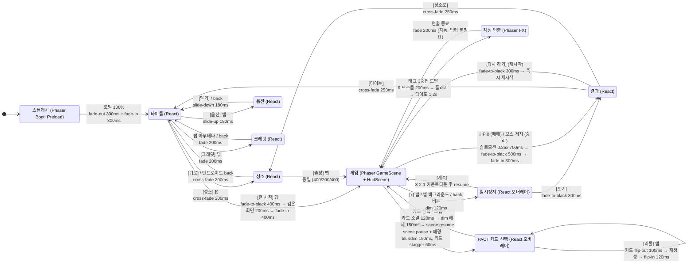

# 10. UI/UX 설계 (가로 모바일)

> **문서 지위: 파생(DERIVED).** 상위 규격은 `01-CONCEPT-AND-STORY.md` / `03-GDD-CORE.md` / `04-PACT-SYSTEM.md`.
> 충돌 시 정본 3개가 우선한다. 이 문서는 정본의 수치를 **화면 좌표로 확정**하는 역할만 한다.
> 최종 수정: 2026-08-10 / 1인 개발

---

## 0. 이 문서의 전제 (정본에서 확정된 값)

| 항목 | 값 | 출처 |
|---|---|---|
| 논리 해상도 | **640 × 360** (16:9) | `03-GDD` §2.1 |
| Scale 모드 | `Phaser.Scale.FIT` + `CENTER_BOTH` | `03-GDD` §2.1 |
| 방향 | **landscape 고정** | `03-GDD` §2.1 |
| 레터박스 배경 | `#0b0710` | `03-GDD` §2.1 |
| 1 런 | 360초 | `01-CONCEPT` §2 |
| 실시간 HUD | **Phaser `HudScene`** | `03-GDD` §10 |
| 정지 UI (타이틀/성소/PACT/결과/옵션) | **React + Zustand** | `03-GDD` §10 |
| 조이스틱 최대 반경 / 데드존 | 48px / 8px | `03-GDD` §3.2 |
| 대시 | 120px 이동, 무적 0.25s, 쿨 3.0s | `03-GDD` §3.2 |
| 버튼 히트박스 | 시각 크기의 **1.5배** | `03-GDD` §3.3 |

### 0.1 색 토큰 (전 화면 공통)

| 토큰 | HEX | 용도 |
|---|---|---|
| `--void` | `#0b0710` | 배경 / 레터박스 |
| `--stone` | `#2a2430` | 패널 바탕 |
| `--stone-line` | `#4a4150` | 테두리 / 구분선 |
| `--parchment` | `#e8dcc0` | 본문 텍스트 (양피지) |
| `--blood` | `#b8202e` | 대가 / 위험 / HP |
| `--blood-ink` | `#ff4a4a` | 대가 강조 텍스트 |
| `--candle` | `#3fd8c0` | 성촉 청록 / 축복 / EXP |
| `--gold` | `#f0c04a` | 각성 임박 / 골드 |
| `--ash` | `#8a8290` | 비활성 / 부가정보 |
| 등급 Common | `#b9b4bf` | 회백 |
| 등급 Rare | `#3fd8c0` | 청록 |
| 등급 Epic | `#e0324a` | 심홍 |

---

## 1. 화면 플로우 다이어그램



### 1.1 전환 규칙 (구현 계약)

| 규칙 | 값 | 근거 |
|---|---|---|
| 모든 페이드는 React `<ScreenFade>` 단일 컴포넌트가 담당 | `position:fixed`, `z-index:9999`, `background:#0b0710` | 페이드 로직을 한 군데로 모아야 7일 안에 안 깨진다 |
| 게임 진입 총 전환 시간 | **1000ms** (400+200+400) | 로딩 체감을 숨기는 최소 길이 |
| 결과 → 다시 하기 총 시간 | **≤ 800ms** | 정본 §12 "재시작이 3초 안에" — 버튼 위치 + 전환 시간 합산 3초 이내 보장 |
| 오버레이(PACT/일시정지) | Phaser 캔버스를 **끄지 않는다**. `scene.pause()`만. | resume 시 재로딩 0 |
| 전환 중 입력 | 전면 차단 (`pointer-events:none` on 하위 레이어) | 더블탭 중복 진입 방지 |
| 안드로이드 back 버튼 | 항상 "한 단계 뒤로". 타이틀에서 back = 종료 확인 다이얼로그 | Capacitor `App.addListener('backButton')` |

---

## 2. 전 화면 ASCII 와이어프레임

> **읽는 법**
> 모든 와이어프레임은 **78칸 × 22행**. 터미널 글자 비율(가로:세로 ≈ 1:2)을 감안하면 78 : 44 ≈ **16:9**로, 실제 가로로 긴 화면 비율을 그대로 반영한다.
> **1칸 ≈ 8.2 논리px** / **1행 ≈ 16.4 논리px**.
> 좌표계 원점은 **좌상단 (0,0)**, 단위는 논리 px. 정렬 기준은 `L`(좌), `C`(중앙), `R`(우), `T`(상), `M`(세로중앙), `B`(하).

---

### 2.1 스플래시 (Phaser `BootScene` + `PreloadScene`)

```
┌──────────────────────────────────────────────────────────────────────────────┐
│                                                                              │
│                                                                              │
│                                                                              │
│                                                                              │
│                        ✦   B L O O D S W O R N   ✦                           │
│                                                                              │
│                             피 의   서 약                                    │
│                                                                              │
│                                                                              │
│                                                                              │
│                                                                              │
│             ▓▓▓▓▓▓▓▓▓▓▓▓▓▓▓▓▓▓▓▓▓▓░░░░░░░░░░░░░░░░░░░░░░                     │
│                                                                              │
│                          묘 실 을   여 는   중 …                             │
│                                                                              │
│                                                                              │
│                                                                              │
│                                                                              │
│                                                                              │
│                                                                              │
│  ⓘ 이 게임은 광고·인터넷 연결·개인정보 수집이 없습니다                        │
│                                                                              │
└──────────────────────────────────────────────────────────────────────────────┘
```

| 요소 | x, y | 크기 (w×h) | 정렬 | 비고 |
|---|---|---|---|---|
| 배경 | 0, 0 | 640×360 | — | `#0b0710` 단색. 이미지 로드 전이므로 도형만 |
| 로고 타이포 `BLOODSWORN` | 320, 132 | 자동 | C / M | 24px, `--parchment`, 자간 +4px |
| 부제 `피의 서약` | 320, 164 | 자동 | C / M | 12px, `--blood`, 자간 +6px |
| 로딩바 프레임 | 160, 216 | 320×10 | C / T | 1px 테두리 `--stone-line` |
| 로딩바 채움 | 161, 217 | (0→318)×8 | L / T | `--candle`, 진행률 선형 |
| 로딩 문구 | 320, 240 | 자동 | C / T | 11px, `--ash`. 4단계 텍스트 로테이션 |
| 고지 문구 | 16, 336 | 자동 | L / T | 10px, `--ash`. 스토어 심사 대비 |

- **최소 표시 시간 800ms** — 로딩이 200ms에 끝나도 800ms는 보여준다(깜빡임 방지).
- 로딩바가 100%에 도달하면 300ms 대기 후 페이드 아웃.

---

### 2.2 타이틀 (React `TitleScreen`)

```
┌──────────────────────────────────────────────────────────────────────────────┐
│░░░░░░░░░░░░░░░░░░░░░░░░░░░░░░░░░░░░░░░░░░░░░░░░░░░░░░░░░░░░░░░░░░░░░░░░░░░░░░│
│░░  (배경: 봉인묘 정지 일러스트 + 촛불 파티클 6개, 좌우 패럴랙스 ±4px)  ░░░░░░░│
│░░░░░░░░░░░░░░░░░░░░░░░░░░░░░░░░░░░░░░░░░░░░░░░░░░░░░░░░░░░░░░░░░░░░░░░░░░░░░░│
│                                                                              │
│        ✦   B L O O D S W O R N   ✦                                           │
│              피 의   서 약                                                    │
│        ────────────────────────                                              │
│        새벽까지 버텨라. 대가는 나중에 치른다.                                 │
│                                                                              │
│                                        ┌────────────────────────────┐        │
│                                        │      ▶  런  시  작         │        │
│                                        └────────────────────────────┘        │
│                                        ┌────────────────────────────┐        │
│                                        │      ⛨  성      소         │        │
│                                        └────────────────────────────┘        │
│                                                                              │
│                                        ┌───────────┐  ┌───────────┐          │
│                                        │  ⚙ 옵션   │  │ ⓘ 크레딧  │          │
│                                        └───────────┘  └───────────┘          │
│                                                                              │
│  최고 기록  06:00 클리어 · 엔딩 B          보유 골드 ⬤ 1,240        v0.1.0    │
│                                                                              │
└──────────────────────────────────────────────────────────────────────────────┘
```

| 요소 | x, y | 크기 | 정렬 | 히트박스 | 비고 |
|---|---|---|---|---|---|
| 배경 일러스트 | 0, 0 | 640×360 | — | — | `cover`, 어둡게 60% 오버레이 |
| 로고 | 64, 68 | 자동 | L / T | — | 28px |
| 부제 | 76, 96 | 자동 | L / T | — | 13px |
| 구분선 | 64, 112 | 176×1 | L / T | — | `--blood` |
| 태그라인 | 64, 122 | 자동 | L / T | — | 11px, `--ash` |
| **런 시작** 버튼 | 368, 152 | **224×44** | R영역 / T | 240×54 | 1차 액션. 우측 배치 = 오른손 엄지 |
| **성소** 버튼 | 368, 204 | **224×44** | R영역 / T | 240×54 | |
| 옵션 버튼 | 368, 260 | **104×40** | L / T | 116×52 | |
| 크레딧 버튼 | 488, 260 | **104×40** | L / T | 116×52 | |
| 최고 기록 | 16, 330 | 자동 | L / T | — | 10px, `--ash` |
| 보유 골드 | 320, 330 | 자동 | C / T | — | 11px, `--gold` |
| 버전 | 624, 330 | 자동 | R / T | — | 10px, `--ash`. 버그 리포트용 필수 |

- **주요 버튼을 오른쪽에 몬 이유:** 가로 모바일은 양손 파지가 기본이고, 오른손 엄지의 자연 스윕 아크가 x≈420~600 / y≈150~300에 걸린다. 로고는 왼쪽(정보), 액션은 오른쪽(조작)으로 좌우를 역할 분리한다.

---

### 2.3 성소 — 영구 업그레이드 6종 그리드 (React `SanctumScreen`)

```
┌──────────────────────────────────────────────────────────────────────────────┐
│ ◀ 뒤로        ⛨  성 소 (SANCTUM)                    보유 골드  ⬤ 1,240      │
│──────────────────────────────────────────────────────────────────────────────│
│                                                                              │
│  ┌────────────────────┐ ┌────────────────────┐ ┌────────────────────┐        │
│  │ 🛡 강인함           │ │ ⚔ 예리함           │ │ 👟 신속            │        │
│  │ maxHp +10 / 단계    │ │ 공격력 +4% / 단계   │ │ 이동속도 +3% /단계  │        │
│  │ ■■■□□   3/5        │ │ ■■□□□   2/5        │ │ ■□□□□   1/5        │        │
│  │        [ ⬤ 500 ]   │ │        [ ⬤ 280 ]   │ │        [ ⬤ 250 ]   │        │
│  └────────────────────┘ └────────────────────┘ └────────────────────┘        │
│                                                                              │
│  ┌────────────────────┐ ┌────────────────────┐ ┌────────────────────┐        │
│  │ ⬤ 탐욕             │ │ ✦ 각성 촉진        │ │ 📜 재계약          │        │
│  │ 골드 +10% / 단계    │ │ 각성 중첩 -0.2/단계 │ │ 리롤 +1 / 단계     │        │
│  │ □□□□□   0/5        │ │ ■□   1/2           │ │ ■■□   2/3          │        │
│  │        [ ⬤ 80  ]   │ │        [ ⬤ 800 ]   │ │        [ ⬤1000 ]   │        │
│  └────────────────────┘ └────────────────────┘ └────────────────────┘        │
│                                                                              │
│──────────────────────────────────────────────────────────────────────────────│
│                                          ┌──────────────────────────┐        │
│                                          │     ▶  출      정        │        │
│                                          └──────────────────────────┘        │
└──────────────────────────────────────────────────────────────────────────────┘
```

| 요소 | x, y | 크기 | 정렬 | 히트박스 | 비고 |
|---|---|---|---|---|---|
| 상단 바 | 0, 0 | 640×28 | — | — | `--stone` 90% |
| 뒤로 버튼 | 8, 2 | 64×24 | L / T | **72×48** | 시각 24px, 히트 48px(1.5배 초과 허용) |
| 화면 타이틀 | 120, 6 | 자동 | L / T | — | 14px |
| 보유 골드 | 624, 8 | 자동 | R / T | — | 12px `--gold`. 구매 시 숫자 카운트다운 0.3s |
| 업그레이드 타일 (6개) | 아래 표 | **192×82** | 그리드 | **192×82** (전체가 히트박스) | |
| └ 열 x | 20 / 224 / 428 | — | — | — | gap 12 |
| └ 행 y | 44 / 138 | — | — | — | gap 12 |
| └ 아이콘 | 타일+8, +8 | 16×16 | L / T | — | Raven Fantasy |
| └ 이름 | 타일+28, +8 | 자동 | L / T | — | 12px |
| └ 효과 설명 | 타일+8, +28 | 176 폭 | L / T | — | 10px, `--ash`, 1줄 고정 |
| └ 단계 게이지 `■□` | 타일+8, +46 | 자동 | L / T | — | 12px. **색만이 아니라 채움 도형으로 구분** |
| └ 구매 버튼 | 타일+112, +56 | **72×20** (시각) | R / B | **108×40** | 골드 부족 시 `--ash` + 자물쇠 아이콘, 탭 시 흔들림 4px |
| 하단 구분선 | 0, 300 | 640×1 | — | — | |
| **출정** 버튼 | 392, 310 | **208×40** | R / T | 224×50 | 타이틀의 "런 시작"과 같은 우측 존 |

- **6종을 3×2 가로 그리드로 둔 이유:** 가로 화면에서 세로 스크롤은 엄지 이동 거리가 길어 손실이 크다. 6개는 **스크롤 없이 한 화면에 전부** 들어가므로 스크롤을 아예 없앤다(구현 시간 절약 + 오조작 0).

---

### 2.4 ★ 게임 HUD (Phaser `HudScene`)

```
┌──────────────────────────────────────────────────────────────────────────────┐
│ ██████████████████░░░░░░  Lv.12                              05:12   ☠ 137   │ ← 상단 밴드
│ ♥♥♥♡♡  ✦2                                                                    │
│ ▓▓▓▓▓▓▓▓▓▓▓▓▓▓▓▓▓▓▓▓▓▓▓▓▓▓▓▓▓░░░░░░░░░░░░░░░░░░░░░░░░░░░░░░░░░░░░░░░░░░░░░░░ │ ← EXP (전폭)
│                                                                              │
│                                                                              │
│                   ▲                                                          │
│                                     ▲     ▲                                  │
│         ▲                                                                    │
│                          ╔═══════════════╗                                   │
│                          ║               ║                                   │
│               ▲          ║   중앙 시야    ║          ▲                       │
│                          ║  (UI 금지 구역) ║                                  │
│                          ║       ⚔       ║                                   │
│                          ╚═══════════════╝                                   │
│                    ▲                            ▲                            │
│                                       ▲                                      │
│                                                                              │
│         ╭─────╮                                                              │
│        ╱   ◉   ╲                                                    ⏸        │
│        ╲       ╱                                          ┌────┐             │
│         ╰─────╯                                           │ ⚡ │             │
│           (플로팅 조이스틱: 최초 터치 지점에 생성)          └────┘             │
└──────────────────────────────────────────────────────────────────────────────┘
```

| 요소 | x, y | 크기 | 정렬 | 알파 | 히트박스 | 근거 |
|---|---|---|---|---|---|---|
| HP 바 프레임 | 16, 8 | 148×10 | L / T | 0.85 | — | 좌상단 = 시선 시작점 |
| HP 바 채움 | 17, 9 | (0→146)×8 | L / T | 1.00 | — | `--blood`. 감소 시 흰 잔상 0.25s 후 따라옴 |
| Lv 텍스트 | 172, 7 | 자동 | L / T | 0.90 | — | 12px `--parchment` |
| 타이머 `05:12` | 556, 7 | 자동 | R / T | 0.90 | — | 14px. **우상단 = 스캔 종점** |
| 킬수 `☠137` | 624, 7 | 자동 | R / T | 0.75 | — | 11px `--ash` |
| 인간성 심장 ×5 | 16, 24 | 각 12×12, gap 3 | L / T | 0.90 | — | 20%마다 1개 흑화(정본 §8) |
| 각성 카운터 `✦2` | 96, 24 | 자동 | L / T | 0.90 | — | 각성 0개면 **숨김** |
| EXP 바 | 0, 40 | **640×4** | 전폭 / T | 0.70 | — | 화면 전폭. 얇아서 시야 방해 0 |
| **중앙 시야 금지 구역** | 200, 96 | **240×168** | C / M | — | — | 이 사각형 안에 **어떤 UI도 그리지 않는다** |
| 조이스틱 베이스 | **(145, 225)** 고정 / 플로팅은 동적 | r=48 (링 2px) | 고정 원점 (5.3) | 대기 **0.22** / 터치 중 0.85 | 반경 80 | 기본은 고정. 좌표 근거는 5.3 (2026-08-12 3차 재조정) |
| 조이스틱 노브 | 동적 | r=14 (채움) | 베이스 상대 | 0.55 | — | |
| 조이스틱 활성 존 | 0, 0 | **320×360** | L | — | 전체 | 좌측 절반 |
| 대시 버튼 | 556, 292 | **48×48** (시각 40) | R / B | 0.45 (쿨 중 0.25) | **72×72** | 우하단. 시각 40 × 1.5 = 60 → 안전하게 72 |
| 대시 쿨 링 | 556, 292 | 48×48 원호 | — | 0.6 | — | 3.0s 원형 클럭. 완료 시 1프레임 흰 플래시 |
| 일시정지 버튼 | 596, 24 | **28×28** (시각 20) | R / T | 0.35 | **48×48** | 우상단. 알파 0.35 = 실수 탭 유도 안 함 |

**전투 가독성 근거**

1. **중앙 시야 금지 구역 (200,96)–(440,264):** 플레이어 스프라이트(32×40)와 근접 무기 부채꼴 90°(사거리 ~72px)가 전부 이 안에 들어간다. 여기에 UI가 겹치면 "내가 맞았는지"를 못 본다. HUD는 전부 **상단 밴드(y<44)** 와 **하단 코너**로 밀어낸다.
2. **HUD 총 점유 면적:** 상단 밴드 640×44(12.2%) + 하단 코너 2개 ≈ 총 **15% 미만**. 나머지 85%가 전투 시야.
3. **알파 정책:** 상시 정보(HP/Lv/타이머)는 0.85~0.90으로 또렷하게. 조작 오브젝트(조이스틱 0.30, 대시 0.45, 일시정지 0.35)는 반투명 — 손가락이 이미 그 자리에 있으므로 시각 정보량이 필요 없다.
4. **EXP 바를 전폭 4px로 만든 이유:** EXP는 "지금 얼마인가"보다 "곧 차는가"만 알면 된다. 화면 전폭이면 주변시(peripheral vision)로 채워지는 게 보이고, 두께가 4px이라 시야를 전혀 안 먹는다. 90% 이상 차면 청록 → 금색 펄스(0.6s 주기)로 예고.
5. **인간성 심장을 HP 바 바로 아래 둔 이유:** 둘 다 "죽음까지의 거리"다. 인접시키면 한 번의 시선 고정(fixation)으로 두 값을 동시에 읽는다.
6. **타이머 우상단:** 좌상단→우상단 스캔이 자연스러운 F 패턴. 그리고 타이머는 **런의 목표(6:00)** 이므로 시선 종착점에 있는 게 맞다.

---

### 2.5 ★★ PACT 카드 선택 (React `PactCardOverlay`) — 대표 화면

```
┌──────────────────────────────────────────────────────────────────────────────┐
│ ┌───┐  녹턴 —— "이번엔 조금 비싸. 그만큼 좋거든."           Lv.11 ▸ Lv.12    │
│ │ 🩸│                                              인간성 ♥♥♥♡♡  72          │
│ └───┘══════════════════════════════════════════════════════════════════════  │
│  ┏━━━━━━━━━━━━━━━━━━━┓  ┌───────────────────┐  ╔═══════════════════╗         │
│  ┃ ◇ RARE      [🔥] ┃  │ ○ COMMON    [🗡] │  ║ ◆ EPIC      [💀] ║ ← 등급   │
│  ┃                   ┃  │                   │  ║                   ║         │
│  ┃  화 염 탄         ┃  │  긴   팔          │  ║  폭군의 손톱      ║ ← 축복   │
│  ┃  Lv.2 ▸ Lv.3      ┃  │                   │  ║                   ║   (최대)│
│  ┃  투사체 +1        ┃  │  사거리 +12%      │  ║  공격력 +22%      ║         │
│  ┃───── ✖ 대 가 ─────┃  │───── ✖ 대 가 ─────│  ║───── ✖ 대 가 ─────║ ← 구분선│
│  ┃ [◐ 근시]          ┃  │ [◑ 둔족]          │  ║ [◒ 갈증]          ║         │
│  ┃ 사거리 -32%       ┃  │ 이동속도 -10%     │  ║ 초당 HP -1.1  ×2  ║ ← 대가   │
│  ┃ 중첩 ●●○          ┃  │ 중첩 ●○○          │  ║ 중첩 ●○○ ▸ ●●●    ║         │
│  ┃                   ┃  │                   │  ║ ✦ 이 계약으로 각성 ║ ← 하이 │
│  ┃ 인간성 -6         ┃  │ 인간성 -3         │  ║ 인간성 -12        ║   라이트│
│  ┗━━━━━━━━━━━━━━━━━━━┛  └───────────────────┘  ╚═══════════════════╝         │
│                                                                              │
│              ┌──────────────────┐    ┌──────────────────┐                    │
│              │  ↻ 리롤  (2/2)   │    │  ✖ 거절 (HP+25%) │                    │
│              └──────────────────┘    └──────────────────┘                    │
│                                                                              │
└──────────────────────────────────────────────────────────────────────────────┘
```

> Epic 카드(3번)가 **금빛 이중 테두리 `╔═╗`** 로 맥동 중 = "각성 임박". 정본 §6-5.

**전체 좌표**

| 요소 | x, y | 크기 | 정렬 | 비고 |
|---|---|---|---|---|
| 딤 레이어 | 0, 0 | 640×360 | — | `#0b0710` 알파 0.82. **blur 금지**(모바일 GPU 비용) |
| 녹턴 초상 | 12, 6 | 40×40 | L / T | 원형 마스크, 1px `--blood` 링 |
| 녹턴 대사 | 60, 12 | 최대 380 폭 | L / T | **13px**, `--parchment`, 이탤릭 없음(픽셀폰트) |
| Lv 표시 | 624, 10 | 자동 | R / T | 12px, `Lv.11 ▸ Lv.12` |
| 인간성 표시 | 624, 28 | 자동 | R / T | 심장 5개 + 숫자. 카드 호버/선택 예정값을 **붉게 미리보기** |
| 헤더 구분선 | 0, **48** | 640×2 | — | `--blood` 그라데이션. **50 → 48로 2px 올렸다** — 카드가 224에서 240으로 커지며 세로 예산이 빠듯해졌다 |
| **카드 1** | **64, 52** | **160×240** | — | |
| **카드 2** | **240, 52** | **160×240** | — | 좌우 gap 16 |
| **카드 3** | **416, 52** | **160×240** | — | 우측 여백 64 |
| 리롤 버튼 | **136, 296** | **160×48** (시각=히트) | — | 아트 `btn-normal` 9-slice(양피지). 잔여 0회면 **fill 을 떼어 속 빈 액자**로 비활성 |
| 거절(스킵) 버튼 | **344, 296** | **160×48** (시각=히트) | — | 아트 `btn-pressed` 9-slice(**fill 없음**) + 피색 속. 되돌릴 수 없는 조작이라 리롤과 같은 그림을 쓰지 않는다 |
| 하단 여백 | — | 20 | — | 제스처 내비 바 회피 |

**가로 3분할 계산 (왜 이 숫자인가)**

```
가로 640 = 좌여백(64) + [카드160] + gap(16) + [카드160] + gap(16) + [카드160] + 우여백(64)
         = 64 + 160 + 16 + 160 + 16 + 160 + 64 = 640  ✔ 정확히 맞음

세로 360 = 헤더(48) + 구분선(2) + 여백(2) + [카드240] + 여백(4)
           + [버튼48] + 하단여백(16)
         = 48 + 2 + 2 + 240 + 4 + 48 + 16 = 360  ✔ 정확히 맞음
           (카드 y=52~292 / 버튼 y=296~344)

★ 2026-08-12 — 버튼 40 -> 48. 예전 구현은 `height: 11%` = 39.6 논리px 이었고,
  2.5.2 가 계약으로 못박은 "모든 탭 대상 최소 48x48 논리px" 보다 8.4 작았다
  (논리 1px = 1.00dp 인 720p/1080p 20:9 기기에서 그대로 40dp 짜리 버튼이 된다).
  9-slice 아트는 box-sizing:border-box 라 테두리가 **상자 안쪽**을 먹으므로,
  아트를 입히면서 상자를 안 키우면 손가락 넓이는 그대로인데 글자만 좁아진다.
  빼 온 8 은 카드 여백 8->4 와 하단 여백 20->16 에서 절반씩 나눴다.
  이 표가 원래 적어 두었던 히트 176x54(= y 293~347)보다 오히려 보수적이다.
```

> ⚠ **2026-08-10 변경: 카드 크기가 184×224 → 160×240이 되었다.**
> 실제 생성된 카드 프레임 자산이 `15-IMAGE-PROMPTS-FOR-CODEX.md` A-08 규격인 **160×240(2:3)** 으로 나왔고,
> 그 원본(카드당 640×960)에서 184×224는 **정수배로 떨어지지 않아** 재의뢰 없이는 만들 수 없다.
> 픽셀아트에서 비정수 축소는 격자를 깨뜨리므로(§`15` 3.1), **문서를 자산에 맞추는 쪽을 택했다.**
> 세로가 16px 늘어 버튼과 충돌하므로 **헤더 구분선을 50 → 48로 2px 올려 흡수**했다.

- 카드는 **세로로 긴 직사각형(160×240, 비율 2:3)**. 가로 화면에서 3장을 나란히 놓으면 각 카드는 필연적으로 세로형이 되고, 이게 오히려 "계약서/증서" 모티프(정본 §7 톤 가이드)와 정확히 맞는다. **2:3은 이전 1:1.22보다 더 세로로 길어 이 모티프에 오히려 유리하다.**
- 세로형 카드는 **정보를 위→아래로 쌓을 수 있다** = 축복(위) / 구분선 / 대가(아래)라는 서사 순서가 그대로 시각 순서가 된다.
- 좌우 여백이 28 → 64로 넓어졌다. **20:9 기기에서 레터박스와 이어져 "여백이 곧 묘실의 어둠"으로 읽힌다**(§3.2 근거 4).

---

#### 2.5.1 카드 1장 내부 레이아웃 (160 × 240)

```
     ┌── x: 0 ──────────────────── 160 ──┐
 y=0 ╔════════════════════════════════════╗  ← 등급 테두리 3px (Epic은 4px + 외곽 글로우)
     ║ ◆ EPIC                     [아이콘]║  y   4 ~ 28  등급 배지 + 축복 아이콘 24×24
  32 ╟────────────────────────────────────╢
     ║                                    ║
     ║  폭 군 의  손 톱                   ║  y  40 ~ 58  ★ 축복 이름 16px (최대 크기)
     ║                                    ║
     ║  공격력 +22%                       ║  y  64 ~ 76  축복 효과 12px (최대 2줄)
     ║                                    ║
  92 ╟──────────  ✖ 대 가  ───────────────╢  y  92 ~ 104 구분선 + 인장 (붉은 1px + 중앙 라벨)
     ║                                    ║
     ║  [ ◒ 갈  증 ]                      ║  y 110 ~ 126 대가 태그 칩 14px (도형+색+이름)
     ║                                    ║
     ║  초당 HP -1.1            ×2        ║  y 132 ~ 144 대가 수치 12px  `--blood-ink`
     ║                                    ║
     ║  중첩  ● ● ○                       ║  y 150 ~ 164 중첩 인디케이터 (원 10px, gap 6)
     ║                                    ║
     ║  ✦ 이 계약으로 각성한다            ║  y 170 ~ 184 각성 임박 문구 11px `--gold` (조건부)
 198 ╟────────────────────────────────────╢
     ║  인간성 −12    ♥♥♥♡♡ ▸ ♥♥♡♡♡       ║  y 204 ~ 220 인간성 비용 11px + 변화 미리보기
 240 ╚════════════════════════════════════╝
```

> **폭 24px를 잃고 세로 16px를 얻었다.** 내부 여백은 좌우 12px 유지이므로 **콘텐츠 폭이 160 → 136**으로 줄었다.
> 가장 위험한 것은 **축복 이름 16px 한 줄**이다 — 한글 16px 고정폭에서 136px는 약 8글자다.
> 「폭군의 손톱」(6자)은 들어가지만 **8자를 넘는 이름은 잘린다.** `blessings.json` 작성 시(Day 3, T310)
> **축복 이름을 8자 이내로 제한**하고, 넘으면 이름을 줄이지 말고 **14px로 낮춰 2줄**을 허용한다.
> 세로가 16px 늘었으므로 2줄로 떨어져도 아래 요소를 밀지 않는다.

| # | 요소 | x(카드 상대), y | 크기 | 폰트 | 색 | 정렬 |
|---|---|---|---|---|---|---|
| 1 | 등급 테두리 | 0, 0 | **160×240** | — | 등급색 | Common 2px / Rare 3px / Epic 4px+글로우 |
| 2 | 등급 배지 (도형+글자) | 8, 6 | 자동 | 10px | 등급색 | L/T. `○ COMMON` `◇ RARE` `◆ EPIC` |
| 3 | 축복 아이콘 | **128, 4** | 24×24 | — | — | R/T. Raven Fantasy 16×16을 1.5배. 우여백 8 |
| 4 | **축복 이름** | 12, **40** | **136×18** | **16px** | `--parchment` | L/T. **화면 내 최대 문자.** ⚠ 136px = 한글 약 8자 |
| 5 | 축복 레벨 표기 | 12, **60** | 자동 | 11px | `--candle` | 무기일 때만. `Lv.2 ▸ Lv.3` |
| 6 | 축복 효과 | 12, **64**(레벨 표기 있으면 76) | **136 폭** | 12px | `--candle` | L/T. 최대 2줄 |
| 7 | 구분선 + `✖ 대가` 라벨 | 8, **92** | **144×12** | 10px | `--blood` | C. 선 1px + 라벨 배경 파냄 |
| 8 | 대가 태그 칩 | 12, **110** | 자동×16 | **14px** | 태그색 + 도형 | L/T. `[◒ 갈증]` — **도형·아이콘 병용** |
| 9 | 대가 수치 | 12, **132** | **136 폭** | 12px | `--blood-ink` | L/T |
| 10 | Epic 2중첩 배지 | **148, 132** | 자동 | 10px | `--blood-ink` | R/T. `×2` |
| 11 | **중첩 인디케이터** | 12, **150** | 자동×10 | — | 채움/빈 원 | L/T. `● ● ○` 원 지름 10, gap 6 |
| 12 | 각성 임박 문구 | 12, **170** | **136 폭** | 11px | `--gold` | L/T. **조건부 표시** |
| 13 | 하단 구분선 | 8, **198** | **144×1** | — | `--stone-line` | |
| 14 | 인간성 비용 | 12, **204** | 자동 | 11px | `--blood` | L/T |
| 15 | 인간성 변화 미리보기 | **148, 204** | 자동 | 11px | `--ash`→`--blood` | R/T |

**중첩 인디케이터 상세 (색맹 대응 포함)**

| 상태 | 표기 | 부가 |
|---|---|---|
| 0 중첩 | `○ ○ ○` | 없음 |
| 1 중첩 | `● ○ ○` | |
| 2 중첩 → 이 카드로 3 | `● ● ○` → 선택 시 `●●●` **애니메이션 프리뷰** (0.8s 루프) | 세 번째 원이 금색으로 깜빡 |
| Epic 2중첩 부여 | `● ○ ○` 옆에 `+●●` | `×2` 배지 병기 |
| 각성 완료 태그 | `✦✦✦` (원이 아니라 별) | 카드 후보에서 제외되므로 카드엔 안 나타남. HUD 전용 |

---

#### 2.5.2 엄지 탭 최소 크기 검증 (48dp 환산)

**핵심 항등식**

```
논리 해상도 세로 = 360 px
Phaser FIT 배율(가로 모바일, 16:9 이상)  s = 기기세로해상도(px) / 360

기기 세로 dp = 기기세로해상도(px) / density

∴ 논리 1px 이 차지하는 dp = s / density
                          = (기기세로px / 360) / density
                          = (기기세로dp) / 360
```

즉 **가로 모드에서 화면 세로가 360dp인 기기라면 논리 1px = 정확히 1dp**다.
그리고 안드로이드 폰의 landscape 세로 dp는 압도적으로 **360dp 부근**에 몰려 있다.

| 기기 (가로 기준) | 해상도 | density | FIT 배율 s | 세로 dp | **논리 1px = ? dp** | 48dp = ? 논리px |
|---|---|---|---|---|---|---|
| 저가형 (1600×720, 20:9) | 1600×720 | 2.00 (320dpi) | 720/360 = **2.00** | 360 | **1.00** | **48.0** |
| 보급형 Galaxy A (2400×1080, 20:9) | 2400×1080 | 3.00 (480dpi) | **3.00** | 360 | **1.00** | **48.0** |
| Pixel 7 (2340×1080, 19.5:9) | 2340×1080 | 2.625 (420dpi) | **3.00** | 411 | **1.14** | 42.0 |
| 18:9 (2160×1080) | 2160×1080 | 2.75 (440dpi) | **3.00** | 393 | **1.09** | 44.0 |
| S23 Ultra (3200×1440, 20:9) | 3200×1440 | 4.00 (640dpi) | **4.00** | 360 | **1.00** | **48.0** |
| 태블릿 (2000×1200, 5:3) | 2000×1200 | 2.00 (320dpi) | min(3.125,3.333)=**3.125** | 600 | **1.56** | 30.8 |

> **결론 (구현 계약):**
> **논리 1px ≥ 1.00 dp 가 항상 성립한다.**
> 따라서 **모든 탭 대상의 히트박스는 최소 48 × 48 논리 px**로 잡으면 전 기기에서 Android 접근성 기준 48dp를 만족한다.
> 그리고 시각 크기 × 1.5 = 히트박스(정본 §3.3)이므로, **시각 크기 최소값은 32 × 32 논리 px** (32 × 1.5 = 48).

**PACT 카드 검증**

| 대상 | 시각 크기 | 히트박스 | 48dp 기준 | 판정 |
|---|---|---|---|---|
| PACT 카드 | **160 × 240** | 160 × 240 (전체) | 48×48 | ✅ **가로 3.3배 / 세로 5.0배** — 압도적 여유 |
| 리롤 버튼 | 156 × 40 | **176 × 54** | 48×48 | ✅ 세로 54 ≥ 48 |
| 거절 버튼 | 156 × 40 | **176 × 54** | 48×48 | ✅ |
| 카드 간 gap | 16 | — | ≥ 8 권장 | ✅ 오탭 방지 여유 |
| 카드 ↔ 하단 버튼 수직 간격 | 300 − 284 = **16** | — | ≥ 8 | ✅ |

- 카드 세로 240px는 48dp의 **5.0배**. "엄지로 못 누르는" 상황은 물리적으로 불가능하다. 카드가 좁아졌어도(184→160) 가로는 여전히 **3.3배**다.
- 대신 반대 위험(**오탭**)이 생긴다 → 대응: **카드 탭 시 즉시 확정하지 않는다.**
  1탭 = 선택(테두리 발광 + 인간성 미리보기 표시), 같은 카드 **2탭 = 확정**.
  단, 옵션에서 `한 번 탭으로 확정` 켤 수 있다(숙련자용, 기본 OFF).
  → 정본 §1 "카드 선택 3~6초"를 지키면서 되돌릴 수 없는 선택의 실수를 0으로 만든다.

---

#### 2.5.3 정보 위계 — 3초 안에 판단시키는 순서

플레이어가 3초 동안 실제로 하는 일은 **"이 카드가 나를 죽이는가, 각성시키는가"** 단 하나다.

| 순위 | 요소 | 크기/처리 | 시선 도달 목표 | 왜 이 순위인가 |
|---|---|---|---|---|
| **1** | **등급 테두리 (두께·색·글로우)** | 2/3/4px + Epic 글로우 | 0.0 ~ 0.3s | 형태로 인식 — 읽지 않아도 "이건 무겁다"가 즉시 전달 |
| **2** | **축복 이름 16px** | 화면 최대 문자 | 0.3 ~ 1.0s | "무엇을 얻는가". 3장 비교의 1차 축 |
| **3** | **중첩 인디케이터 `●●○` + 금빛 맥동** | 원 10px, 애니메이션 | 0.5 ~ 1.2s | 움직임은 크기보다 강하게 시선을 끈다. 각성 임박 카드는 **위계 1위로 승격** |
| **4** | **대가 태그 칩 14px** | 도형+색+2글자 | 1.0 ~ 2.0s | "무엇을 잃는가". 이름만 알면 충분(수치는 몰라도 됨) |
| **5** | 축복 효과 수치 12px | | 2.0 ~ 2.8s | 최적화 플레이어만 읽음 |
| **6** | 대가 수치 12px | | 2.0 ~ 2.8s | |
| **7** | 인간성 비용 11px | 하단 고정 | 2.8 ~ 3.0s | 엔딩 조건 관리용. 즉시성 낮음 |
| **8** | 등급 배지 텍스트 10px | 최소 | (읽지 않아도 됨) | 테두리로 이미 전달됨. 색맹 대응 보조 수단 |

**크기 비율 정리:** `16 : 14 : 12 : 11 : 10` — **인접 단계 차이가 최소 1px, 최대·최소 차이 1.6배.**
픽셀 폰트라 크기 계단이 좁을 수밖에 없으므로, **크기 대신 색·굵기·여백·애니메이션으로 위계를 만든다.**

| 위계 수단 | 1순위 | 2순위 | 3순위 |
|---|---|---|---|
| 크기 | 16px | 12~14px | 10~11px |
| 색 | `--parchment`(최고 대비) | `--candle` / `--blood-ink` | `--ash` |
| 상하 여백 | 위아래 12px | 6px | 2px |
| 애니메이션 | 금빛 맥동 (각성 임박만) | 없음 | 없음 |

**"각성 임박" 하이라이트 연출 (정본 §6-5 구현)**

| 항목 | 값 |
|---|---|
| 테두리 | 4px 금빛(`#f0c04a`) 이중선. 바깥에 8px 소프트 글로우 |
| 맥동 | 알파 0.55 ↔ 1.00, 주기 **900ms**, easing `sineInOut` |
| 카드 스케일 | 1.00 ↔ 1.02 동기 맥동 (다른 카드보다 살짝 앞으로 나온 느낌) |
| 문구 | `✦ 이 계약으로 각성한다` — y=162, 11px, 금색 |
| 중첩 인디케이터 | `● ● ○` 의 세 번째 원이 금색으로 채워졌다 비워지는 프리뷰 (450ms 주기) |
| 사운드 | 카드 등장 시 낮은 종 1타 (`sfx_pact_omen`, −6dB) |
| 동시에 2장이 각성 임박일 때 | 둘 다 하이라이트. 맥동 위상을 180° 어긋나게 하여 구분 |
| 각성 상한(2개) 도달 상태 | 하이라이트 **금지**. 대신 회색 문구 `✦ 각성 상한 — 인간성 −20` 표시 |

**녹턴 대사 표시 위치 (정본 §5.2 대사 풀 12종)**

| 항목 | 값 |
|---|---|
| 위치 | **좌상단** x=60, y=12, 최대 폭 380px |
| 이유 | ① 카드(y≥60)를 절대 가리지 않는다 ② F패턴 첫 시선이 닿는 곳 ③ 초상(x=12)과 인접해 "누가 말하는가"가 명확 |
| 폰트 | 13px, `--parchment` |
| 최대 글자수 | **22자 / 1줄** (2줄 금지 — 정본 §7 "한 문장 12자 이내" 톤 유지) |
| 등장 | 타이핑 없음. **알파 0→1 페이드 180ms**. (타이핑은 3~6초 예산을 잡아먹는다) |
| 규칙 | 직전 레벨업과 **같은 대사 금지** (직전 1개 제외 후 랜덤) |
| 특수 케이스 | 각성 임박 카드가 포함된 회차 → 전용 대사 3종 풀에서 선택 (`"내 사슬, 헐거워지는 소리가 들려."` 등) |
| Lv 1~3 (대가 없음 구간) | 전용 대사 `"이번엔 공짜야. 처음이니까."` 고정 |

**카드 등장 애니메이션**

| 시점 | 동작 |
|---|---|
| 0ms | 딤 레이어 알파 0 → 0.82 (150ms) |
| 80ms | 녹턴 초상 + 대사 페이드 인 (180ms) |
| 150ms | 카드 1 — y+16 에서 y로 슬라이드 + 알파 0→1 (140ms) |
| 210ms | 카드 2 (stagger **60ms**) |
| 270ms | 카드 3 |
| 410ms | 각성 임박 카드가 있으면 종소리 + 맥동 시작 |
| 총 | **≈ 470ms** — 3~6초 판단 예산의 10% 이내 |

---

### 2.6 각성 연출 (Phaser `AwakeningFx`, `HudScene` 위 레이어)

> **설계 결정: 각성 연출은 React가 아니라 Phaser로 만든다.**
> 히트스톱(0.2s) · 화면 플래시 · 충격파 · 적 넉백이 **전부 게임 월드의 시간축**에 묶여 있다. React로 그리면 두 시간축을 동기화해야 하고, 그건 7일 안에 반드시 버그가 난다.

```
┌──────────────────────────────────────────────────────────────────────────────┐
│                                                                              │
│    ▲          ▲                                          ▲         ▲         │
│         ▲              ← 넉백 + 2초 스턴 (화면 내 전체)         ▲            │
│                                                                              │
│                    ╱╱╱╱╱╱╱╱╱╱╱╱╱╱╱╱╱╱╱╱╱╱╱╱╱╱╱╱╱                            │
│                                                                              │
│                            ✦ 각    성 ✦                                      │
│                                                                              │
│                     「 중 력 의   군 주 」                                    │
│                                                                              │
│                  ─────────────────────────────                               │
│                  "움직이지 않는 자가, 세상을 멈춘다."                          │
│                                                                              │
│                              ⬢  (인장)                                       │
│                                                                              │
│                    ╲╲╲╲╲╲╲╲╲╲╲╲╲╲╲╲╲╲╲╲╲╲╲╲╲╲╲╲╲                            │
│                                                                              │
│              ((( 원형 충격파 확산 r: 0 → 420px )))                            │
│   ▲                                                            ▲             │
│                              HP +30% 회복                                    │
│                                                                              │
└──────────────────────────────────────────────────────────────────────────────┘
```

| 타임라인 | t (ms) | 내용 | 수치 |
|---|---|---|---|
| ① 히트스톱 | 0 → **200** | `timeScale = 0`. 오디오는 유지 | 정본 §5.2-1 |
| ② 심홍 플래시 | 200 → 260 | 전체 사각형 `#e0324a` 알파 0.9 → 0 | 60ms |
| ③ 흑백 반전 | 260 → **410** | 카메라 색반전 (셰이더 없이 흰 사각형 `difference` 블렌드) | 150ms, 정본 §5.2-2 |
| ④ 타이포 등장 | 380 → 560 | `✦각성✦` 12px → 각성명 **26px** 스케일 1.4→1.0 + 알파 0→1 | 180ms |
| ⑤ 인용구 | 560 → 700 | 12px, `--ash`, 페이드 인 | 140ms |
| ⑥ 인장 아이콘 | 600 → 800 | 48×48, 회전 −20°→0°, 태그색 | 200ms |
| ⑦ 충격파 | 410 → **1010** | 원 반경 0 → 420px, 선 두께 6→1px | 600ms |
| ⑧ 넉백 + 스턴 | 410 | 화면 내 전 적: 방사 방향 **48px** 넉백 + **2.0초** 스턴 | 정본 §5.2-5 |
| ⑨ HP 회복 | 410 | maxHp의 **30%** 회복 (안전장치 S6) | 회복 숫자 `+30` 초록 표시 |
| ⑩ 화면 흔들림 | 410 → 910 | 진폭 **8px** → 0 감쇠 | 500ms. 흔들림 OFF 옵션 시 **0** |
| ⑪ 텍스트 유지 | 800 → **1800** | 정지 | 1000ms |
| ⑫ 페이드 아웃 | 1800 → 2000 | 알파 1→0, `timeScale = 1` 복귀 | 200ms |
| **총 길이** | | **2.0초** | 6분 런에서 최대 2회 = 총 4초 (허용) |

| 요소 | x, y | 크기 | 정렬 |
|---|---|---|---|
| 상단 장식선 | 160, 108 | 320×2 | C |
| `✦ 각성 ✦` | 320, 122 | 자동 | C |
| 각성 이름 | 320, 148 | 자동 | C / **26px** |
| 구분선 | 190, 178 | 260×1 | C |
| 인용구 | 320, 190 | 최대 420 폭 | C / 12px |
| 인장 아이콘 | 320, 218 | 48×48 | C |
| 하단 장식선 | 160, 250 | 320×2 | C |
| 회복 표시 | 320, 300 | 자동 | C / 14px `#6ae3a0` |

- **입력 차단:** 연출 2초 동안 조이스틱/대시 입력을 큐에 담았다가 종료 시 흘려보낸다(입력 유실 방지).
- **각성 후 상시 오라:** 플레이어에 태그색 파티클 8개, 반경 24px 공전, 알파 0.5 (저사양 모드에서 4개).

---

### 2.7 일시정지 (React `PauseOverlay`)

```
┌──────────────────────────────────────────────────────────────────────────────┐
│░░░░░░░░░░░░░░░░░░░░░░░░░░░░░░░░░░░░░░░░░░░░░░░░░░░░░░░░░░░░░░░░░░░░░░░░░░░░░░│
│░░░  (게임 화면 정지 + 딤 0.75)                                          ░░░░░│
│░░  ┌────────────────────────────────┐  ┌──────────────────────────────┐  ░░░│
│░░  │  일  시  정  지                 │  │  현 재 계 약                 │  ░░░│
│░░  ├────────────────────────────────┤  ├──────────────────────────────┤  ░░░│
│░░  │                                │  │ 🗡 피의 송곳니      Lv.4            │  ░░░│
│░░  │   ┌────────────────────────┐   │  │ 🔥 화염탄    Lv.3            │  ░░░│
│░░  │   │     ▶  계   속         │   │  │ 💀 뼈 회오리 Lv.2            │  ░░░│
│░░  │   └────────────────────────┘   │  │ ─────────────────────────    │  ░░░│
│░░  │   ┌────────────────────────┐   │  │ ◐ 근시   ● ● ○              │  ░░░│
│░░  │   │     ⚙  옵   션         │   │  │ ◑ 둔족   ✦ ✦ ✦  각성됨      │  ░░░│
│░░  │   └────────────────────────┘   │  │ ◒ 갈증   ● ○ ○              │  ░░░│
│░░  │   ┌────────────────────────┐   │  │ ─────────────────────────    │  ░░░│
│░░  │   │     ✖  포   기         │   │  │ 인간성 ♥♥♡♡♡  42            │  ░░░│
│░░  │   └────────────────────────┘   │  │ 각성 1/2 · 리롤 1/2          │  ░░░│
│░░  │                                │  │ 경과 03:24 · 처치 412        │  ░░░│
│░░  └────────────────────────────────┘  └──────────────────────────────┘  ░░░│
│░░░░░░░░░░░░░░░░░░░░░░░░░░░░░░░░░░░░░░░░░░░░░░░░░░░░░░░░░░░░░░░░░░░░░░░░░░░░░░│
│                                                                              │
└──────────────────────────────────────────────────────────────────────────────┘
```

| 요소 | x, y | 크기 | 히트박스 | 비고 |
|---|---|---|---|---|
| 딤 | 0, 0 | 640×360 | — | 알파 0.75 |
| 좌측 패널 | 40, 44 | 264×272 | — | `--stone` 0.95 |
| 계속 버튼 | 72, 116 | 200×44 | 216×56 | **최상단 = 가장 자주 누름** |
| 옵션 버튼 | 72, 172 | 200×44 | 216×56 | |
| 포기 버튼 | 72, 228 | 200×44 | 216×56 | 붉은 테두리. **탭 → 확인 다이얼로그 필수** |
| 우측 패널 (현재 계약) | 328, 44 | 272×272 | — | 스크롤 없음. 항목 초과 시 폰트 10px로 축소 |
| 무기 목록 | 344, 76 | 240 폭 | — | 최대 5행 |
| 태그 중첩 현황 | 344, 172 | 240 폭 | — | 보유 태그만 표시(최대 6행) |
| 런 요약 | 344, 268 | 240 폭 | — | 10px `--ash` |

- **"계속" 후 3-2-1 카운트다운(각 400ms, 총 1.2초)** — 손가락을 조이스틱으로 옮길 시간. 카운트 중 적은 정지.
- 우측 "현재 계약" 패널이 이 게임에서 유일하게 **빌드 전체를 조망**하는 화면이다. 일시정지가 곧 빌드 확인 UI를 겸한다(별도 인벤토리 화면 만들지 않음 = 7일 절약).

---

### 2.8 결과 — 승리 (React `ResultScreen`)

```
┌──────────────────────────────────────────────────────────────────────────────┐
│                                                                              │
│              ☀  여  명                                                       │
│              엔딩 B —— 「 서 약 자 」                                         │
│              ────────────────────────────────────────                        │
│              봉인은 유지됐다. 하지만 거울 속 얼굴이 낯설다.                    │
│                                                                              │
│   ┌───────────────────────────────┐   ┌──────────────────────────────┐       │
│   │ 생존 시간        06:00 (클리어)│   │ 각성                         │       │
│   │ 최종 레벨        Lv.21         │   │  ✦ 「중력의 군주」 (SLOW×3)  │       │
│   │ 처치 수          847           │   │  ✦ 「진조의 갈증」 (HUNGER×3)│       │
│   │ 남은 인간성      12 / 100      │   │                              │       │
│   │ 최대 연속 처치   38            │   │ 획득 골드                    │       │
│   └───────────────────────────────┘   │  ⬤ 847 + 180 + 200 = 1,227  │       │
│                                       └──────────────────────────────┘       │
│                                                                              │
│         ┌────────────────────┐ ┌────────────────────┐ ┌───────────────┐      │
│         │  ↻  다 시  하 기   │ │  ⛨  성  소  로     │ │  ⌂  타이틀    │      │
│         └────────────────────┘ └────────────────────┘ └───────────────┘      │
│                                                                              │
└──────────────────────────────────────────────────────────────────────────────┘
```

### 2.9 결과 — 패배

```
┌──────────────────────────────────────────────────────────────────────────────┐
│                                                                              │
│              ✖  실  패                                                       │
│              「 먹    이 」                                                   │
│              ────────────────────────────────────────                        │
│              녹턴 —— "아깝군. 다음 그릇을 기다려야겠어."                       │
│                                                                              │
│   ┌───────────────────────────────┐   ┌──────────────────────────────┐       │
│   │ 생존 시간        04:12         │   │ 사망 원인                    │       │
│   │ 최종 레벨        Lv.16         │   │  진홍 임프 (돌진)            │       │
│   │ 처치 수          502           │   │                              │       │
│   │ 남은 인간성      34 / 100      │   │ 획득 골드                    │       │
│   │ 도달 페이즈      04:30 러시    │   │  ⬤ 502 + 126 = 628          │       │
│   └───────────────────────────────┘   └──────────────────────────────┘       │
│                                                                              │
│         ┌────────────────────┐ ┌────────────────────┐ ┌───────────────┐      │
│         │  ↻  다 시  하 기   │ │  ⛨  성  소  로     │ │  ⌂  타이틀    │      │
│         └────────────────────┘ └────────────────────┘ └───────────────┘      │
│                                                                              │
└──────────────────────────────────────────────────────────────────────────────┘
```

| 요소 | x, y | 크기 | 정렬 | 히트박스 | 비고 |
|---|---|---|---|---|---|
| 결과 헤더 | 96, 28 | 자동 | L / T | — | 20px. 승리 `--gold` / 패배 `--blood` |
| 엔딩 이름 | 96, 52 | 자동 | L / T | — | 14px |
| 구분선 | 96, 72 | 384×1 | L / T | — | |
| 엔딩 텍스트 | 96, 82 | 최대 440 폭 | L / T | — | 12px, **최대 2줄** |
| 좌측 통계 패널 | 24, 112 | 280×112 | — | — | 5행 |
| 우측 요약 패널 | 320, 112 | 296×112 | — | — | 각성 목록 + 골드 |
| 골드 애니메이션 | — | — | — | — | 0 → 최종값 카운트업 **700ms** |
| **다시 하기** | 72, 258 | **168×44** | — | **184×56** | ★ 최좌측 = 엄지 기본 위치 |
| 성소로 | 256, 258 | 168×44 | — | 184×56 | |
| 타이틀 | 440, 258 | 128×44 | — | 144×56 | |

- **정본 §12 "재시작 3초 이내" 검증:** 결과 화면 페이드 인 완료 = 1.5초 → 버튼은 이미 그려져 있음(카운트업 애니메이션과 무관하게 즉시 탭 가능) → 탭 → 전환 300ms. **총 ≈ 1.9초 ✅**
- 카운트업 중 탭하면 애니메이션을 **즉시 스킵**하고 최종값 표시(2회 탭 필요 없음).

---

### 2.10 옵션 (React `OptionsScreen`)

```
┌──────────────────────────────────────────────────────────────────────────────┐
│ ◀ 닫기         ⚙  옵 션                                                      │
│──────────────────────────────────────────────────────────────────────────────│
│                                                                              │
│  ┌──── 사 운 드 ─────────────────────┐  ┌──── 조 작 ────────────────────┐    │
│  │ BGM      ◀ ▓▓▓▓▓▓░░░░ 60% ▶      │  │ 조이스틱  [플로팅] [ 고정 ]   │    │
│  │ SFX      ◀ ▓▓▓▓▓▓▓▓░░ 80% ▶      │  │ 조이스틱 크기 ◀ 100% ▶        │    │
│  └───────────────────────────────────┘  │ 카드 확정   [2탭] [ 1탭 ]     │    │
│                                         └───────────────────────────────┘    │
│  ┌──── 화 면 / 접 근 성 ─────────────┐  ┌──── 데 이 터 ─────────────────┐    │
│  │ 화면 흔들림      [ ON ] [OFF]     │  │  ┌─────────────────────────┐  │    │
│  │ 데미지 숫자      [ ON ] [OFF]     │  │  │  ✖ 저장 데이터 삭제      │  │    │
│  │ 저사양 모드      [ ON ] [OFF]     │  │  └─────────────────────────┘  │    │
│  │ 고대비 UI        [ ON ] [OFF]     │  │  빌드 v0.1.0 (2026-08-17)     │    │
│  │ 언어             [한국어] [ EN ]  │  │  세이브 v1 · 1,240 골드       │    │
│  └───────────────────────────────────┘  └───────────────────────────────┘    │
│                                                                              │
└──────────────────────────────────────────────────────────────────────────────┘
```

| 요소 | x, y | 크기 | 히트박스 | 비고 |
|---|---|---|---|---|
| 닫기 버튼 | 8, 2 | 64×24 | 72×48 | |
| 사운드 패널 | 20, 40 | 296×60 | — | |
| 조작 패널 | 328, 40 | 292×84 | — | |
| 화면/접근성 패널 | 20, 112 | 296×124 | — | |
| 데이터 패널 | 328, 136 | 292×100 | — | |
| 슬라이더 `◀ ▶` 버튼 | 각 행 | 20×20 (시각) | **48×48** | ★ 드래그 슬라이더 대신 **스텝 버튼 10% 단위** — 가로 화면 드래그는 오조작이 많고 구현도 느리다 |
| 토글 `[ON][OFF]` | 각 행 우측 | 44×22 각 | **56×44** | 선택된 쪽은 채움 + 밑줄(색맹 대응) |
| 저장 삭제 버튼 | 344, 168 | 200×32 | 216×48 | 붉은 테두리 + **2단계 확인** |

- 옵션은 **타이틀에서도, 일시정지에서도 같은 컴포넌트**를 띄운다. 진입 경로에 따라 닫기 시 되돌아갈 곳만 달라진다.
- 값 변경은 **즉시 반영 + 즉시 localStorage 저장** (확인 버튼 없음).

---

### 2.11 크레딧 (React `CreditsScreen`)

```
┌──────────────────────────────────────────────────────────────────────────────┐
│ ◀ 뒤로         ⓘ  크 레 딧                                                   │
│──────────────────────────────────────────────────────────────────────────────│
│                                                                              │
│   BLOODSWORN / 피의 서약                    ─── 에 셋 라 이 선 스 ───         │
│   v0.1.0 · 2026                                                              │
│                                                                              │
│   기획 · 프로그래밍 · 디자인                 캐릭터   FREE Adventurer 2D      │
│     SOLO DEV                                          (CC0 / 저작자 표기)     │
│                                                       ...                     │
│   엔진   Phaser 3.90 · React 19             적       Basic Undead Pack        │
│   빌드   Vite 7 · Capacitor 7                         ...                     │
│                                                                              │
│   폰트   Galmuri (OFL 1.1)                  보스     Bringer-Of-Death         │
│                                                       ...                     │
│                                              이펙트   Free Effect Pack        │
│                                                       ...                     │
│                                              아이콘   Raven Fantasy Icons     │
│   ▼ 스크롤                                            ...                     │
└──────────────────────────────────────────────────────────────────────────────┘
```

| 요소 | x, y | 크기 | 비고 |
|---|---|---|---|
| 좌측 컬럼 (제작) | 24, 44 | 280 폭 | 고정 |
| 우측 컬럼 (라이선스) | 328, 44 | 292×290 | **세로 스크롤 (유일하게 허용)** |
| 스크롤 인디케이터 | 620, 44 | 3×290 | 우측 트랙 |

- 라이선스 전문은 **텍스트 리스트로 전부 실제 표기**. 스토어 심사/저작권 분쟁 방어선이므로 "…" 로 생략하지 않는다.

---

## 3. 터치 타겟 & 세이프에어리어

### 3.1 스케일 계산표

```
FIT 배율  s = min(기기가로px / 640, 기기세로px / 360)
가로 모드 폰(16:9 ~ 20:9)은 항상 세로가 제약 → s = 기기세로px / 360
캔버스 실제 크기 = 640s × 360s
좌우 레터박스(편측) = (기기가로px − 640s) / 2
```

| 기기 (landscape) | 플랫폼 | 화면비 | s | 캔버스 실크기 | **좌우 레터박스(편측)** | 상하 레터박스 | 논리 1px = ?dp/pt |
|---|---|---|---|---|---|---|---|
| 1920×1080 | And | 16:9 | 3.000 | 1920×1080 | **0 px** | 0 | 1.00 |
| 2160×1080 | And | 18:9 | 3.000 | 1920×1080 | **120 px** (=40 논리px) | 0 | 1.09 |
| 2280×1080 | And | 19:9 | 3.000 | 1920×1080 | **180 px** (=60 논리px) | 0 | 1.14 |
| 2340×1080 | And | 19.5:9 | 3.000 | 1920×1080 | **210 px** (=70 논리px) | 0 | 1.14 |
| **2400×1080** | And | **20:9** | 3.000 | 1920×1080 | **240 px** (=80 논리px) | 0 | 1.00 |
| 1600×720 | And | 20:9 | 2.000 | 1280×720 | **160 px** (=80 논리px) | 0 | 1.00 |
| 3200×1440 | And | 20:9 | 4.000 | 2560×1440 | **320 px** (=80 논리px) | 0 | 1.00 |
| **2868×1320** (iPhone 16 Pro Max 계열) | **iOS** | 약 19.55:9 | 3.667 | 2347×1320 | **260.5 px** (=71 논리px) | 0 | 1.22 |
| 2796×1290 (6.9인치 계열) | iOS | 약 19.5:9 | 3.583 | 2293×1290 | **251.5 px** (=70 논리px) | 0 | 1.19 |
| 2736×1260 (6.9인치 계열) | iOS | 약 19.5:9 | 3.500 | 2240×1260 | **248 px** (=71 논리px) | 0 | 1.17 |
| iPhone SE 계열 (16:9, DPR 2) | iOS | 16:9 | 세로px ÷ 360 | 화면 전체 | **0 px** | 0 | 약 1.0 |
| 2000×1200 (태블릿) | And | 5:3 | 3.125 | 2000×1125 | 0 | **37.5 px** (상하) | 1.56 |
| 2732×2048 (4:3 태블릿) | And/iPad | 4:3 | 3.200 | 2048×1152 | 342 px | 448 px | 1.60 |

> **"=N 논리px"** 는 레터박스 폭을 논리 좌표계 단위로 환산한 값(레터박스px ÷ s)이다. 20:9 계열은 화면비가 같으므로 항상 **편측 80 논리px 상당**이 검은 띠가 된다.
>
> **iOS 행의 출처.** `2868×1320`은 §3.3.2 검산에 쓴 값이고, `2796×1290` / `2736×1260`은 App Store가 6.9인치 계열로 인정하는 세로 치수(`1320×2868` / `1290×2796` / `1260×2736`)를 **가로로 뒤집은 것**이다. 즉 스크린샷 규격표에서 가져온 실제 기기 해상도이므로 임의값이 아니다.
> iPhone SE 계열은 "**16:9 · DPR 2 · 레터박스 0**"까지만 확인되어 그 범위 안에서만 적는다. 정확한 device 해상도는 `⚠ 확인 필요(2026-08-10 기준 미확인)`.
> **결론:** iPhone 계열은 전부 **Android 19:9~20:9 대역과 같은 자리**에 떨어진다. 편측 레터박스 70~71 논리px은 Android 19.5:9(70 논리px)와 사실상 동일하다. **iOS 때문에 새로 생기는 레이아웃 케이스는 없다.**

### 3.2 ★ 20:9 레터박스에서 HUD를 어디에 둘 것인가 — 결정과 근거

**결정**

> **HUD의 그리기(렌더)는 전부 640×360 캔버스 안쪽에만 한다. 레터박스로는 절대 확장하지 않는다.**
> **단, 조이스틱과 대시 버튼의 "히트박스"만은 레터박스 영역까지 확장한다.**
> 구현: 캔버스 위에 `position:fixed; inset:0` 투명 DOM 레이어(`<TouchExtender>`)를 깔고, 여기서 받은 좌표를 `640×360` 논리 좌표로 클램프해 Phaser 입력으로 전달.

**근거**

| # | 근거 | 설명 |
|---|---|---|
| 1 | **좌표계 단일화** | `HudScene`은 640×360 좌표계에서만 산다. 레터박스는 캔버스 밖 DOM 영역이라 Phaser가 그릴 수 없다. 그리려면 React로 이중 렌더해야 하고, 그러면 HUD가 두 시스템에 쪼개진다. 7일 스코프에서 이건 확정 버그 소스다. |
| 2 | **근육 기억 보존** | 레터박스 폭은 기기별로 0~80 논리px이다. HUD를 바깥으로 밀면 **기기마다 대시 버튼 위치가 다르다**. 640 기준 고정이면 어느 기기에서든 "화면 콘텐츠 우하단"으로 동일하다. |
| 3 | **QA 조합 폭발 방지** | 확장 배치를 하면 (16:9 / 18:9 / 19.5:9 / 20:9 / 태블릿) × (전 UI 요소) 만큼 레이아웃 검증이 필요하다. 고정하면 **검증이 1회로 끝난다.** 이건 1인 개발에서 압도적 이득이다. |
| 4 | **레터박스는 "베젤"이라는 아트 결정** | 배경 `#0b0710`은 게임의 배경색과 같다. 즉 레터박스가 검은 띠가 아니라 **묘실의 어둠**으로 읽힌다. 이걸 UI로 채우면 오히려 몰입이 깨진다. |
| 5 | **엄지 파지 이득만 취한다** | 20:9 기기에서 왼손 엄지는 실제로 캔버스 왼쪽 끝보다 더 바깥(레터박스)에 놓인다. 히트박스만 확장하면 **"화면 끝에 닿아서 조이스틱이 안 잡히는"** 문제가 사라진다. 시각적 비용 0, 이득만 취함. |

**히트박스 확장 규칙**

| 대상 | 논리 좌표 히트 영역 | 레터박스 확장 |
|---|---|---|
| 조이스틱 활성 존 | x ∈ [0, 320], y ∈ [0, 360] | **좌측 레터박스 전체 포함** (x < 0 터치는 x=0으로 클램프) |
| 대시 버튼 | x ∈ [520, 640], y ∈ [268, 360] | **우측 레터박스 하단 절반 포함** (x > 640 은 x=640으로 클램프) |
| 일시정지 버튼 | x ∈ [572, 640], y ∈ [0, 48] | 확장 **안 함** (오탭 방지 — 여긴 좁아야 좋다) |
| PACT 카드 / 결과 버튼 등 정지 UI | 캔버스 내부만 | 확장 **안 함** |

### 3.3 노치 / 펀치홀 / 제스처 바 · 홈 인디케이터 인셋 (Android + iOS)

> 이 절은 **Android와 iOS를 각각 검산한 뒤 하나의 인셋 계약으로 합친다.**
> 두 플랫폼을 나란히 놓는 이유는 단순하다 — 결론이 같다는 것을 **보여야** 인셋을 하나로 유지할 근거가 생기기 때문이다. 결론만 같다고 적으면 나중에 누구도 그 판단을 재검증할 수 없다.

#### 3.3.1 Android 검산

**핵심 발견:** 가로 모드에서 디스플레이 컷아웃(노치/펀치홀)은 **긴 변 한쪽**에 온다. 그런데 노치가 있는 기기는 대부분 19.5:9 이상이고, 그 기기들의 편측 레터박스는 **180 ~ 320 device px**다. 일반적인 컷아웃 세이프 인셋은 landscape에서 **88 ~ 140 device px**이므로,

```
레터박스(180~320px)  >  컷아웃 인셋(88~140px)
∴ 컷아웃은 검은 레터박스 안에 완전히 들어가고, 캔버스를 침범하지 않는다.
```

| 상황 | 컷아웃이 캔버스를 침범하는가 | 조치 |
|---|---|---|
| 19:9 이상 (레터박스 ≥ 180px) | ❌ 침범 없음 | 없음 |
| 18:9 (레터박스 120px) | ⚠️ 컷아웃 130px 기기면 10px 침범 가능 | 좌우 마진 16 논리px로 흡수 |
| 16:9 (레터박스 0px) | 이론상 침범이나 16:9 + 노치 기기는 사실상 없음 | 좌우 마진 16 논리px로 흡수 |
| 4:3 태블릿 | 컷아웃 없음 | 없음 |

**그러나 제스처 내비게이션 바는 반드시 침범한다.** Android 10+ 제스처 모드에서 홈 인디케이터는 가로 모드에서도 **하단 중앙**에 위치하며 높이 ≈ **24dp = 24 논리px**, 폭 ≈ **108dp**.

#### 3.3.2 iOS 검산 — 결론은 같지만 과정을 남긴다

**전제 (확인된 값)**

| 항목 | 값 |
|---|---|
| 가로에서 컷아웃 방향 | 좌우. **iOS는 좌우 인셋을 대칭으로 보고한다** — 노치가 한쪽에만 있어도 양쪽에 같은 값이 들어온다 |
| 좌우 인셋 크기 | Dynamic Island 계열 **59~62pt**, 노치 계열 **44~50pt** |
| CSS에서의 구분 | **불가능.** Dynamic Island와 노치는 둘 다 `env(safe-area-inset-*)` 로만 읽히며 서로 구분되지 않는다 |

**검산 (iPhone 16 Pro Max — 2868×1320, DPR 3)**

```
s = min(2868/640, 1320/360) = min(4.48, 3.667) = 3.667
캔버스           = 640×3.667 × 360×3.667 = 2347 × 1320
편측 레터박스     = (2868 − 2347) / 2 = 260.5 device px
Dynamic Island 인셋 = 59pt × 3 = 177 device px

177 < 260.5   ∴ 컷아웃은 레터박스 안에 완전히 들어간다. 캔버스 미침범.
```

가장 큰 인셋(62pt)으로 다시 눌러봐도 `62 × 3 = 186 < 260.5`로 여유가 74.5px 남는다. 노치 계열(44~50pt)은 더 안전하다.

| iOS 상황 | 컷아웃이 캔버스를 침범하는가 | 근거 |
|---|---|---|
| 6.9인치 계열 (Dynamic Island, 레터박스 248~260.5px) | ❌ 침범 없음 | 인셋 177~186px < 레터박스 248px |
| 노치 계열 (인셋 44~50pt = 132~150px) | ❌ 침범 없음 | 레터박스가 그보다 크다 |
| iPhone SE 계열 (16:9, 레터박스 0) | ❌ 해당 없음 | **노치도 홈 인디케이터도 없다.** 레터박스가 0이어도 침범할 대상 자체가 없다 |

> **→ Android 결론과 완전히 동일하다.** §3.3.1의 논증 구조가 iOS에서도 그대로 성립하므로, **인셋 계약을 플랫폼별로 분기시키지 않는다.** 분기는 그 자체가 QA 조합을 2배로 만든다(§3.2 근거 3과 같은 사상).

**⚠ 하단 홈 인디케이터 — 확정값이 없다**

이것이 iOS에서 유일하게 열려 있는 항목이다.

- iOS 14 가로에서 **21pt**로 보고된 사례가 있다.
- iOS 15 이후 **조건에 따라 0으로 보고되는** 사례도 있다.
- 즉 `env(safe-area-inset-bottom)` 이 얼마를 돌려줄지 **버전·상황에 따라 다르다.** `⚠ 확인 필요(2026-08-10 기준 미확인)`

**조치: 기존 "하단 24 논리px" 규칙을 그대로 유지한다.**
근거 — 보고값이 21pt든 0이든 **24 논리px은 어느 쪽이든 충분히 보수적**이다. 값이 0으로 오는 경우가 오히려 위험한데(인셋을 믿고 붙이면 인디케이터에 깔린다), 하드코딩 24가 그 경우까지 방어한다. **즉 이 불확실성은 이미 해소되어 있으며, 인셋 값을 iOS 때문에 바꿀 이유가 없다.**

**⚠ 가로 상단 터치 데드존 — 새로 생긴 주의사항**

최근 iOS에서 **가로 모드 상단 가장자리에 `safe-area-inset-top`이 0으로 보고되는데도 터치가 먹지 않는 영역**(터치 데드존)이 보고되고 있다. 인셋이 0이므로 **CSS만으로는 이 영역을 탐지할 수 없다.**

- 따라서 기존 "**상단 8 논리px**" 규칙은 **레이아웃 여백으로는 유지하되, 터치 방어선으로는 신뢰하지 않는다.**
- **원칙: 가로 상단 가장자리에 탭 대상을 두지 않는다.** 일시정지 버튼(x ∈ [572, 640], y ∈ [0, 48])이 유일한 상단 탭 대상이므로 **§11 iOS 체크리스트에서 실기기 탭 검증을 P0으로 잡는다.**
- 이 항목은 계산으로 결론이 나지 않는다. **실기기에서 눌러보는 것 외에 확인 방법이 없다** → `13-QA-TEST-PLAN.md` §3.10 UI-08.

#### 3.3.3 최종 세이프 인셋 (구현 계약 — 양 플랫폼 공통)

| 방향 | 논리 px | Android 근거 | iOS 근거 |
|---|---|---|---|
| 상 | **8** | 상태바 숨김(`immersive`) 사용. 스와이프로 내려올 때만 노출 | 가로 상단 인셋은 0으로 보고되나 **터치 데드존 가능성**이 있다. 8은 여백일 뿐이며 방어선이 아니다 — 상단 가장자리에 탭 대상을 두지 않는 원칙으로 방어한다 |
| 하 | **24** | 제스처 인디케이터(약 24dp) 회피 | 홈 인디케이터 인셋 **확정값 없음**(0 ~ 21pt 보고). 24는 양쪽 경우를 모두 덮는 보수값 |
| 좌 | **16** | 컷아웃 방어 마진 | 컷아웃은 레터박스가 흡수(§3.3.2). 16은 잔여 마진 |
| 우 | **16** | 컷아웃 방어 마진 | 위와 동일. iOS는 좌우 인셋을 **대칭 보고**하므로 좌우 비대칭 처리가 필요 없다 |
| **하단 중앙 금지 구역** | x ∈ [266, 374], y ∈ [336, 360] | 제스처 스와이프와 충돌 | **홈 인디케이터 스와이프와 충돌.** 양 플랫폼 모두 하단 중앙이므로 금지 구역이 정확히 겹친다 |
| **상단 가장자리 탭 금지** | y < 8 전 구간 | (해당 없음) | **iOS 가로 터치 데드존 대응.** 신규 규칙 |

- 실제 값은 React 레이어에서 `env(safe-area-inset-*)`(`viewport-fit=cover`)로 읽고, 위 값과 **max()** 를 취한다. Phaser `HudScene`은 위 상수를 하드코딩(캔버스는 이미 컷아웃 밖).
- **`max()` 를 쓰는 이유가 iOS에서 더 커졌다.** iOS는 하단 인셋을 0으로 돌려줄 수 있으므로 `env()` 값을 그대로 쓰면 인디케이터에 UI가 깔린다. `max(env(...), 24px)` 형태를 반드시 지킨다.
- `AndroidManifest.xml`: `android:screenOrientation="sensorLandscape"`, `layoutInDisplayCutoutMode="shortEdges"`.
- iOS `Info.plist`: `UISupportedInterfaceOrientations` 를 landscape 2종으로만 제한. `viewport-fit=cover` 는 `index.html` 의 viewport 메타에 이미 필요하며 **Android/iOS 공용**이다.
- 조이스틱/대시 버튼은 하단 인셋 24px 위에 배치되어 있음을 확인: 대시 버튼 y=292~340 → 하단 여백 20px. 하단 중앙 금지 구역(x 266~374)과 x 겹침 없음 ✅
- 일시정지 버튼은 y ∈ [0, 48]로 **상단 가장자리에 걸친다.** 시각 요소는 그대로 두되, iOS 실기기에서 **상단 8px 안쪽을 탭했을 때 반응하는지**를 반드시 확인한다. 안 되면 버튼을 y=8부터 시작하도록 8px 내린다(히트박스 48×48은 유지).

#### 3.3.4 ★ 오버레이 박스 3종 — 무엇을 무엇에 맞출 것인가 (2026-08 확정)

React 오버레이의 상자는 **셋**이고, 각각 기준이 다르다. 하나로 합치려는 시도는 전부 실패한다.

| 상자 | 크기 기준 | 쓰는 곳 | 왜 그 기준인가 |
| --- | --- | --- | --- |
| `.ui-stage` | **16:9 640×360 중앙 고정** | PACT · 각성 배너 · 로딩 | 카드가 `pct(x, 640)` 으로 재단돼 있다. 넓히면 카드 3장이 초광폭에 흩어진다 |
| `.ui-hud-stage` | **Phaser 캔버스와 1:1** (`--canvas-w/h`) + 좌우 세이프 인셋 | 플레이 중 HUD (인간성 심장 · 장비 슬롯 · 토스트 · 조우 배너) | Phaser 가 캔버스에 그린 HP바·EXP바와 **좌표를 맞춰야** 한다. 캔버스 말고는 기준이 될 수 있는 사각형이 없다 |
| `.ui-screen` | **뷰포트 전체 (`inset: 0`)** | 타이틀 · 출정지 · 성소 · 옵션 · 크레딧 · 결과 · 일시정지 · 확인 | Phaser 좌표와 맞출 것이 **하나도 없다**. 요구사항은 "화면을 덮는다" 뿐이다 |

**★ `.ui-screen` 을 캔버스에 묶으면 안 되는 이유 (실기기 제보로 확인)**

`game/config.js` 의 `logicalWidthFor` 는 논리 가로를 **640~864 로 자른다**(월드가 한 번에
보는 면적을 고정하기 위한, 의도된 제약이다 — §3.1). 화면비가 그 창 **바깥**이면
Phaser 의 `Scale.FIT` 이 캔버스를 레터박스한다.

- 화면비 < 16:9 (16:10 태블릿 = 1.60, §3.1 표의 5:3 항목): 캔버스 세로가 뷰포트의 **90%** → 상하 검은 띠
- 화면비 > 21.6:9: 캔버스 가로가 잘림 → 좌우 검은 띠

★★ **이 띠는 전투에서는 보이지 않는다.** 월드 배경이 `--void`(#0b0710)라 레터박스와 색이
같기 때문이다. 그런데 결과·타이틀·성소는 밝은 양피지 배경이라 **같은 띠가 그대로 드러난다.**
"전투 페이지 말고 다른 페이지가 화면을 못 채운다"는 제보의 정체가 정확히 이것이다.
전면 화면은 뷰포트에 맞춰야 하고, 레터박스는 캔버스만의 사정이다.

**부수 효과 — 갱신 타이밍 의존이 사라진다.** `--canvas-w/h` 는 JS 가 리사이즈마다 쓰는 값이라
한 번이라도 놓치면 낡는다. 전면 화면이 그 값을 읽지 않으므로 부팅·회전·시스템 UI 변화의
어느 시점에도 전면 화면은 꽉 찬 채로 남는다. `:root` 의 폴백도 16:9 상자에서 `100vw/100dvh`
로 바꿨다 — 폴백은 틀리더라도 화면을 **덜** 채우는 쪽으로 틀리면 안 된다.

### 3.4 히트박스 최종 표 (1.5배 규칙 검증)

| 요소 | 시각 크기 | ×1.5 | **실제 히트박스** | 48 논리px 충족 |
|---|---|---|---|---|
| PACT 카드 | 160×240 | — | 160×240 | ✅ |
| 리롤 / 거절 | 156×40 | 234×60 | 176×54 | ✅ (세로 54 ≥ 48) |
| 대시 버튼 | 40×40 (원 r=20) | 60×60 | **72×72** | ✅ |
| 일시정지 | 20×20 | 30×30 | **48×48** | ✅ (30 < 48 이므로 48로 상향) |
| 타이틀 주 버튼 | 224×44 | — | 240×54 | ✅ |
| 성소 구매 버튼 | 72×20 | 108×30 | **108×48** | ✅ (세로 48로 상향) |
| 옵션 토글 | 44×22 | 66×33 | **56×48** | ✅ (세로 48로 상향) |
| 옵션 스텝 `◀▶` | 20×20 | 30×30 | **48×48** | ✅ |
| 결과 다시 하기 | 168×44 | — | 184×56 | ✅ |
| 뒤로/닫기 | 64×24 | 96×36 | **72×48** | ✅ |

> **규칙 정리:** `히트박스 = max(시각크기 × 1.5, 48)` — 두 조건을 동시에 만족시킨다.
> 인접 히트박스 사이 최소 간격 **8 논리px**. (PACT 카드 gap 16 ✅ / 하단 버튼 gap 32 ✅)

---

## 4. HUD 설계 상세

### 4.1 요소별 최종 규격

| # | 요소 | 위치(x,y) | 크기 | 알파 | 갱신 주기 | 애니메이션 |
|---|---|---|---|---|---|---|
| H1 | HP 바 | 16, 8 | 148×10 | 0.85 | 매 프레임 | 감소 시 흰 고스트 바가 0.25s 뒤따라 줄어듦 |
| H2 | HP 수치 (옵션) | 168, 8 | 자동 | 0.75 | 매 프레임 | 기본 OFF. 고대비 UI 시 ON |
| H3 | Lv | 172, 7 | 자동 | 0.90 | 레벨업 시 | 레벨업 순간 스케일 1.0→1.6→1.0 (300ms) + 금색 |
| H4 | 인간성 심장 ×5 | 16, 24 | 12×12 (gap 3) | 0.90 | 카드 확정 시 | 흑화 시 심장이 **한 번 크게 뛰고**(200ms) 검게 굳음 |
| H5 | 각성 카운터 | 96, 24 | 자동 | 0.90 | 각성 시 | 0개면 숨김. 증가 시 금색 플래시 |
| H6 | EXP 바 | 0, 40 | 640×4 | 0.70 | 매 프레임 | 90% 이상 시 금색 펄스 0.6s 주기 |
| H7 | 타이머 | 556, 7 | 자동 | 0.90 | 1초 | 페이즈 전환 10초 전부터 붉은 깜빡임 |
| H8 | 킬 카운터 | 624, 7 | 자동 | 0.75 | 0.2초 스로틀 | 매 처치 갱신은 낭비 |
| H9 | 일시정지 | 596, 24 | 28×28 | 0.35 | — | 탭 시 알파 1.0 |
| H10 | 조이스틱 | 동적 | r40 / r14 | 0.30 / 0.55 | 매 프레임 | 릴리즈 시 150ms 페이드 아웃 |
| H11 | 대시 버튼 | 556, 292 | 48×48 | 0.45 | 매 프레임 | 쿨 완료 시 흰 링 1회 확산 (200ms) |
| H12 | 태그 중첩 미니 표시 | 16, 44 | 자동 | 0.55 | 카드 확정 시 | **2중첩 이상 태그만** 표시. `◐●●○` 형태 |
| H13 | 보스 HP 바 | 120, 30 | 400×8 | 0.95 | 매 프레임 | 보스전에서만. 페이즈 경계에 눈금 2개 |
| H14 | 페이즈 알림 토스트 | 320, 76 | 자동 | 1.0→0 | 90초마다 | `— 01:00 축시 —` 1.4초 표시 후 페이드 |

### 4.2 배치 근거 (전투 가독성)

| 원칙 | 적용 |
|---|---|
| **중앙 시야 사수** | (200,96)–(440,264) 240×168 영역에 UI 렌더 전면 금지. 유일한 예외는 페이즈 토스트(y=76, 금지구역 위)와 각성 연출(전용 레이어) |
| **정보는 위, 조작은 아래** | 읽는 것(HP/Lv/EXP/타이머)은 y<48, 만지는 것(조이스틱/대시)은 y>268. 중간 220px가 순수 전투 |
| **엄지 그림자 회피** | 왼손 엄지는 좌하단, 오른손 엄지는 우하단을 가린다. 그래서 **좌하단·우하단엔 읽을 정보를 두지 않는다**(조작 오브젝트만) |
| **반투명 수치** | 조작 오브젝트 0.30~0.45 / 정보 오브젝트 0.70~0.90. 조작 오브젝트는 위치만 알면 되고, 그 위엔 손가락이 있어 어차피 안 보인다 |
| **좌우 비대칭 정보 배치** | 좌상단 = 나의 상태(HP·인간성·각성) / 우상단 = 세계의 상태(시간·처치수). 시선 이동이 의미 단위로 끊긴다 |
| **색만으로 구분 안 함** | HP=붉은 채움바 / EXP=청록 얇은바 → **위치·두께·형태가 다르다.** 색맹이어도 혼동 불가 |

### 4.3 보스전 HUD 변형

| 변경 | 내용 |
|---|---|
| 보스 HP 바 등장 | y=30에 400×8. **EXP 바(y=40)와 겹치므로 EXP 바를 y=52로 이동** |
| 킬 카운터 | 숨김 (보스전엔 무의미) |
| 페이즈 눈금 | 66% / 33% 지점에 세로 눈금 2px. 페이즈 전환 시 해당 눈금 금색 플래시 |
| 텔레그래프 | 붉은 인디케이터는 HUD가 아니라 **월드 좌표**에 그린다. 알파 0.5, 예고 0.6~0.8초 (정본 §7.3) |

---

## 5. 가상 조이스틱 UX 상세

### 5.1 플로팅 모드 (옵션)

| 항목 | 값 | 비고 |
|---|---|---|
| 활성 영역 | x ∈ [0, 320], y ∈ [0, 360] + 좌측 레터박스 | 좌측 절반 전체 |
| 예외 영역 | 없음 (좌측 절반엔 다른 UI 없음) | |
| 원점 | **최초 터치 지점** | 손가락이 어디에 닿든 그 자리가 중심 |
| 최대 반경 | **48 px** | 정본 §3.2 |
| 데드존 | **8 px** | 반경 8 이내 = 입력 0 |
| 정규화 | `mag = clamp((d − 8) / (48 − 8), 0, 1)` → `d=8→0.0`, `d=48→1.0` | 데드존을 뺀 뒤 재정규화. 이게 없으면 데드존 경계에서 속도가 튄다 |
| 응답 곡선 | `mag^1.0` (선형) | 픽셀 이동이라 곡선 보정 불필요 |
| 방향 | **연속 아날로그** (8방향 스냅 없음) | 정본 §3.2 |
| 원점 재설정(드리프트) | 손가락이 **반경 48을 초과**하면 원점을 손가락 쪽으로 끌어당김 (`origin += (p − origin) × (1 − 48/d)`) | 긴 드래그에서 팔이 아프지 않게 |
| 표시 지연 | 터치 후 **0ms** (즉시). 페이드 인 80ms | |
| 릴리즈 | 알파 → 0, 150ms. 입력 즉시 0 | |

### 5.2 시각 표현 (손가락 가림 최소화)

```
   ┌── 반경 48 (최대 입력 지점) ─────┐
   │        ╭─────────╮             │
   │      ╱     ┈┈┈     ╲           │   베이스: r=40 **링만** (2px, 채움 없음)
   │     │   ╭───────╮   │          │   → 손가락 아래가 비어 있어 캐릭터가 비쳐 보인다
   │     │   │   ◉   │   │          │   노브: r=14 채움 원
   │     │   ╰───────╯   │          │
   │      ╲    ┈┈┈     ╱            │   방향 티크: 8방향 눈금 2px (알파 0.15)
   │        ╰─────────╯             │
   └────────────────────────────────┘
```

| 요소 | 형태 | 크기 | 알파 | 색 |
|---|---|---|---|---|
| 베이스 링 | **외곽선만** (fill 없음) | r=40, 두께 2 | **0.30** | `--parchment` |
| 방향 눈금 | 8개 짧은 선 | 길이 4, 두께 2 | 0.15 | `--parchment` |
| 노브 | 채움 원 + 1px 링 | r=14 | 0.55 | `--candle` |
| 노브 궤적 | 원점→노브 선 | 두께 1 | 0.20 | `--parchment` |
| 데드존 표시 | 없음 | — | — | 시각적 노이즈만 됨 |

**손가락 가림 최소화 3원칙**

1. **베이스를 채우지 않는다** — 링만 그리면 조이스틱 안쪽으로 게임 화면이 그대로 보인다. 채운 원은 최대 80×80px(=화면의 5%)를 가린다.
2. **노브를 작게(r=14)** — 손가락 접촉 면적(≈ 실기기 9mm ≈ 논리 34px)보다 작게 만들어, 노브가 손가락 밖으로 삐져나오지 않게 한다. 삐져나오면 시각적 노이즈다.
3. **플레이어 캐릭터는 항상 화면 중앙(320,180)** — 조이스틱(고정 원점 (145,225))과 hypot(175,45)=181px 떨어져 있어 손가락과 절대 겹치지 않는다. 링 오른쪽 끝(x=193)과 중앙 시야 금지 구역(x≥200) 사이에도 7px 여유가 있다.

### 5.3 고정 모드 (★ 기본값)

| 항목 | 값 |
|---|---|
| 위치 | 중심 **(145, 225)** 고정 — x 는 좌측 절대값, y 는 **바닥에서 135** |
| 표시 | **상시 표시** (대기 알파 0.22 = 링 / 터치 중 0.85) |
| 활성 영역 | 중심에서 반경 **80px** 이내에서 터치 시작해야 활성 |
| 그 외 좌측 절반 터치 | 무시 (고정 모드의 의도) |
| 나머지 규격 | 플로팅과 동일 (반경 48, 데드존 8) |
| 크기 옵션 | 80% / 100% / 120% (반경 38.4 / 48 / 57.6) |
| 언제 쓰나 | **기본 모드다**(2026-08 사용자 요청). 링이 늘 같은 자리라 눈으로 찾지 않아도 되고 근육 기억이 남는다 |

**원점 (145, 225) 의 근거 — 「가로 파지에서 왼손 엄지가 편한 자리」**

> 2026-08-12 실기기 제보로 세 번 옮겼다. (120, 200) → (145, 165) → (145, 210) → **(145, 225)**.
> 2차부터는 "몇 px 내린다"가 아니라 **엄지 도달 범위에서 유도**한다.

**[1] 아크 데이터 (§2.2 원문)** — "오른손 엄지의 자연 스윕 아크가 `x≈420~600 / y≈150~300`".
왼손 데이터는 없으므로 640 폭 기준 좌우 반전(`x' = 640 − x`) → **왼손 아크 `x 40~220 / y 150~300`**.
양손 파지에서 왼손은 화면 **왼쪽 끝**을 쥐므로 x 는 좌측 절대값이고, 논리 폭이 640~864 로 늘어도 안 변한다.

**[2] x = 145 에서 세로로 편한 구간**
가로 파지의 엄지는 **아래 모서리 근처를 축**으로 안쪽·위로 쓸어 올린다. 왼손 축을 `(0, 360)` 으로 두면
아크 상자의 두 대각 끝이 `(40,300)` → 축에서 72, `(220,150)` → 축에서 304 로 **둘 다 dx ≈ dy**,
즉 아크 상자의 **대각선이 스윕의 중심선**이다.

| 추정 | 계산 | 값 |
|---|---|---|
| 중심선 보간 | `y = 300 + (145 − 40) × (150 − 300) / (220 − 40)` | **212.5** |
| 반경 상한 304 로 x=145 자르기 | `y ≥ 360 − √(304² − 145²)` = 92.8 → x=145 에서는 **안 걸린다** | — |
| 아크 상자 세로 중앙 | `(150 + 300) / 2` | **225** |
| 링(r=48) 전체가 아크 안 | `y − 48 ≥ 150` 이고 `y + 48 ≤ 300` | **y ∈ [198, 252]** |

**[2-1] 3차 재조정 — 왜 225 인가 (2026-08-12, "조금만 더 내려줘")**

새 값을 임의로 고르지 않았다. **[2] 가 이미 뽑아 둔 두 추정치 중 아래쪽으로 갈아탄 것**이다.

- 2차가 212.5(→210)를 고른 유일한 근거는 "0차 (120,200) 이 너무 좌측 하단이라는 평가를 받았다" 였다.
  그런데 그 평가의 원인은 y 가 아니라 **x** 다 — x=120 에서 중심선은 y ≈ 233 이라 200 은 오히려
  중심선보다 33 **위**였다. 사용자가 x=145 를 "좋다"고 못박은 것과도 맞는다.
  **x 가 확정된 지금 그 근거는 소진됐고, 남는 것은 "더 아래"라는 이번 제보뿐이다.**
- 225 는 우연이 아니라 **두 방향에서 같은 값**이다.

| 유도 | 계산 | 값 |
|---|---|---|
| 아크 상자 세로 중앙 | `(150 + 300) / 2` | **225** |
| 링이 아크 안에 통째로 드는 구간의 정중앙 | `(198 + 252) / 2` | **225** |

  즉 링 위 여유 27 / 아래 여유 27 로 **아크 안에 정확히 대칭**으로 놓인다(210 은 위 12 / 아래 42).
- 이동량은 **+15px** — 링 반경 48 의 31%, 논리 세로 360 의 4.2%. "조금만"의 크기와 맞고
  상한 252 까지 27 이 남는다. 한 번에 252 로 가지 않는 이유는 [4] 다.
- 1차 값 165 는 아크 상단(150)에서 15 밖에 안 떨어져 **엄지를 최대로 폈을 때만** 닿았다.

**[3] 경계 검사 (헤드리스 실측: 16:9 1280×720 / 20:9 915×412 / 21:9 1120×480 전부 동일)**

| 조건 | 값 | 여유 | 판정 |
|---|---|---|---|
| 논리 화면 | 16:9 → 640×360 / 20:9 → **799**×360 / 21:9 → **840**×360 | — | 세로는 언제나 360 |
| 링 사각 | x 97~193 / y **177~273** | — | 세 화면비에서 동일(좌·하단 앵커) |
| 링이 화면 안 | 아래끝 273 ≤ 360 | **87** | ✅ 이탈 0px |
| 링이 아크 안 | 177~273 ⊂ 150~300 | 위 27 / 아래 27 (대칭) | ✅ |
| EXP 바 y 0~10 / HP 바 y 10~26 | 링 위끝 177 | **151** | ✅ |
| 인간성 심장 y **38~62** (실측) | 링 위끝 177 | **115** | ✅ |
| 녹턴 초상 y 66~131 (PACT 전용) | 링 위끝 177 | 46 | ✅ |
| 중앙 시야 금지 구역 x ≥ 200 | 링 우끝 193 | 7 | ✅ (x 는 안 건드렸다) |
| 대시 버튼 중심 (556,292)/16:9 | 중심거리 **416.4** / 반경합 80+36=116 | **300.4** | ✅ |
| 대시 버튼 (715,292)/20:9 · (756,292)/21:9 | 거리 573.9 / 614.7 | 457.9 / 498.7 | ✅ 넓어질수록 멀어진다 |

**[4] 잡기 반경 80 이 화면 밖으로 나가는가 → 안 나간다 (0 px)**

잡기 원은 `x 65~225 / y 145~305`. 좌측 65 / 아래 **55** 가 남아 **실효 잡기 면적이 잘리지 않는다**.
이게 y 를 상한 252 까지 더 내리지 않은 이유다 — `y > 280` 이면 잡기 원 아래쪽이 화면 밖으로
나가 **보이는 곳 ≠ 먹히는 곳**이 된다(고정 모드의 존재 이유를 스스로 깬다).
252 도 그 선 안이지만 여유가 28 뿐이라, 세로 논리 높이를 건드리는 날 곧바로 잘린다. 225 는 두 배의 완충을 갖는다.

**[5] 실드래그 검증 (CDP 실제 포인터, 16:9 1280×720, 배율 2.0)**

| 시작 지점(논리) | 원점에서 거리 | `input.active` | 결과 |
|---|---|---|---|
| (145, 225) 새 원점 | 0 | ✅ true | 우 드래그 **+65.5px** / 하 드래그 **+56.5px** 실이동 |
| (145, 210) 구 원점 | 15 | ✅ true | 반경 80 안 |
| (145, 304) 아래 79 | 79 | ✅ true | 반경 80 안 |
| (145, 146) 위 79 | 79 | ✅ true | 반경 80 안 |
| (145, 306) 아래 81 | 81 | ❌ false | 반경 밖 |
| (145, 135) 위 90 | 90 | ❌ false | 반경 밖 |
| (245, 225) 우 100 | 100 | ❌ false | 반경 밖 |

### 5.4 예외 처리 (반드시 구현)

| 상황 | 처리 | 이유 |
|---|---|---|
| **드래그 중 화면 밖으로 나감** | 마지막 유효 벡터를 **유지**. `pointerup`이 안 와도 계속 그 방향으로 이동 | 화면 끝에서 손가락이 나가면 캐릭터가 멈춰 죽는다. 이게 가장 흔한 모바일 사망 원인 |
| 위 상태에서 pointer 유실 | `pointerupoutside` / `pointercancel` / `window.blur` 중 하나라도 오면 **즉시 입력 0** | |
| 유실 이벤트도 안 옴 (일부 기기) | **1.0초 워치독** — 1초 동안 `pointermove` 갱신이 없고 마지막 좌표가 화면 경계 8px 이내면 입력 0 | 무한 이동 버그 방지 |
| **멀티터치**: 좌측에 이미 손가락이 있는데 좌측을 또 터치 | 두 번째는 **무시**. 첫 번째 pointerId만 조이스틱 소유 | |
| 첫 손가락을 떼면 두 번째가 이어받는가 | **안 이어받는다.** 새 터치부터 다시 원점 생성 | 예측 가능성 |
| **좌측 조이스틱 + 우측 대시 동시** | 완전 독립. pointerId 분리 관리 | 필수 |
| 우측 절반에서 드래그가 좌측으로 넘어옴 | 조이스틱 활성화 **안 함** (터치 시작 위치로만 판정) | |
| 좌측에서 시작해 우측으로 넘어감 | 조이스틱 계속 유지 (원점 드리프트 적용) | |
| 3개 이상 동시 터치 | 3번째 이상은 전부 무시 | |
| PACT/일시정지 오버레이 진입 | 조이스틱 상태 **강제 리셋** (입력 0, 시각 제거) | resume 시 유령 입력 방지 |
| 앱 백그라운드 복귀 | 조이스틱 상태 리셋 + 일시정지 화면 | |
| 키보드(웹/디버그) 입력과 동시 | **마지막에 입력된 쪽 우선**. 조이스틱 활성 중엔 키보드 무시 | |

---

## 6. 피드백 & 게임필 (Game Feel)

> 원칙: **입력 → 반응까지 1프레임(16.7ms) 이내.** 어떤 피드백도 지연시키지 않는다.

### 6.1 데미지 숫자

| 항목 | 값 |
|---|---|
| 폰트 크기 (일반) | **10px** |
| 폰트 크기 (치명타) | **14px** + 1px 검은 외곽선 |
| 폰트 크기 (각성 보너스 딜) | 12px |
| 색 — 일반 | `#fff2c4` (양피지 흰) |
| 색 — 치명타 | `#ff4a4a` |
| 색 — 각성 보너스 | `#c9ff5a` |
| 색 — 회복 | `#6ae3a0` (`+` 접두) |
| 색 — 피격(플레이어) | `#ff2020`, 16px, 화면 중앙 위 24px 고정 위치 |
| **수명** | **450 ms** |
| 이동 | 위로 **18px**, `quadOut`. 좌우 랜덤 ±6px |
| 알파 | 0~250ms 알파 1.0 유지 → 250~450ms 1.0→0 |
| 스케일 | 등장 시 1.3 → 1.0 (80ms), 치명타는 1.6 → 1.0 (120ms) |
| **동시 표시 상한** | **24개** (풀). 초과 시 가장 오래된 것 즉시 재활용 |
| 저사양 모드 상한 | **12개** |
| 데미지 숫자 OFF | 0개 (풀 자체를 만들지 않음) |
| **합산 규칙** | 같은 적에게 **150ms 이내** 추가 타격 → 새 숫자를 만들지 않고 기존 숫자에 **누적 + 스케일 1.15 리바운드** |
| 정수 처리 | `Math.round()`. 소수점 절대 표시 안 함 |
| 4자리 이상 | `1.2k` 형태로 축약 (5자리 = 화면 오염) |

> 적 150체 × 무기 5종이면 초당 수백 개 숫자가 나올 수 있다. **상한 24 + 150ms 합산**이 성능과 가독성을 동시에 지키는 유일한 방법이다.

### 6.2 히트 플래시

| 대상 | 처리 | 지속 |
|---|---|---|
| 일반 적 피격 | 스프라이트 **흰색 틴트 1.0** (`setTintFill(0xffffff)`) | **60 ms** (3프레임) |
| 치명타 피격 | 흰색 → 40ms → 붉은 틴트 → 40ms | 80 ms |
| 엘리트 피격 | 흰색 0.6 (완전 백색은 실루엣이 사라져 부담) | 60 ms |
| 보스 피격 | 흰색 0.4 | 50 ms |
| 플레이어 피격 | 붉은 틴트 + **스프라이트 알파 깜빡임 3회** (무적 시간 동안) | 무적 0.5s |
| 처치 직전 (HP<15%) | 적 스프라이트 미세 붉은 틴트 0.2 상시 | — |

### 6.3 넉백

| 대상 | 거리 | 시간 | 이징 |
|---|---|---|---|
| 일반 적 (일반 타격) | **12 px** | 120 ms | `quadOut` |
| 일반 적 (치명타) | 20 px | 140 ms | `quadOut` |
| 일반 적 (근접 피의 송곳니) | 16 px | 120 ms | |
| 엘리트 | **4 px** | 100 ms | 무게감 표현 |
| 보스 | **0 px** | — | 넉백 없음. 대신 히트 플래시 강화 |
| 각성 충격파 | **48 px** + 스턴 2.0s | 200 ms | `cubicOut` |
| 넉백 중 충돌 | 벽 충돌 시 즉시 정지 | — | 벽 관통 방지 |

### 6.4 화면 흔들림 (Screen Shake)

| 상황 | 진폭 (px) | 지속 (ms) | 감쇠 | 비고 |
|---|---|---|---|---|
| 일반 적 타격 | **0** | — | — | 초당 수십 회 발생. 흔들면 멀미 |
| 치명타 | **1.0** | 60 | 선형 | 거의 못 느낄 정도 |
| 근접 피의 송곳니 명중(3체 이상 동시) | 1.5 | 80 | 선형 | |
| 대시 발동 | 1.0 | 60 | 선형 | 방향 반대로 1회 |
| **플레이어 피격** | **3.0** | 120 | `cubicOut` | 가장 중요한 알림 |
| 엘리트 처치 | 4.0 | 180 | `cubicOut` | |
| 보스 낫 착탄 | **6.0** | 250 | `cubicOut` | |
| 보스 등장 | 5.0 | 600 | 사인파 | 붉은 플래시 동반 |
| 보스 페이즈 전환 | 4.0 | 300 | | |
| **각성 발동** | **8.0** | 500 | `cubicOut` | 최대치. 정본 §5.2 |
| 완전 흡혈귀화 | 8.0 | 700 | | |
| 레벨업 | **0** | — | — | 곧 정지 UI가 뜨므로 흔들면 어지럽다 |

- **동시 발생 시 합산 금지.** 진폭이 더 큰 쪽만 채택하고, 진행 중인 흔들림은 즉시 교체.
- **누적 상한 8px.** 어떤 조합에서도 8px를 넘지 않는다.
- **옵션 "화면 흔들림 OFF" 시 전부 0.** 대신 각성/피격은 **화면 가장자리 비네트 플래시**로 대체(정보 손실 0).

### 6.5 히트스톱 (Hitstop)

| 상황 | `timeScale` | 지속 (ms) |
|---|---|---|
| 일반 타격 | 1.0 | 0 (없음) |
| 치명타 | **0.05** | **40** |
| 엘리트 처치 | 0.05 | 80 |
| 보스 페이즈 전환 | 0.0 | **250** |
| 보스 처치 | 0.0 | 500 → 이후 슬로모션 0.25x 700ms |
| **각성 발동** | 0.0 | **200** (정본 §5.2-1) |
| 플레이어 피격 | 0.05 | **60** |
| 플레이어 사망 | 0.0 | 300 → 슬로모션 0.25x 700ms |

- 히트스톱 중에도 **오디오는 정상 속도**로 계속 재생한다(정지시키면 뚝 끊겨서 버그처럼 들린다).
- 히트스톱은 **파티클/트윈만 멈추고 UI 트윈은 안 멈춘다** — HUD가 얼어붙으면 프리즈로 오인된다.

### 6.6 레벨업 순간 연출

| t (ms) | 내용 |
|---|---|
| 0 | EXP 바 100% 도달. **금색 전폭 플래시** (640×4 바가 1프레임 흰색) |
| 0 | 플레이어 발밑에서 **금색 링 확산** r: 0→64px, 300ms |
| 0 | 사운드 `sfx_levelup` (짧은 상승 3음) |
| 0 | `Lv.` 텍스트 스케일 1.0→1.6→1.0, 300ms, 금색 |
| **120** | `scene.pause()` — 120ms 딜레이를 주는 이유: 링 확산이 시작되는 걸 보여준 뒤 멈춰야 "내가 레벨업했다"가 인지된다 |
| 120 | React `PactCardOverlay` 마운트 → §2.5 등장 시퀀스(470ms) |
| — | **화면 흔들림 0** |

### 6.7 처치 이펙트

| 대상 | 이펙트 | 수치 |
|---|---|---|
| 일반 적 | 스프라이트 **흰색 → 알파 0** + 위로 4px | 150 ms |
| 일반 적 | 붉은 픽셀 파티클 | **4개** (저사양 2개), 속도 40px/s, 수명 250ms |
| 일반 적 | EXP 오브 드롭 | 즉시 (정본 §5.2) |
| 다수 동시 처치 (5체 이상/0.2초) | 파티클을 **1개 중앙 폭발로 병합** | 파티클 총량 상한 유지 |
| 엘리트 | 백색 플래시 전신 + 파티클 16개 + 보물상자 드롭 | 300 ms |
| 보스 | 3연속 폭발(각 200ms 간격) → 백색 페이드 → 결과 화면 | 총 1.4s |
| 각성 「진조의 갈증」 보유 시 | 처치 지점 반경 40px 피 폭발 링 | 200 ms, 붉은 원 확산 |
| **파티클 총 상한** | **120개** (저사양 60개) | 초과 시 신규 생성 스킵 |

### 6.8 "잘하고 있다"를 느끼게 하는 즉각 피드백 체크리스트

| # | 순간 | 피드백 | 지연 |
|---|---|---|---|
| 1 | 적을 때렸다 | 흰 플래시 60ms + 데미지 숫자 + 넉백 12px | 0 프레임 |
| 2 | 적을 죽였다 | 소멸 + 파티클 4 + EXP 오브 튀어나옴 | 0 프레임 |
| 3 | 여러 마리를 한 번에 죽였다 | 처치 수가 눈에 띄게 튐 + 오브 밭이 생김 | 0 프레임 |
| 4 | 치명타가 터졌다 | 14px 붉은 숫자 + 히트스톱 40ms + 흔들림 1px | 0 프레임 |
| 5 | EXP가 차오른다 | 전폭 바가 눈에 보이게 밀려온다 | 실시간 |
| 6 | 곧 레벨업이다 | EXP 바 금색 펄스 | 90% 시점 |
| 7 | 레벨업했다 | 금색 링 + 3음 스팅 + Lv 텍스트 팝 | 0 프레임 |
| 8 | 좋은 카드를 골랐다 | 카드가 확대되며 흡수되는 연출 + 스탯 변화 HUD 하이라이트 | 즉시 |
| 9 | 대가가 쌓였다 | 인간성 심장이 크게 뛰고 검게 굳음 | 즉시 |
| 10 | 곧 각성이다 | 카드 금빛 맥동 + HUD 태그 표시 `●●○` 금색 | 카드 등장 시 |
| 11 | **각성했다** | 2초 전용 연출 + 화면 정리(넉백/스턴) + HP 30% 회복 | 즉시 |
| 12 | 대시가 준비됐다 | 흰 링 확산 200ms | 쿨 완료 즉시 |
| 13 | 페이즈가 올랐다 | 토스트 1.4s + BGM 레이어 추가 | 90초마다 |
| 14 | 위험하다 (HP<25%) | 화면 가장자리 붉은 비네트 맥동 (1.2s 주기) | 상시 |
| 15 | 보스를 만났다 | 붉은 전체 플래시 + 잡몹 전멸 + 흔들림 5px | 즉시 |

---

## 7. 온보딩 — 튜토리얼 텍스트 없이 가르치기

> 정본 §7 금지 사항: **"긴 튜토리얼 텍스트"**. 그리고 §9(안전장치) **S4: Lv 1~3 레벨업은 대가 없음**.
> 이 S4 규칙이 곧 튜토리얼이다. 별도 튜토리얼 씬을 **만들지 않는다.**

### 7.1 첫 런 학습 시퀀스

| 단계 | 시점 | 플레이어가 깨닫는 것 | 어떻게 가르치는가 (텍스트 없이) |
|---|---|---|---|
| **①** | 0:00 ~ 0:03 | **"움직여야 한다"** | 적이 즉시 다가온다. 화면 좌하단에 **조이스틱 고스트**가 3초간 알파 0.35로 표시되고 원을 그리는 힌트 애니메이션. 첫 터치 시 즉시 사라짐 |
| **②** | 0:03 ~ 0:08 | **"공격은 자동이다"** | 첫 적이 접근하면 피의 송곳니이 알아서 발동. 플레이어가 공격 버튼을 찾을 필요가 없다. **버튼이 화면에 없다는 것 자체가 메시지** |
| **③** | 0:08 ~ 0:15 | **"경험치를 주우면 강해진다"** | 첫 적 처치 시 오브가 튀어나오고, **자석 반경 32px**이 오브를 빨아들이는 걸 눈으로 본다. EXP 바가 눈에 띄게 찬다 |
| **④** | ~0:15 (Lv2) | **"레벨업하면 카드를 고른다"** | 첫 카드 3장 등장. **S4로 대가 영역이 비어 있다.** 카드 하단에 `✖ 대가` 구분선 자리에 `— 없음 —`이 회색으로 **자리를 차지한 채** 표시된다 → "여기에 뭔가 들어올 자리가 있다"는 시각적 예고 |
| | | | 녹턴 대사: **`"이번엔 공짜야. 처음이니까."`** — 한 문장으로 "다음엔 공짜가 아니다"를 예고 |
| **⑤** | Lv2~3 | **"카드가 실제로 나를 바꾼다"** | 무기를 고르면 즉시 새 무기가 화면에서 돈다/날아간다. 스탯을 고르면 HUD의 해당 수치가 **금색으로 1초 하이라이트** |
| **⑥** | ~Lv4 (첫 대가) | **★ "축복에는 대가가 있다"** | 처음으로 대가 영역이 채워진다. **카드 등장 시 대가 영역만 0.5초 늦게 붉은 잉크가 번지듯 나타난다**(150ms 딜레이 + 알파 0→1 350ms). 이 한 번의 연출로 "새로 생긴 것"이 각인된다 |
| | | | 녹턴 대사 고정: **`"조금만 가져갈게. 늘 그랬듯이."`** |
| **⑦** | Lv4 확정 직후 | **"인간성이 줄어든다"** | 인간성 심장 5개 중 첫 번째가 **크게 한 번 뛰고 검게 굳는다**(200ms). HUD에서 이 위치를 처음으로 보게 된다 |
| **⑧** | Lv5~8 | **"같은 대가가 쌓인다"** | 같은 태그를 두 번 받으면 HUD 좌측에 `◐ ● ● ○` 미니 인디케이터가 **처음 등장**(2중첩부터만 표시). "이게 뭐지?" → 카드에서 본 것과 같은 모양임을 인지 |
| **⑨** | Lv6~10 | **★ "3개 모으면 뭔가 터진다"** | 2중첩 상태에서 3중첩 카드가 나오면 **금빛 맥동 + `✦ 이 계약으로 각성한다`**. 여기서 처음으로 명시 텍스트를 쓴다 — **게임 통틀어 유일한 설명 문장** |
| **⑩** | 첫 각성 | **★★ "저주가 힘이 됐다"** | 2초 각성 연출. 적 전체 넉백+스턴으로 **압도적인 위력을 몸으로 체감**. HP 30% 회복으로 "이건 보상이다"가 확정됨 |
| **⑪** | 각성 이후 | **"대가를 일부러 모을 수도 있다"** | 다음 카드부터 플레이어는 스스로 태그를 본다. 이 전환이 정본 §2의 **아하 모먼트** |
| **⑫** | Lv12+ | **"인간성이 다 떨어지면 뭔가 있다"** | 심장 4개째가 검어지면 HUD 심장 아이콘이 **1.5s 주기로 붉게 맥동** 시작. 설명 없음. 궁금하게만 만든다 |
| **⑬** | 4:30~ | **"거절이라는 선택지가 있다"** | HP가 40% 미만인 상태로 카드가 뜨면 **거절 버튼이 초록빛으로 1회 펄스**(HP 25% 회복이 지금 필요하다는 신호). 튜토리얼이 아니라 **상황 기반 힌트** |

### 7.2 온보딩 설계 원칙

| 원칙 | 적용 |
|---|---|
| **텍스트는 총 3문장 이하** | ① `"이번엔 공짜야. 처음이니까."` ② `"조금만 가져갈게."` ③ `✦ 이 계약으로 각성한다` — 끝. |
| **빈 자리로 예고한다** | Lv1~3 카드의 대가 영역을 **없애지 않고 `— 없음 —`으로 비워둔다**. 레이아웃이 안 바뀌므로 Lv4에서 "채워진 것"만 인지된다 |
| **새로운 것은 늦게 등장시킨다** | 대가 영역 페이드 인 350ms 딜레이. 동시에 나타나면 못 본다 |
| **HUD 요소는 필요해질 때 생긴다** | 각성 카운터(0이면 숨김), 태그 미니 인디케이터(2중첩부터), 보스 HP 바(보스전만) — **첫 화면의 HUD 요소 수를 최소화** |
| **실패도 학습이다** | 첫 런에서 죽어도 정상. 결과 화면의 "사망 원인"이 다음 런의 목표를 만든다 |
| **강제 진행/모달 금지** | "확인" 눌러야 넘어가는 튜토리얼 창을 하나도 만들지 않는다 |

### 7.3 첫 런 성공 지표 (QA 연동)

| 지표 | 목표 | 측정 |
|---|---|---|
| 첫 터치까지 걸린 시간 | ≤ 2.0초 | 텔레메트리 `t_first_touch` |
| 첫 카드 선택 소요 시간 | 3 ~ 8초 | `t_card_decide[0]` |
| 첫 런 도달 시간 | ≥ 2:00 | `survive_time` |
| 첫 런에서 각성 도달 | **≥ 50%** | `awakening_count > 0` |
| 리롤/거절 사용 여부 (3런 이내) | ≥ 1회 | 미사용이면 버튼이 안 보이는 것 |

---

## 8. 한국어 텍스트 규칙

### 8.1 폰트

| 항목 | 값 |
|---|---|
| 본문 폰트 | **Galmuri11** (갈무리, OFL 1.1, 한글 픽셀 폰트) |
| 대형 타이포 | **Galmuri14** 또는 Galmuri11 2배 스케일 |
| 최소 폰트 | **Galmuri9** (부가정보 전용) |
| 숫자/영문 | 동일 폰트 사용 (혼용 시 베이스라인이 어긋난다) |
| 렌더링 | `pixelArt: true`, **폰트 크기는 반드시 폰트 원본 크기의 정수배** (11 / 22, 9 / 18, 14 / 28) |
| 안티앨리어싱 | **끈다.** 픽셀 폰트에 AA를 걸면 한글 획이 뭉개진다 |
| 폰트 파일 | `.woff2` 서브셋 (KS X 1001 2,350자 + 영숫자 + 기호) → **약 120~180KB** |

> **왜 시스템 폰트가 아니라 픽셀 폰트인가:** 640×360을 3~4배 확대하므로, 벡터 폰트를 쓰면 텍스트만 매끄럽고 그래픽은 도트라서 이질감이 극심하다. 그리고 안드로이드 WebView 기본 한글 폰트는 기기마다 달라 **줄바꿈 위치가 기기마다 달라진다**(레이아웃 붕괴). 폰트를 번들하는 게 유일한 안전한 선택.

### 8.2 한글 가독 최소 크기

640×360 논리 해상도에서 논리 1px ≈ 1dp (§3.1)이므로 **논리 px 값이 곧 dp 값**이다.

| 용도 | 크기 | dp 환산 | 판정 근거 |
|---|---|---|---|
| **절대 최소** | **9 px** | 9dp | Galmuri9 원본 크기. **부가정보 전용**(버전, 라이선스, 툴팁). 본문 사용 금지 |
| **본문 최소 (권장 하한)** | **11 px** | 11dp | Galmuri11 원본. 한글 받침이 1px 라인으로 온전히 구분되는 최소치 |
| 카드 효과 / 표 본문 | **12 px** | 12dp | Galmuri11 + 자간 1px. 실제 사용 기본값 |
| 태그 칩 / 강조 | **14 px** | 14dp | |
| 카드 축복 이름 | **16 px** | 16dp | |
| 버튼 라벨 | **13 ~ 14 px** | | |
| 화면 타이틀 | 20 ~ 24 px | | |
| 각성 이름 | **26 px** | | 화면 최대 |

> **검증:** 실기기 1080p 기준 11 논리px × 3.0 = **33 device px**. 6.4인치 20:9 기기의 픽셀 밀도에서 33px는 약 2.0mm — 팔 길이(30cm) 시야각 약 **0.38°**. 가독 임계(0.3°)를 넘는다. ✅
> 태블릿(s=3.125, density 2.0)에서는 11 논리px = 17.2dp로 **더 커진다**. 즉 폰이 최악 조건이며, 폰 기준으로 잡으면 전 기기 안전.

### 8.3 줄바꿈 규칙

| 규칙 | 내용 |
|---|---|
| **`word-break: keep-all`** | React 텍스트 전역 적용. 한글 단어 중간 끊김 금지 |
| **`overflow-wrap: break-word`** | 단, 한 어절이 컨테이너보다 길면 예외적으로 끊음 |
| **수동 줄바꿈 우선** | 카드/버튼처럼 폭이 고정된 곳은 데이터 JSON에 `\n`을 직접 넣어 **개발자가 줄바꿈 위치를 확정**한다. 자동 줄바꿈에 맡기면 기기별로 달라진다 |
| 조사 고립 금지 | 마지막 줄에 조사(`을/를/이/가/의`)만 남는 배치 금지 → 수동 줄바꿈으로 해결 |
| 숫자+단위 | `+22%`, `-1.1/s` 는 절대 분리 금지 (`white-space: nowrap` 스팬) |
| 최대 줄 수 | 카드 축복 효과 **2줄** / 대가 수치 **1줄** / 녹턴 대사 **1줄** / 엔딩 텍스트 **2줄** |
| 초과 시 | `text-overflow: ellipsis` 가 아니라 **개발 중 콘솔 경고**를 띄운다. 잘려나가는 건 버그로 취급 |
| 문장 부호 | 마침표 생략 가능(정본 §7 "선언할 것"). 쉼표는 줄바꿈 지점으로 활용 |

### 8.4 텍스트 최대 글자수 (한글 기준)

| 대상 | 폭 | 폰트 | **최대 글자수** | 산출 |
|---|---|---|---|---|
| 카드 — 축복 이름 | 160px | 16px | **9자** | 160 ÷ (16+1자간) = 9.4 |
| 카드 — 축복 효과 | 160px | 12px | **12자 × 2줄 = 24자** | 160 ÷ 13 = 12.3 |
| 카드 — 대가 태그명 | 칩 내부 | 14px | **4자** | `허약`/`둔족`/`근시`/`탐욕`/`암야`/`갈증` = 전부 2자 ✅ |
| 카드 — 대가 수치 | 160px | 12px | **12자 × 1줄** | |
| 카드 — 각성 임박 문구 | 160px | 11px | **13자** | `이 계약으로 각성한다` = 11자 ✅ |
| 카드 — 인간성 비용 | 100px | 11px | **8자** | `인간성 −12` = 8자 ✅ |
| 녹턴 대사 | 380px | 13px | **22자** | 정본 대사 풀 최장 `"셋 중 하나. 세상은 늘 그렇게 잔인해."` = 20자 ✅ |
| 버튼 라벨 | 버튼폭−32 | 14px | **8자** | `런 시작`, `다시 하기`, `성소로` ✅ |
| 각성 이름 | 420px | 26px | **12자** | `중력의 군주` = 5자 ✅ |
| 각성 인용구 | 420px | 12px | **30자** | 최장 `"굶주림은 멈추지 않는다. 그러니 멈추지 마라."` = 24자 ✅ |
| 엔딩 텍스트 | 440px | 12px | **32자 × 2줄** | |
| 성소 업그레이드 이름 | 156px | 12px | **11자** | `각성 촉진` ✅ |
| 성소 효과 설명 | 176px | 10px | **16자** | `각성 중첩 -0.2/단계` = 13자 ✅ |
| 페이즈 토스트 | 자동 | 13px | **14자** | `— 03:00 마의 시각 —` ✅ |

> **정본의 모든 기존 텍스트가 위 상한을 만족함을 확인했다.** 신규 텍스트 추가 시 이 표로 검증한다.
> i18n 대비: `i18n/ko.json` 키 구조를 미리 잡되(정본 §13), 영어는 한글보다 **평균 1.8배 길다**는 점만 기록해 두고 이번 주엔 번역하지 않는다.

---

## 9. 접근성

### 9.1 색맹 대응 — "색만으로 구분하지 않기"

| 구분 대상 | 색 (1차) | **형태 (2차)** | **문자/아이콘 (3차)** |
|---|---|---|---|
| 등급 Common | 회백 `#b9b4bf` | 테두리 **2px 실선** | `○ COMMON` |
| 등급 Rare | 청록 `#3fd8c0` | 테두리 **3px 실선 + 모서리 장식** | `◇ RARE` |
| 등급 Epic | 심홍 `#e0324a` | 테두리 **4px 이중선 + 외곽 글로우** | `◆ EPIC` |
| 각성 임박 | 금색 `#f0c04a` | **맥동 애니메이션** (색맹과 무관하게 인지) | `✦ 이 계약으로 각성한다` |
| 대가 태그 T1 허약 | — | `◇` | `허약` + 갈라진 방패 아이콘 |
| 대가 태그 T2 둔족 | — | `◑` | `둔족` + 족쇄 아이콘 |
| 대가 태그 T3 근시 | — | `◐` | `근시` + 감긴 눈 아이콘 |
| 대가 태그 T4 탐욕 | — | `◓` | `탐욕` + 빈 자루 아이콘 |
| 대가 태그 T5 암야 | — | `◕` | `암야` + 꺼진 촛불 아이콘 |
| 대가 태그 T6 갈증 | — | `◒` | `갈증` + 핏방울 아이콘 |
| 축복 vs 대가 영역 | 청록 vs 심홍 | **구분선으로 물리 분리 + 상/하 위치 고정** | `✦ 축복` / `✖ 대가` 라벨 |
| HP vs EXP 바 | 붉은 vs 청록 | **두께 10px vs 4px, 위치 y=8 vs y=40, 폭 148 vs 640** | — |
| 중첩 인디케이터 | 채움/빈 | **`●` 채운 원 vs `○` 빈 원** — 색 없이도 구분 | — |
| 각성 완료 태그 | 금색 | **`✦` 별 모양** (원이 아님) | — |
| 옵션 ON/OFF | 채움/빈 | **선택된 쪽 배경 채움 + 밑줄 2px** | — |
| 골드 충분/부족 | 금색/회색 | **부족 시 자물쇠 🔒 아이콘 표시** | — |

- **고대비 UI 옵션 (ON/OFF, 기본 OFF):** 켜면 모든 패널 배경 알파 0.95, 텍스트 `#ffffff`, 테두리 두께 +1px, HUD 알파 최소 0.85로 상향, HP 수치 숫자 표시 ON.
- **검증 방법:** Chrome DevTools > Rendering > `Emulate vision deficiencies` 로 Protanopia / Deuteranopia / Tritanopia / Achromatopsia 4종에서 PACT 카드 화면을 캡처해 등급 구분이 되는지 확인 (QA 문서 UI-02).

### 9.2 화면 흔들림 OFF

| 항목 | ON (기본) | OFF |
|---|---|---|
| 모든 카메라 shake | §6.4 표대로 | **전부 0** |
| 대체 피드백 | — | 화면 가장자리 **비네트 플래시**: 두께 24px 링, 해당 상황 색, 알파 0→0.5→0, 150ms |
| 각성 연출 | shake 8px | 비네트 + 플래시만 (플래시/타이포/충격파는 유지) |
| 정보 손실 | — | **없음.** "피격당했다"를 색 플래시가 전달 |
| 설정 위치 | 옵션 > 화면/접근성 | 즉시 반영 |

### 9.3 저사양 모드

| 항목 | 기본 | 저사양 모드 |
|---|---|---|
| 파티클 총 상한 | 120 | **60** (−50%, 정본 §13) |
| 처치 파티클/체 | 4 | 2 |
| 데미지 숫자 | ON, 상한 24 | **OFF** (정본 §13) |
| 각성 오라 파티클 | 8 | 4 |
| 화면 흔들림 | ON | ON 유지 (비용 0) |
| EXP 오브 합체 임계 | 200개 | **120개** |
| 적 그림자 | ON | OFF |
| 촛불/횃불 애니메이션 | 전부 | **화면 내 8개까지만** 재생 |
| 히트 플래시 | 전부 | 유지 (비용 낮고 중요) |
| 자동 활성화 | — | **최근 5초 평균 fps < 40 이면 1회 토스트 제안** (`저사양 모드를 켤까요? [예][아니오]`), 강제 전환 안 함 |

### 9.4 기타 접근성

| 항목 | 대응 |
|---|---|
| 한 손 플레이 | 대시 없이 클리어 가능하도록 밸런싱 (정본 §3.3) |
| 조이스틱 크기 조절 | 80% / 100% / 120% |
| 카드 확정 방식 | 2탭(기본) / 1탭 선택 — 오조작 방지 |
| 반응 속도가 느린 플레이어 | 보스 텔레그래프 0.6s 이상 보장 (정본 §7.3). 카드 선택엔 **제한 시간 없음** |
| 소리 없이 플레이 | 모든 오디오 신호에 시각 대응이 있음 (레벨업=금색 링, 각성=플래시, 피격=붉은 비네트) |
| 광과민성 | 각성 연출의 플래시는 **1회성**(반복 점멸 없음). 초당 3회 이상 점멸하는 연출 **없음** |

---

## 10. UI 상태 표 — React 컴포넌트 명세

### 10.1 디렉토리 구조 제안 (`07-PROJECT-STRUCTURE-AND-CONVENTIONS.md` 정합)

```
FE/src/
├── game/                       # Phaser 영역
│   ├── config.js               # 640×360, FIT+CENTER_BOTH, pixelArt, roundPixels
│   ├── EventBus.js             # ★ React ↔ Phaser 유일 통로 (Phaser.Events.EventEmitter)
│   ├── scenes/
│   │   ├── BootScene.js
│   │   ├── PreloadScene.js
│   │   ├── GameScene.js
│   │   └── HudScene.js         # 실시간 HUD 전담
│   └── fx/
│       ├── AwakeningFx.js      # 각성 2초 연출 (Phaser)
│       ├── DamageNumbers.js    # 풀 24개
│       └── ScreenShake.js      # 진폭 상한 8px, OFF 옵션 반영
├── ui/                         # ★ React 정지 UI 영역
│   ├── screens/
│   │   ├── TitleScreen.jsx
│   │   ├── SanctumScreen.jsx
│   │   ├── OptionsScreen.jsx
│   │   ├── CreditsScreen.jsx
│   │   └── ResultScreen.jsx
│   ├── overlays/
│   │   ├── PactCardOverlay.jsx     # ★ 대표 화면
│   │   ├── PauseOverlay.jsx
│   │   └── ConfirmDialog.jsx
│   ├── components/
│   │   ├── PactCard.jsx
│   │   ├── RarityFrame.jsx
│   │   ├── TollTagChip.jsx
│   │   ├── StackIndicator.jsx      # ●●○
│   │   ├── HumanityMeter.jsx       # ♥♥♥♡♡
│   │   ├── NocturneLine.jsx
│   │   ├── PrimaryButton.jsx
│   │   ├── ToggleRow.jsx
│   │   ├── StepSlider.jsx          # ◀ 60% ▶
│   │   ├── UpgradeTile.jsx
│   │   ├── StatPanel.jsx
│   │   ├── ScreenFade.jsx          # 전 화면 전환 단일 담당
│   │   ├── SafeArea.jsx            # env(safe-area-inset-*) + 최소 인셋 max()
│   │   └── TouchExtender.jsx       # 레터박스 히트박스 확장 레이어
│   ├── hooks/
│   │   ├── useEventBus.js
│   │   ├── useBackButton.js        # Capacitor App backButton
│   │   └── useAppLifecycle.js      # pause/resume
│   └── styles/
│       ├── tokens.css              # 색/폰트/인셋 토큰
│       └── layout.css
├── store/
│   ├── uiStore.js              # 현재 화면, 오버레이 스택, 페이드 상태
│   ├── runStore.js             # 진행 중 런 스냅샷 (HUD/PACT/결과 공용)
│   └── metaStore.js            # 골드, 성소 단계, 옵션, 세이브 I/O
└── data/
    ├── blessings.json / tolls.json / awakenings.json
    ├── nocturneLines.json
    └── i18n/ko.json
```

### 10.2 컴포넌트 명세표

| 컴포넌트 | 표시 조건 | 주요 props | 구독하는 EventBus 이벤트 | 발생시키는 EventBus 이벤트 |
|---|---|---|---|---|
| `App` | 항상 | — | `game:ready` | `app:boot` |
| `ScreenFade` | `uiStore.fade.active` | `{ to, duration, hold }` | `ui:fade:request` | `ui:fade:done` |
| `SafeArea` | 항상 (래퍼) | `{ children }` | — | — |
| `TouchExtender` | `uiStore.screen === 'game'` | `{ enabled }` | `game:pause`, `game:resume` | `input:pointer` (raw 좌표 → 논리 좌표 클램프 후 전달) |
| `TitleScreen` | `screen === 'title'` | — | — | `run:request-start`, `ui:goto` |
| `SanctumScreen` | `screen === 'sanctum'` | — | `meta:updated` | `meta:purchase`, `run:request-start`, `ui:goto` |
| `UpgradeTile` | Sanctum 내 6개 | `{ id, name, desc, level, maxLevel, cost, affordable, icon }` | — | `meta:purchase` (부모 콜백 경유) |
| `OptionsScreen` | `screen === 'options'` \|\| `overlay === 'options'` | `{ origin: 'title' \| 'pause' }` | — | `options:changed`, `meta:wipe-save`, `ui:back` |
| `ToggleRow` | Options 내 | `{ label, value, onChange, options }` | — | — |
| `StepSlider` | Options 내 | `{ label, value, step, min, max, onChange }` | — | — |
| `CreditsScreen` | `screen === 'credits'` | — | — | `ui:back` |
| **`PactCardOverlay`** | `overlay === 'pact'` | `{ cards: Card[3], level, humanity, rerollLeft, canSkip, nocturneLine, awakeningCap }` | `pact:open` | `pact:select`, `pact:reroll`, `pact:skip`, `pact:closed` |
| `NocturneLine` | Pact 내 | `{ portrait, text }` | — | — |
| **`PactCard`** | Pact 내 3개 | `{ card, index, selected, isAwakeningImminent, isCapped, onTap }` | — | (부모 콜백) |
| `RarityFrame` | PactCard 내 | `{ rarity, pulsing }` | — | — |
| `TollTagChip` | PactCard 내 | `{ tag, shape, icon, label }` | — | — |
| `StackIndicator` | PactCard / Pause | `{ current, delta, threshold, previewMode }` | — | — |
| `HumanityMeter` | Pact / Pause / Result | `{ value, previewDelta, size }` | `run:humanity-changed` | — |
| `PauseOverlay` | `overlay === 'pause'` | `{ snapshot: RunSnapshot }` | `game:paused` | `game:resume-request`, `game:abandon`, `ui:goto` |
| `StatPanel` | Pause / Result | `{ rows: {label, value}[] }` | — | — |
| `ConfirmDialog` | `uiStore.confirm !== null` | `{ title, body, confirmLabel, danger, onConfirm, onCancel }` | — | — |
| `ResultScreen` | `screen === 'result'` | `{ outcome, ending, stats, awakenings, gold }` | `run:ended` | `run:request-start`(재시작), `ui:goto` |
| `PrimaryButton` | 공용 | `{ label, icon, variant, disabled, onTap, hitPadding }` | — | — |

### 10.3 EventBus 이벤트 규약

| 방향 | 이벤트 | 페이로드 | 발신 | 수신 |
|---|---|---|---|---|
| P→R | `game:ready` | `{}` | BootScene | App |
| P→R | `hud:update` | `{ hp, maxHp, lv, exp, expNeed, humanity, awakenCount, time, kills }` | HudScene | (HUD는 Phaser가 그리므로 **React는 구독하지 않음**. `runStore` 스냅샷 갱신용으로 **0.25초 스로틀** 전송) |
| P→R | `pact:open` | `{ level, cards[3], humanity, rerollLeft, canSkip, nocturneLine, awakeningCap }` | GameScene | PactCardOverlay |
| R→P | `pact:select` | `{ cardIndex }` | PactCardOverlay | GameScene |
| R→P | `pact:reroll` | `{}` | PactCardOverlay | GameScene |
| R→P | `pact:skip` | `{}` | PactCardOverlay | GameScene |
| P→R | `pact:cards` | `{ cards[3] }` (리롤 응답) | GameScene | PactCardOverlay |
| R→P | `pact:closed` | `{}` | PactCardOverlay | GameScene (`scene.resume`) |
| P→R | `awaken:started` | `{ tag, awakeningId, name }` | GameScene | uiStore (React UI 입력 차단) |
| P→R | `awaken:ended` | `{}` | GameScene | uiStore |
| P→R | `game:paused` | `{ snapshot }` | GameScene | PauseOverlay |
| R→P | `game:resume-request` | `{}` | PauseOverlay | GameScene (3-2-1 후 resume) |
| R→P | `game:abandon` | `{}` | PauseOverlay | GameScene |
| P→R | `run:ended` | `{ outcome, ending, stats, awakenings, gold }` | GameScene | ResultScreen |
| R→P | `run:request-start` | `{ metaUpgrades }` | Title/Sanctum/Result | GameManager |
| R→P | `options:changed` | `{ bgm, sfx, shake, dmgNum, lowSpec, joystickMode, joystickScale, cardConfirm, highContrast }` | OptionsScreen | GameScene, HudScene, AudioManager |
| R→P | `input:pointer` | `{ id, x, y, phase }` (논리 좌표) | TouchExtender | GameScene |
| P→R | `run:humanity-changed` | `{ value, delta }` | GameScene | HumanityMeter |
| R→R | `ui:goto` / `ui:back` | `{ screen }` | 각 화면 | uiStore |

**규약 3가지 (반드시 지킬 것)**

1. **EventBus는 단 하나의 인스턴스.** `game/EventBus.js`에서 `export const EventBus = new Phaser.Events.EventEmitter()`. React는 이것만 import한다.
2. **React는 Phaser 객체를 직접 참조하지 않는다.** `scene.xxx` 접근 금지. 전부 이벤트 + 직렬화 가능한 plain object.
3. **모든 리스너는 `useEffect` cleanup에서 `off`.** React 19 StrictMode에서 이중 마운트되므로 안 지우면 이벤트가 2번 발화한다 (**7일 개발 중 가장 흔한 버그**).

### 10.4 화면 상태 머신 (uiStore)

| `screen` | 가능한 `overlay` | Phaser 상태 | 안드로이드 back 동작 |
|---|---|---|---|
| `splash` | — | Boot/Preload 실행 | 무시 |
| `title` | `options`, `confirm` | 정지 (씬 미생성) | 종료 확인 다이얼로그 |
| `sanctum` | `confirm` | 정지 | → `title` |
| `credits` | — | 정지 | → `title` |
| `game` | `pact`, `pause`, `options`, `confirm` | Game+Hud 실행 | overlay 없으면 → `pause` 열기 |
| `result` | — | 정지 (씬 파괴) | → `title` |

- **overlay는 스택이다.** `game` → `pause` → `options` → back 하면 `pause`로 돌아간다.
- `pact` overlay 중에는 back 버튼 **무시** (선택을 강제한다. 단 거절 버튼이 있으므로 막다른 길이 아님).

---

## 11. 구현 체크리스트 (Day별)

- [ ] **D1** `config.js`를 640×360 / FIT+CENTER_BOTH / pixelArt / roundPixels로 교체, `AudienceRoomScene` 참조 제거
- [ ] **D1** `landscape` 고정 **3곳** — `AndroidManifest.xml`(`sensorLandscape` + `layoutInDisplayCutoutMode="shortEdges"`) + iOS `Info.plist`(`UISupportedInterfaceOrientations` landscape 2종만) + `capacitor.config.json`
- [ ] **D1** `index.html` viewport에 `viewport-fit=cover` (Android/iOS 공용 — 없으면 `env(safe-area-inset-*)` 가 항상 0을 돌려준다)
- [ ] **D1** `EventBus.js` + `useEventBus` 훅 + `ScreenFade` + `SafeArea`
- [ ] **D2** `HudScene` 전 요소 배치 (§4.1 표 좌표 그대로)
- [ ] **D2** 플로팅 조이스틱 + 예외 처리 8종 (§5.4)
- [ ] **D2** `TouchExtender` (레터박스 히트박스 확장)
- [ ] **D3** `PactCardOverlay` + `PactCard` (§2.5 좌표 그대로) + 2탭 확정
- [ ] **D3** 정보 위계 검증 — 실기기에서 3초 안에 판단되는지 본인 테스트
- [ ] **D4** `AwakeningFx` 2초 타임라인 (§2.6)
- [ ] **D4** 데미지 숫자 / 히트 플래시 / 넉백 / 히트스톱 / 흔들림 (§6)
- [ ] **D5** `TitleScreen` / `SanctumScreen` / `ResultScreen`
- [ ] **D5** `PauseOverlay` + `OptionsScreen` + 옵션 즉시 반영
- [ ] **D6** 온보딩 연출 (조이스틱 고스트, 대가 영역 지연 페이드, 상황 힌트)
- [ ] **D6** 색맹 4종 검증 + 흔들림 OFF 대체 피드백 + 저사양 모드
- [ ] **D6** 한글 폰트 서브셋 번들 + 전 화면 글자수 오버플로 검사
- [ ] **D7** 화면비 3종(16:9 / 19.5:9 / 20:9) 레이아웃 확인, 히트박스 48px 실측

**iOS 전용 항목** (§3.3.2에서 파생 — Android 검증으로 대체할 수 없는 것만 남긴다)

- [ ] **D1** 세이프 인셋 CSS를 `max(env(safe-area-inset-bottom), 24px)` 형태로 작성. **`env()` 값을 그대로 신뢰하지 않는다** — iOS는 하단을 0으로 돌려줄 수 있다
- [ ] **D2** 상단 가장자리(y < 8)에 탭 대상이 없는지 좌표 감사. 일시정지 버튼만 해당되므로 이 1개만 보면 된다
- [ ] **D6~D7** **iOS 실기기 또는 디바이스 팜**에서 ① 레터박스 색 `#0b0710` ② 컷아웃이 캔버스를 침범하지 않음 ③ **상단 일시정지 버튼이 실제로 눌린다**(터치 데드존 검증) ④ 하단 홈 인디케이터와 대시 버튼 충돌 없음 — 검증 경로는 `13-QA-TEST-PLAN.md` §5.4
- [ ] **D6~D7** iOS에서 소리가 안 나면 **레이아웃이 아니라 무음 스위치를 먼저 의심한다** (`13-QA` AU-11). UI 버그로 오진하지 말 것

---

## 12. 다음 문서

- 테스트/QA: → `13-QA-TEST-PLAN.md`
- 기술 구조 / EventBus 구현: → `06-TECH-DESIGN.md`
- 프로젝트 구조 규약: → `07-PROJECT-STRUCTURE-AND-CONVENTIONS.md`
- 데이터 스키마: → `08-DATA-SCHEMA.md`
- 7일 일정: → `11-ROADMAP-7DAYS.md`
</content>
</invoke>
